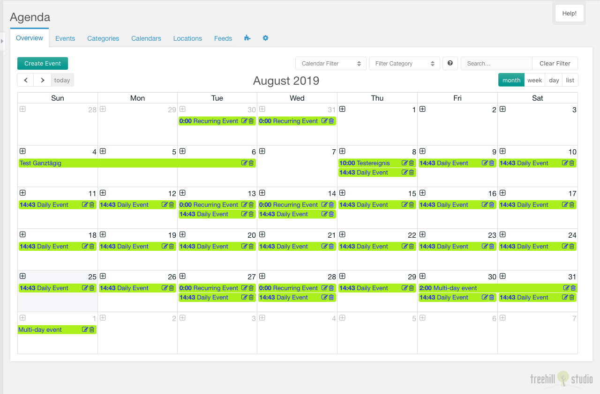

This tab contains a calendar view of the current month.

You can create a new event with a click on the plus sign at beneath the day
number in the month view (or the date/weekday in the week/day view). There is
also a create event button on the top left of the tab.

The calendar can be filtered by calendar or category dropdown selects and by a
search input on the top right of the tab.

The arrow buttons on the top left can be used to switch the event month (in
the month view). If you click on today, the calendar will show the current day
in the selected view.

The view mode can be changed on top right to the month view, the week view,
the day view and the list view.

Each event can be edited by a click on the edit icon displayed on an event. It
can be deleted after a confirmation with a click on the trash icon.

There is also a hover popup for each event, that shows a short information for
the hovered event.

## Create/Edit

The create/edit window for one event has a lot of options, that can be set.

### Event Tab

In the event tab you have to set the event title and the event calendar, where
the event is shown in. An event should have a start date/time and an end
date/time, and it could have a location. The location could be directly
created/edited in the event tab.

The event could be linked with a MODX resource. This combo field is only shown,
when the system setting `agenda.parents_event` is filled with a comma separated
list of resources, that are parents for the resources selectable with the combo
field. This combo has a select, a preview and a quickedit button. The resource
could be edited in a new window with an alt click on the quickedit button.

The event could be restricted to a context, it has to be tagged with at least
one category, and it could be toggled to inactive. If the `All Day Event`
checkbox is checked, the events don't have a time input.

If the event is set as repeating event, an additional section is visible. There
you could set the repeating type. On base of the repeating type, you have
different inputs visible.

With the interval the event repeats could be restricted to every `X`
days/months/weeks/years. The repeats will be calculated until the date set in
the last occurence input. There is a maximum of 100 repeating events that are
generated during saving an event. This maximum could be changed with the
optional createable `agenda.repeating_max_occurance` system setting. With the
`weekly` repeating type, you could set the weekdays, where the event will start.
The start date/time will then be recalculated on base of the first repeating
event. With the `monthly by weekday` repeating type, you could set the event
i.e. to the second wednesday or last tuesday of a month.

The fields on the event tab can be extended by the [Extended Event
Fields](../06_Extended_Fields.md) system setting.

### Repeats Tab

In the repeats tab you could view the repeats of the current event. You could
edit and delete each repeat. The title column of a repeat is light gray, when is
uses the default title. When one field of the repeat does not use the default
value, the modified column contains a green tick.

The grid can be toggled to show past/future repeats. It also can be filtered by
a search input on the top right above the repeats grid.

During editing a repeat, you can change the repeat dates, the title and the
description for each repeat.

The fields in the repeat edit window can be extended by the [Extended Repeat
Fields](../06_Extended_Fields.md) system setting.

The repeats are marked to be reset, when the repeat options of an event are
changed or the event dates are modified. When all repeating events will be
changed or removed during saving the event a warning will be shown.

### Description/Content Tab

In the description tab you could set the description for the current event. In
the content tab you could set the content for the current event. The editor type
of the content/description input could be set with the `agenda.editor_type`
system setting to htmleditor (the system-wide richtext editor) or textarea.

### Images/Videos Tab

After an event is saved, you could attach images and videos to the saved event
in the images/videos tab. Each image/video could have a title and a description.
It could also be toggled to inactive.

### User Tab

In the user tab you could restrict the event to multiple users and/or multiple
usergroups.
