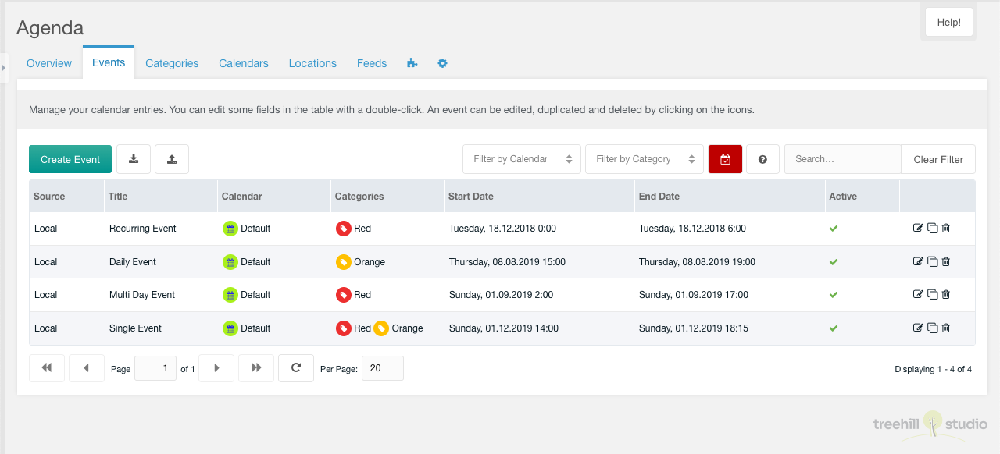

This tab contains a paginated grid with all future (or past) events.

You could create a new event with a click on the create event button on the top
left above the events grid.

The grid could be toggled to show past/future events. It also could be
filtered by a search input on the top right above the events grid.

Each event could be edited by a click on the edit icon in the row of the event.
It could be duplicated with a click on the duplicate icon in the row of the
event. It could be deleted after a confirmation with a click on the trash icon
in the row of the event.

The row of each event shows the event source, the title, the calendar, the
categories, the start and the end date and the active state of an entry. The
title could be edited inline with a double click on the text. An event would
normally have a `Local` source. If the event is created by a feed it will have a
`Feed` source.

## Create/Edit

The create/edit window for one event has a lot of options, that could be set. The
information about those options could be found in the [Tab
Overview](01_Overview.md#createedit) documentation.
