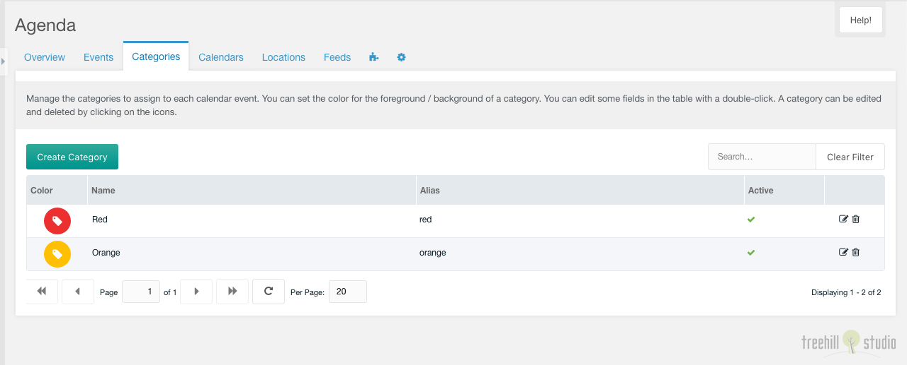

This tab contains a paginated grid with all categories.

You could create a new category with a click on the create category button on the top
left above the categories grid.

The grid could be filtered by a search input on the top right above the
categories grid.

Each category could be edited by a click on the edit icon in the row of the
category. And it could be deleted after a confirmation with a click on the trash
icon in the row of the category.

The row of each category shows the color icon, the name, the alias and the
active state of an entry. The name and the alias could be edited inline with
a double click on the text.

## Create/Edit

The create/edit window for one category has a some of options, that could be set.

You could set the category name, the category alias and you could toggle it to
inactive. And you could set the category text and background color with a color
picker.

The category could be linked with a MODX resource. This combo field is only
shown, when the system setting `agenda.parents_category` is filled with a comma
separated list of resources, that are parents for the resources selectable with
the combo field. This combo has a select, a preview and a quickedit button. The
resource could be edited in a new window with an alt click on the quickedit
button.

