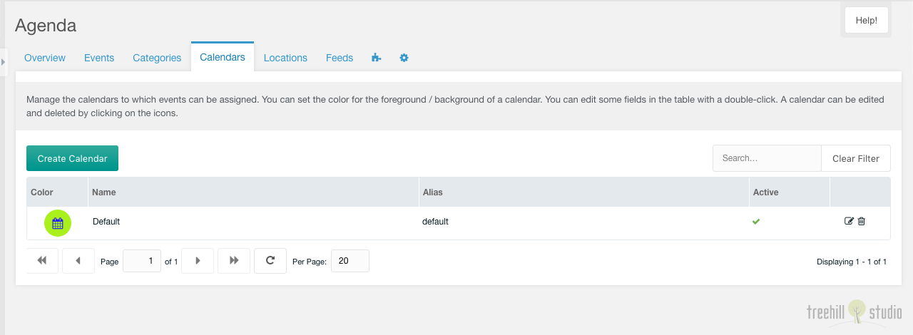

This tab contains a paginated grid with all calendars.

You can create a new calendar with a click on the create calendar button on the top
left above the calendars grid.

The grid can be filtered by a search input on the top right above the
calendars grid.

Each calendar can be edited by a click on the edit icon in the row of the
calendar. And it can be deleted after a confirmation with a click on the trash
icon in the row of the calendar.

The row of each calendar shows the color icon, the name, the alias and the
active state of an entry. The name and the alias can be edited inline with
a double click on the text.

## Create/Edit

The create/edit window for one calendar has some options, that can be set.

You can set the calendar name, and you can toggle it to inactive. And you
can set the calendar text and background color with a color picker.

The calendar can be linked with a MODX resource. This combo field is only
shown, when the system setting `agenda.parents_calendar` is filled with a comma
separated list of resources, that are parents for the resources selectable with
the combo field. This combo has a select, a preview and a quickedit button. The
resource can be edited in a new window with an alt click on the quickedit
button.

