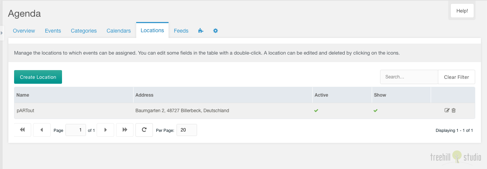

This tab contains a paginated grid with all locations.

You could create a new location with a click on the create location button on the top
left above the locations grid.

The grid could be filtered by a search input on the top right above the
locations grid.

Each location could be edited by a click on the edit icon in the row of the
location. And it could be deleted after a confirmation with a click on the trash
icon in the row of the location.

The row of each location shows the name, the formatted address, the active state
and the show on map setting (if you have set the Google Maps API key in the
system settings) of an entry. The name and the address could be edited inline
with a double click on the text.

## Create/Edit

The create/edit window for one location has a some of options, that could be set.

On the location tab you could set the location name, toggle it to inactive (and
toggle the display on a map, if you have set the Google Maps API key in the
system settings).

On the address tab you could enter the address. If you have set the Google Maps
API key in the system settings, you could geocode that address with the search
button on the map. If marker on the map is not set right, you could drag it
around (the location latitude and longitude values will be changed). Also the
map content could be dragged with the mouse (the map latitude and longitude
values will be changed). The zoom level of the map could be changed by clicking
on the plus/minus signs (the zoom value will be changed).
