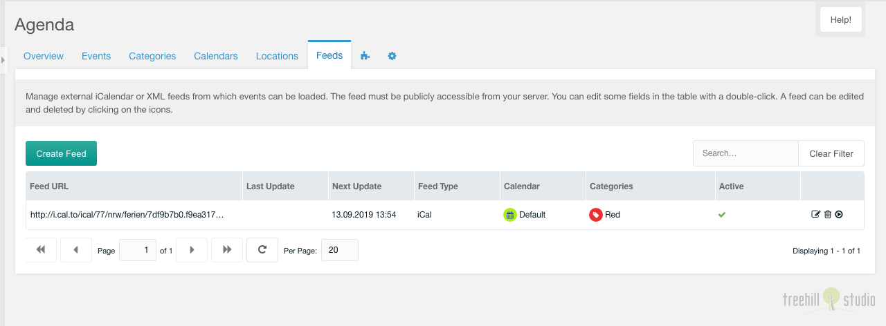

This tab contains a paginated grid with all feeds.

You can create a new feed with a click on the create feed button on the top
left above the feeds grid.

The grid can be filtered by a search input on the top right above the
feeds grid.

Each feed can be edited by a click on the edit icon in the row of the feed. And
it can be deleted after a confirmation with a click on the trash icon in the row
of the feed. The feed can be refreshed with a click on the refresh icon.

The row of each feed shows the feed url, date/time of the last run and the
next run by the cronjob, the feed type the calendar, the categories and the
active state of an entry. The feed url and the feed type can be edited inline
with a double click on the text.

## Create/Edit

The create/edit window for one feed has some options, that can be set.

You can set the feed URL the events are retrieved from. You can select the
calendar, where the feed events are imported into. You can set the categories,
the feed events will get. You can set the update interval and frequency for
the cronjob update of the feed. You can set the feed type (iCal or XML) and
you can toggle the feed to inactive.

The cronjob URL can't use the webcal protocol. Please try to change the url from
`webcal://calendar.domain/url.path` to `https://calendar.domain/url.path` in
that case.
