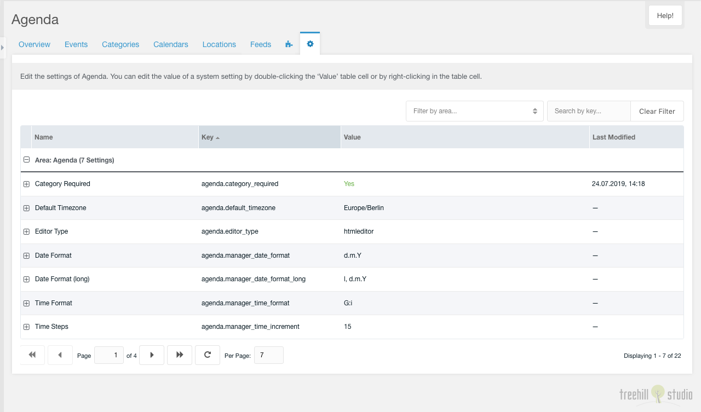

This tab contains a paginated grid with all settings of the agenda namespace.

It is only visible for a user that has the `setting` or the `agenda_settings`
permission enabled. Each setting can be edited the same as in the MODX system
settings panel.
