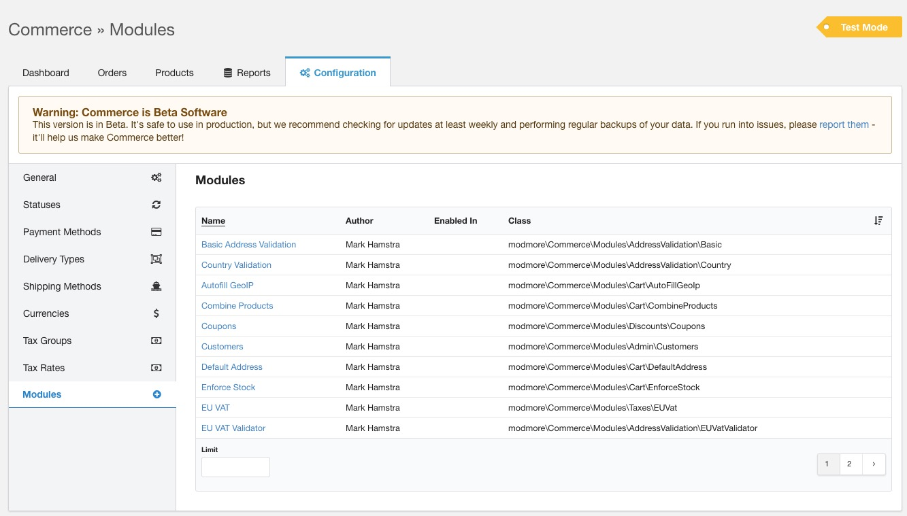
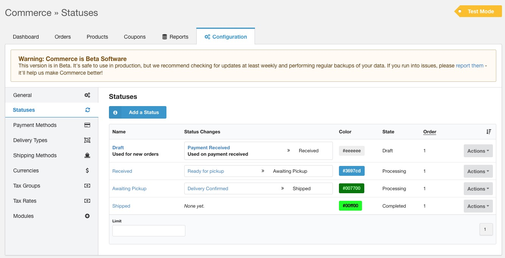
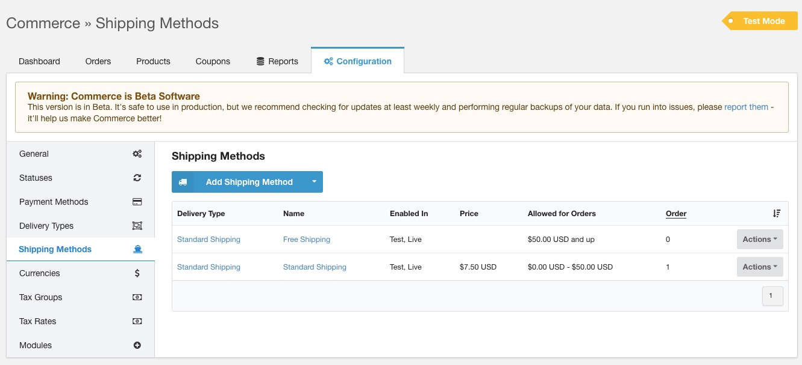
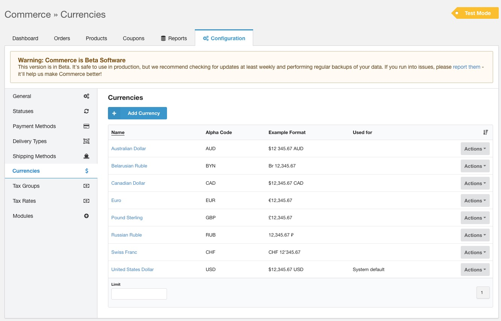

_This document assumes [Commerce was downloaded and installed with the default options](index)._

On this page:

[TOC]

## The Commerce Dashboard

Whenever we talk about the Commerce Dashboard, we refer to the **Extras &raquo; Commerce** section in your MODX Manager. This section of your MODX installation contains the orders, products, configuration, reporting and more. 

## Choosing Modules to use

One of the first things you should do is decide which modules you want to use, because this will determine what features are available and need to be configured.
 
In Commerce, many features are implemented as optional modules that can be enabled/disabled at will, and may contain additional configuration options. The majority of modules ship with the Commerce core, but [additional extensions](https://www.modmore.com/commerce/extensions/) are also available. Some extensions were built by modmore, and are covered by your standard support, while others have been built by the larger community and are _not_ covered by standard support. 
 
In the Commerce Dashboard, navigate to **Configuration &raquo; Modules** to take a look at the available modules. 

To enable and configure a module, click its name in the list. There you can enable modules in either test mode, live mode, or both modes by checking the appropriate boxes. 

Which modules you use depends on the type of shop and how the shop will be run. We'll highlight a couple of common modules here, but it's recommended to go through the list and look at the descriptions to see if any others might be useful for your shop. 

**Note:** The module names are translated, so if you use the manager in a different language than English they will be named differently and may be in a different order. 

### Customer, Address, and Shipping related

It is **strongly recommended** to enable the [Basic Address Validation](../50_Modules/Address_Validation/Basic) module. This module ensures that address information is filled in before the customer can move along in the checkout. In the module configuration, you can enter the fields that should be required depending on your locality. For example the `state` field is not required in a large part of the world. 

You should also enable either the [Autofill GeoIP](../50_Modules/Cart/AutoFillGeoIP) module or the [Default Address](../50_Modules/Cart/DefaultAddress) module. These modules will set an expected address on the order before the customer gets to the address step. This expected address is used by the taxes and shipping configuration to determine what rates and options to show before the customer entered their information.

- The [Default Address module](../50_Modules/Cart/DefaultAddress) is useful if you serve a distinct demographic. For example, if you only (or predominantly) ship to one country or state, you can configure the Default Address module to use that by default, which should be accurate for the majority of your customers.
- If your customer base is more spread out, the Autofill GeoIP module will automatically geolocate the customer by their IP address and use the country (and optionally the state) instead. This uses the [ipinfo.io](https://ipinfo.io/) service (free for up to 1000 lookups per day) which is fairly accurate.  

If you only sell in specific countries, the [Country Validation](../50_Modules/Address_Validation/Country) module is useful to restrict country selection. (Note that this does not remove countries from the country field in the address step, but you can do that by changing the templates.)

If you require the customer to accept terms and conditions before initiating a payment, you can use the [Accept Terms](../Modules/Cart/AcceptTerms) module.

### Discounts

You'll likely want to enable the [Coupons](../50_Modules/Discounts/Coupons) module to get access to coupon codes. After enabling the module, refresh the page to see the Discounts tab added to the top navigation. 

There is also a [User & Usergroup Discounts](../50_Modules/Discounts/UserDIscounts) module that can be used for percentage discounts for users or user groups, accessible from the same Discounts tab once the module is enabled.

### Taxes

Very few people enjoy paying taxes, but it is important to charge the right taxes to your customers. 

- If you sell to customers in the European Union, enable the [EU VAT](../50_Modules/Taxes/EUVat) module to enable the EU VAT Rate Provider that enables automatically up-to-date tax rates across all countries in the EU. This loads (and caches) tax rates from [JSONVat.com](http://github.com/adamcooke/vat-rates), which is an open-source, community-maintained dataset.

- If you sell to customers across the United States, the [TaxJar](../50_Modules/Taxes/TaxJar) module can be used to get automated sales tax calculations. This service covers virtually all possible Sales Tax rules, including product-specific exemptions if you configure the right product codes, and can also be used to help with your tax reporting, but does have a monthly cost to use. 

For all other regions, or if you prefer to manually set rates, you can use the standard configuration. We'll look at configuring the actual [tax groups and rates](../Taxes) in a minute.

### Products & Cart

Enable [CombineProducts](../50_Modules/Cart/CombineProducts) if you want multiple items with the same product to be combined into a single item in the cart. Note that this is not compatible with [ItemData](../50_Modules/Cart/ItemData), which we'll discuss later.

## Setting up Statuses

The default installation created a simple [status workflow](../Statuses) for you. At **Configuration > Statuses** you can see that in action.

For now, we'll leave that as-is, but later on you may want to change the emails that Commerce sends when an order is paid. You can find those by clicking on "Payment Received" in the Status Changes column for Draft, to see the actions that are fired when the payment is received. 

You'll see two email actions are configured here, a confirmation email to the customer, and the order notification to the merchant. By clicking on the name (or "Edit Status Change Action" in the Actions menu), you can see the subject, recipient, and content configuration for each. By default these use templates, but you may need to tweak the recipient email on the order notification to merchant. 

## Setting up Payment Methods

In the installation, a "Dummy Payment" was automatically created. This uses the [manual payment gateway](../Payment_Methods/Manual) which just marks the order as paid. If you want to add [other payment method options](../Payment_Methods), you can do that at **Configuration &raquo; Payment Methods**.

## Setting up Delivery Types & Shipping Methods

Depending on what you will be selling, you may or may not need to tweak the [delivery types](../Delivery_Types) in **Configuration &raquo; Delivery Types**. For basic shops, where every sold product fits in the same type of box or is distributed digitally in the same way, you will only need a single delivery type.

If you have different types of products however, for example a combination of ebooks and physical books, you'll need to create an additional delivery type. 

As a way of determining if you need different delivery types, consider whether or not the way a product is delivered to the customer. While you'll create a delivery type for an ebook and another one for a physical books, you wont typically need a different delivery type if you also sell t-shirts, as those are delivered the same way as a book. If you use different fulfillment partners or warehouses, different delivery types can also be useful if that distinction is clear to the customer.

For now, we'll stick with the the default "Standard Shipping" delivery type. You can edit the delivery type to make the shipping step required or never shown, depending on your requirements. In the default shipping step mode of "Depends", the shipping step is only shown in the checkout if there are 2 or more shipping methods available for an order.

Next, navigate to **Configuration &raquo; Shipping Methods**. You'll already have a free shipping method from the setup, which is assigned to the Standard Shipping delivery type we just saw in **Configuration &raquo; Delivery Types**. If you created extra delivery types, you'll also need to create additional shipping methods for each. 

To help with testing, you can choose to set the Free Shipping method to a minimum order total of $50 by editing it (click on its name in the grid) and setting "Min. Order Total" at the bottom to 5000 ($50). And then create another shipping method of type "Standard Shipping Method" that costs $7,50 for orders with a "Max. Order Total" of 5000 ($50).

**&raquo; Tip:** Prices in Commerce are configured in cents, but you'll see the formatted price when you remove focus from the field. 

## Setting up Currencies

The most common currencies have already been created for you in the installation, but if you want to change the formatting, or set which one to use, navigate to **Configuration &raquo; Currencies**. 

Click on the currency name or choose Edit Currency in the actions menu to change the formatting options. In the Actions menu you can also choose _Set as Default_ to change the default currency.  

For Euro, some countries prefer to use the comma instead of the dot for the decimal separator. Click on Euro and switch out the values for "Decimal Point" and "Thousands Separator" to tweak that.

If you need to add a currency that is not included in Commerce by default, [this site has a comprehensive list of the ISO4217 codes and formatting to use](https://www.thefinancials.com/Default.aspx?SubSectionID=curformat). The ISO codes are important to get right for certain payment providers. 

Use a different currency often? Let us know, maybe we can save you some time in the future by including it in the standard installation.

[Learn more about currencies here](../Currencies). 

## Setting up Tax Groups

Next up, create a tax group under **Configuration &raquo; Tax Groups**. Give it a name that describes the **type** of tax, not the actual rate to charge. For example you could have "Standard Tax" and "Food", but you would not, typically, name them "21%" or "9%".

After creating the tax group, choose **Manage Tax Rules**, in the Actions menu. 

What the tax rules should be exactly depends on your jurisdiction and what you're selling, and to who. In many cases there is a tax rate that applies to local customers, and one (or more) for international customers. [The taxes documentation](../Taxes) explains in more detail how you can configure different rates and rules, but for now let's keep it simple, and add a simple singular tax rate that applies to every purchase.

Click **Add Tax Rule**. Give it a priority of 1, set "Field name" to "country", and "Condition" to "Always". Leave the Rate Provider set to _Manual Tax Rate_. Save. 

After saving the rule, a new section _Rate Provider Options_ will be show. There you can enter the tax rate you want to charge, for example 21, give it a Tax Key like "STANDARD-NL", and a name that is shown to customers like `21% VAT` or `Standard VAT`. Save again. 

If you want to add more tax rules for different rates, repeat this process. The priority determines the order that the tax rules will be evaluated from top-to-bottom in the grid, so set the conditions so that the lowest priority number is the most specific, and eventually fall back to an "Always" condition with the highest priority number. When using conditions that depend on customer information that is not yet be available, the rule is ignored, so keep that in mind.

When creating products, you'll select the tax group to use for that specific product. Or, if only one tax group is configured, it is selected for you automatically.

## Some final System Settings

Now that you've explored the configuration in the Commerce Dashboard, there are a few more system settings you may want to consider tweaking. These can be found by going to System (cog icon in the manager) &raquo; System Settings, and choosing "Commerce" in the first filter (namespace). 

- There are some settings related to the account step in the checkout. [Read more about how to configure them for what result in the Users documentation](../Users)
- The `commerce.default_weight_unit` setting is useful to configure before creating products. It defaults to `kg`, but virtually all weight units are supported. 
- Don't want to see the beta warning? Disable `commerce.show_beta_warning`. 
- The E-mail & Notifications settings are useful to configure some default email options, like an image to use as image header with `commerce.email_header_url`. Other email options are configured through the [status workflow](../Statuses)
- In the Taxes area, set the `commerce.tax_calculation` to `inclusive` if you want product prices to be treated as having taxes included in them, instead of adding taxes on top of it. 
- The resource related settings should already be (partially) configured for you as part of the setup, but you may want to tweak your `login_resource` ([how to setup your login page](../Users/Login_Resource)), `register_resource` ([how to setup your registration page](../Users/Register_Resource)), and `shop_resource` settings. You can ignore the _Resource Product_ settings for now.

## Up next: set up your Product Catalog

Now that the most important configuration is in place, let's start [setting up your products](Product_Catalog)!

