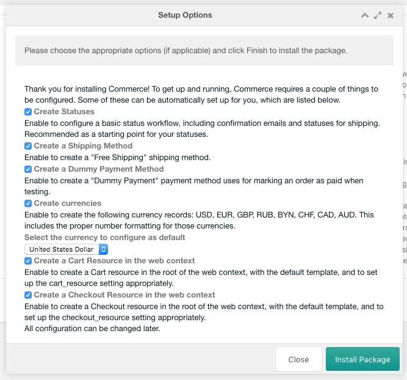

Welcome to Commerce!

Commerce gives you the tools to build a wide variety of online shops and ecommerce solutions. With all this power comes some complexity and especially for your first shop with Commerce, you may find there is a lot to learn. 

This getting started section will help you understand the different aspects to a shop in Commerce, and will give you the tools to dive in deeper. We recommend following this tutorial in the presented order. 

If at any point you are totally confused, ask for help on the [Commerce forum](https://forum.modmore.com/c/commerce) or email support@modmore.com.

On this page:

[TOC]

## Downloading Commerce

First of all you'll need to install Commerce in your MODX installation. Commerce is available from the modmore.com [package provider](https://modmore.com/about/package-provider/), so you'll need to create an [api key](https://modmore.com/account/api-keys/) and add that to your MODX site to get started.

**&raquo; Note:**  If you're new to modmore and haven't worked with our package provider before, [learn more about how that works here](https://modmore.com/about/package-provider/). It's a one-time set up to access all our extras.

In order to install Commerce, you will need to have a license. [Licenses are available for €299](https://modmore.com/commerce/pricing/), but free development licenses are available to use while you're building the shop. 

To use a [free development license](https://modmore.com/free-development-licenses/), make sure that your MODX installation is installed on a domain that matches the free development licenses whitelist. This means you should be on a domain like `localhost`, `site.local`, `dev.site.com`, or a similar pattern. [The full list of supported domains can be found here](https://modmore.com/free-development-licenses/#faq_109). If you're unable (or unwilling) to use a domain that is approved for free licenses, you can also use a paid license and transfer that to the live domain later.

When you have your [API Key](https://modmore.com/account/api-keys/) set up as a package provider in your MODX site, open the modmore.com package provider by clicking the arrow on the _Download Extras_ button (at Extras > Installer), choosing _Select a Provider_ in the menu, and choosing modmore.com in the window. 

Find Commerce in the provider under Premium Extras > Commerce and choose Download. 

**&raquo; Note:** Commerce is a rather big package and will take longer to download than most extras you're used to. This may take up to 30 seconds and in rare cases has timed out. If that happens, simply try to initiate the download again. Check your MODX error log and contact support if it keeps happening. 

## Installing Commerce

After the download follows the installation. In the package manager find Commerce in the list, and choose Install. You'll see the readme, changelog, and license terms. 

Continue the setup by clicking the install or setup options button in the bottom right. On a clean install, you'll be presented with the setup options screen similar to the one shown below. 

**&raquo; Note:** While it is technically optional to use these options, it is **strongly recommended** to leave everything checked for a first install. 

The installation will automatically set up the most important aspects of Commerce for you, so you're ready to start testing. 

This is what it creates:

- A basic [status workflow](../Statuses), covering the draft, processing and completed statuses, with the necessary status changes to send emails to the customer and merchant. 
- A [delivery type](../Delivery_Types) and [shipping method](../Shipping_Methods) that provides free shipping in development. Even if you do not need shipping methods for your shop, you'll always need to have at least one method set up to complete the checkout process.
- A [manual payment method](../Payment_Methods/Manual) that marks the order as paid without any money transfering hands for testing.
- A set of [currencies](../Currencies), along with the proper subunits, formatting, alphanumeric and numeric codes. It will also set the currency you choose as the system default.
- A new resource with the [commerce.cart snippet](../Snippets/cart) to act as the cart. It will be created in the root of the web context, with your default template, and the `commerce.cart_resource` system setting will be updated to point to it.
- A new resource with the [commerce.checkout snippet](../Snippets/checkout) which will hold the checkout process. It will be created in the root of the web context, with your default template, and the `commerce.checkout_resource` system setting will be updated to point to it.

Once these standard options are created, the installation will no longer offer these options when you reinstall or update Commerce to prevent duplications. If you want to recreate the standard currencies or status workflow, you will need to truncate the relevant tables in your database before Commerce will offer them as options.

You will of course be able of changing every standard configuration after the installation. 

The installation also verifies if your server meets the most important [requirements](../Requirements), including the MODX and PHP versions. Additional requirements (like serving the checkout over HTTPS) are checked in the Configuration Checklist, in the Commerce dashboard, when you're looking at switching to live mode.

## Exploring Commerce

If the installation was successful, you're ready to start exploring the **Commerce Dashboard**. Refresh the manager, and find it under **Extras &raquo; Commerce**. 

[Start exploring the Commerce Configuration &raquo;](Configuration)
