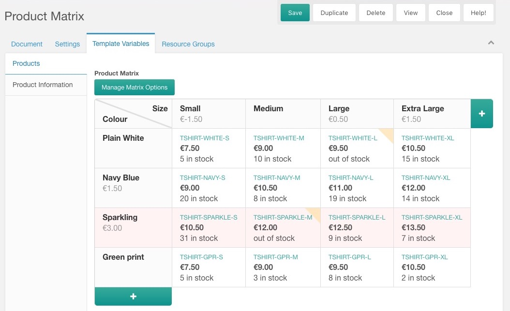
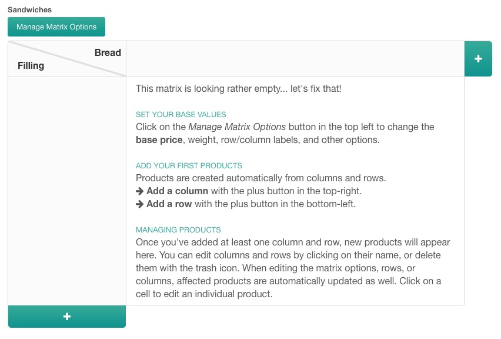
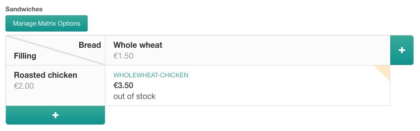
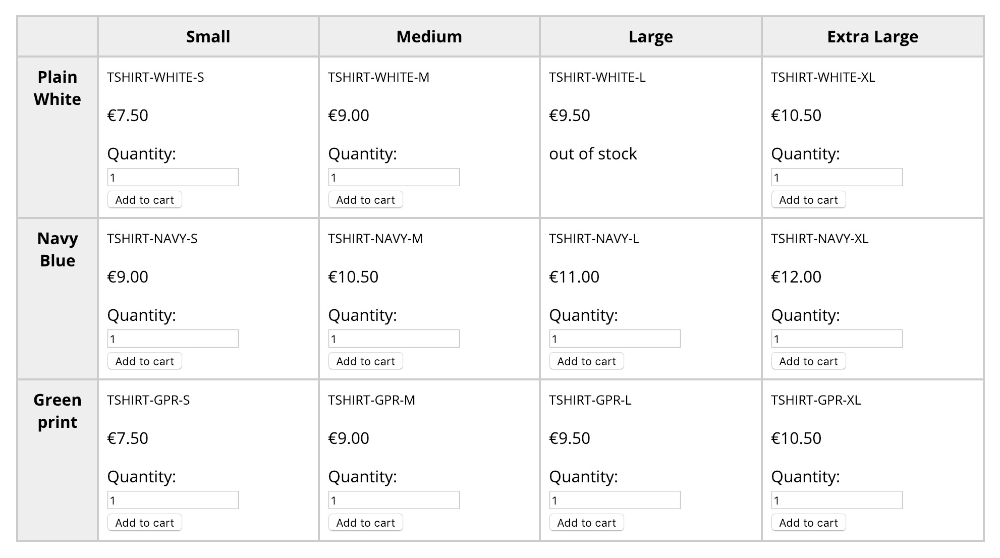
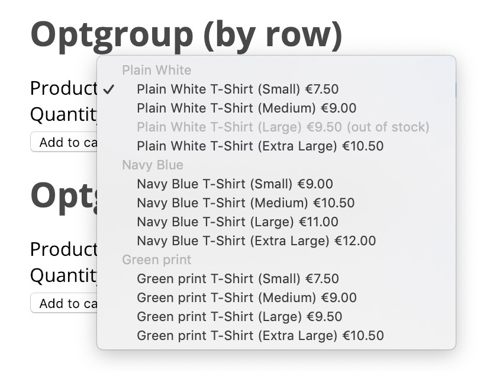

Introduced in v0.12, the Commerce Products Matrix allows you to manage products in a template variable with 2 attributes. This is displayed as a matrix - a table - with one attribute for the rows, and one for the columns.

The [commerce.get_matrix snippet](../Snippets/get_matrix) is used to output the matrix in the frontend. We'll show some examples of how you can show the products further down on this page.

If you have a simpler shop, you can also use the [Products TV](Products_TV) for a one-dimensional list of products. With both solutions, it's recommended to use [Collections](https://modx.com/extras/package/collections), and optionally [Tagger](https://modx.com/extras/package/tagger), to build up the catalog in your resource tree, and to use the Matrix or Products TV to manage the product information. 

[TOC]

## A first look at the Product Matrix

The Product Matrix template variable is available with the standard Commerce install. When configured, and filled with some product information, it looks something like this:



There's quite a few to see there.

1. The _Manage Matrix Options_ button allows you to set up basic options that affect the matrix and all products within it. When changing a value that affects the products (like the base price), all products in the matrix are automatically updated.
2. The top-left most cell contains the labels for the attributes. When you create the template variable, the input properties lets you set the default value that will be used when a matrix is first initialised. After that, you can use the _Manage Matrix Options_ to change them. 
3. Columns and rows are defined for each matrix. They have a name, SKU, and price, which will all be taken into account for generating the products. When hovering over the column or row headers, you will see a trash button to remove the entire row/column, and you can also click the row/column name to edit its options. Products are automatically updated when changing a row/column. 
4. You can click a product cell to edit the specific product. Some of the standard fields are hidden, as they are managed automatically through the matrix and rows/columns. 
5. Rows and columns can be marked as inactive. This means they will not be available in the front-end, and they will show up in a light red in the matrix. In the screenshot above, you can see this on the "Sparkling" row.
6. When a product has no stock left, its cell is highlighted with a yellow ribbon in the top right corner. 

## Setting up the Template Variable

To create a product matrix, you first need to create a template variable. Go to Elements > Template Variables in your MODX installation and create a new TV. Give it the name `product_matrix` and a caption of "Products" (or something similar). 

On the _Input Options_ tab, set the _Input Type_ to `commerce_matrix`. The input options will load, so set your default Row label, Column label, and the SKU/name template if needed (more on those below). 

Next, on the _Template Access_ tab, give the template you use for products access to the new TV, and save. 

## Fill your matrix with data

Open a resource that has your matrix TV. You should see an empty matrix with some getting started instructions.



1. Create a column by clicking on the plus button in the top right. 
2. Create a row by clicking on the plus button in the bottom left. 

Congratulations, you just created your first matrix product! 



In our example we gave both the column (whole wheat, €1.50) and the row (roasted chicken €2.00) a price. Combined, these made up the price of the created product (whole wheat chicken, €3.50). You can also set a price on the matrix itself which will then be applied to all products. Click on "Manage Matrix Options", enter a base price, and save. You'll notice the product is also updated.

When setting a price change on a row or column, it doesn't have to be a positive number. You can also set a negative number, which will reduce the price of the product. This is useful if you use base prices, but want to make one option cheaper. 

You may notice that your product is marked as out of stock. Click on the product cell, enter the stock, and save. You can also change the price for a single product this way, but note that when you next edit the matrix or a row/column, that the product price will be re-calculated from that. 

Now continue to add more attributes. Whenever you add a new row or column, additional products will be created based on the values you give. 

## Matrix Configuration

At any time you can change the matrix configuration by clicking on the **Manage Matrix Options** button at the top left of the matrix. The options provided there are initially configured base on the input options on the template variable, but can be changed for individual matrices. 

The available options are explained below.

- **Column Label**: the name for what type of attribute a column is. Primarily used in the manager, but you can also set up your templates to access this in the front-end (`{{ matrix.column_name }}`)  
- **Row Label**: the name for what type of attribute a row is. Primarily used in the manager, but you can also set up your templates to access this in the front-end (`{{ matrix.row_name }}`)  
- **Product SKU Template**: an inline [Twig template](../Templates) that is used to generate the SKU for each individual product. This usually includes the SKU from the column (`{{ column.sku }}`) and the SKU from the row (`{{ row.sku }}`), but can also include resource fields (any standard resource field, e.g. `{{ resource.alias }}`) or template variables. For template variables, you need to add a comma separated list of TVs to load the value for in the `commerce.matrix.load_tvs` system setting.
- **Product Name Template**: similar to the SKU template, the Name template is an inline [Twig template](../Templates) for generating the name for each individual product. This usually includes the name from the column (`{{ column.name }}`) and the name from the row (`{{ row.name}}`), but can also include resource fields (any standard resource field, e.g. `{{ resource.pagetitle }}`) or template variables. For template variables, you need to add a comma separated list of TVs to load the value for in the `commerce.matrix.load_tvs` system setting.
- **Description**: a description for the matrix itself. Could be used in your front-end to offer additional information about pricing. Is not applied to individual products.
- **Base Price**: the base price for all products in the matrix. This is combined with the base price on the rows and columns to reach the product price. Once created, you can temporarily edit the price on individual products, which will be reverted when you edit the relevant column, row, or matrix configuration.
- **Base Weight** and **Weight Unit**: the default weight for products in the matrix.
- **Tax Group**: see [taxes](../Taxes)
- **Delivery Type**: see [Delivery Types](../Delivery_Types)

## Showing product selection with a matrix

When you place your TV in a template, you'll notice it only outputs an ID. That's the ID of the product matrix. 

To output your products, you'll need to provide that ID to the [commerce.get_matrix snippet](../Snippets/get_matrix), which takes care of loading all your rows, columns, and products. It provides those to a twig template, which you can adapt to fit your frontend needs. 


### Matrix Data Structure

When using the get_matrix snippet, you have access to a bunch of data inside a twig template.

- `matrix` contains information about the matrix:
    - `principal` contains the class name the matrix is tied to; usually `modResource`
    - `principal_id` is the primary ID of the class the matrix is tied to; usually the resource ID
    - `principal_field` is the name of the field that the matrix is applied to, usually the name of the TV.
    - `column_name` is the label set for the columns
    - `row_name` is the label set for the rows
    - `description`
    - `base_price` / `base_price_formatted`
    - `base_weight`
    - `tax_group` is the ID for the tax group
    - `delivery_type` is the ID for the delivery type
- `columns` contains an array of the defined columns, with for each column:
    - `sku`
    - `name`
    - `description`
    - `price_change` / `price_change_formatted`
    - `active`
- `rows` contains an array of the row headers, with for each row:
    - `sku`
    - `name`
    - `description`
    - `price_change` / `price_change_formatted`
    - `active`
- `products` contains an array of products in the TV, indexed by the product ID. So the details of product ID 5 are available in `{{ products[5] }}`. The same product information as elsewhere is available, most notably:
    - `id`
    - `price` / `price_formatted`
    - `stock`
    - `sku`
    - `name`
    - `description` 
    - `matrix` the id of the matrix 
    - `column` the id of the column 
    - `row` the id of the row 
- `map` is a map on `row => column => product ID` indicating where products are in the matrix. You'd typically loop over rows and columns, use the map to determine the product ID, and then output that. 

Commerce ships with a few (unstyled) templates to get you started. It's likely you'll want to create your own; [learn more about templating in Commerce here](../Front-end_Theming).

### Tabular template

The tabular template is most suited for use cases where all options are visible at once. Think along the lines of screws or other mechanical parts that are available in different widths and heights. 

The `frontend/matrix/tabular.twig` template builds a table similar to how the matrix is presented in the back-end. If a product is in stock, it shows an add-to-cart form. If it's out of stock, it shows that message.

To output a table, use the following:

````html
[[!commerce.get_matrix? 
    &matrix=`[[*product_matrix]]` 
    &tpl=`frontend/matrix/tabular.twig`
]]
````

The referenced template looks like this:

````html
<table class="c-productmatrix">
    <thead class="c-productmatrix-head">
    <tr class="c-productmatrix-row c-productmatrix-head-row">
        <th class="c-productmatrix-cell c-productmatrix-head-cell c-productmatrix-lead-cell">

        </th>
        
            
                <th class="c-productmatrix-cell c-productmatrix-head-cell">
                    {{ column.name }}

                    {#
                        {{ column.price_change_formatted }}
                    #}
                </th>
            
        
    </tr>
    </thead>
    <tbody>
    
        
            <tr class="c-productmatrix-row">
                <th class="c-productmatrix-cell c-productmatrix-lead-cell">
                    {{ row.name }}

                    {#
                        {{ row.price_change_formatted }}
                    #}
                </th>
                
                    
                        
                        
                        <td class="c-productmatrix-cell c-productmatrix-item-cell" data-product="{{ productId }}">
                            
                                <p class="c-productmatrix-item-sku">
                                    {{ product.sku }}
                                </p>
                                <p class="c-productmatrix-item-price">
                                    {{ product.price_formatted }}
                                </p>
                                
                                    <p class="c-productmatrix-item-no-stock">
                                        {{ lex('commerce.out_of_stock') }}
                                    </p>
                                
                                    <form method="post" action="[[~[[++commerce.cart_resource]]]]" class="add-to-cart c-productmatrix-item-add-to-cart">
                                        <input type="hidden" name="add_to_cart" value="1">
                                        <input type="hidden" name="product" value="{{ product.id }}">
                                        <input type="hidden" name="link" value="[[*id]]">

                                        <label for="add-quantity-{{ product.id }}">Quantity:</label>
                                        <input id="add-quantity-{{ product.id }}" type="number" name="quantity" value="1">

                                        <input type="submit" value="{{ lex('commerce.add_to_cart') }}">
                                    </form>
                                
                            
                                <p>Product {{ productId }} not loaded</p>
                            
                        </td>
                    
                
            </tr>
        
    
    </tbody>
</table>
````

There are plenty of classes for basic styling: 

- `c-productmatrix-cell` on each cell (including headings)
- `c-productmatrix-lead-cell` on row heading cells
- `c-productmatrix-head-cell` on column heading cells
- `c-productmatrix-item-sku`, `c-productmatrix-item-price`, `c-productmatrix-item-no-stock`, `c-productmatrix-item-add-to-cart`

Here's how that would look.



### Select optgroups

For use in a select dropdown you an use the optgroup template. There are 2 templates available, one where it's grouped by the row, and one where it's grouped by the column.



For **grouped by row** use the following sample:

````html
<form method="post" action="[[~[[++commerce.cart_resource]]]]">
    <input type="hidden" name="add_to_cart" value="1">
    
    <label for="choose-product">Product:</label>
    <select name="product" id="choose-product">
        [[!commerce.get_matrix? 
            &matrix=`[[*product_matrix]]` 
            &tpl=`frontend/matrix/optgroup_row.twig`
        ]]
    </select>
    
    <label for="add-quantity">Quantity:</label>
    <input type="number" name="quantity" value="1">
    <br>
    <input type="submit" value="[[!%commerce.add_to_cart? &namespace=`commerce`]]">
</form>
````

This is what that twig template looks like:

````html

    
        <optgroup label="{{ row.name }}">
        
            
                
                

                <option value="{{ product.id }}" disabled>
                    {{ product.name }} {# Alternatively, use {{ column.name }} to not repeat the full product names #}
                    {{ product.price_formatted }}
                    ({{ lex('commerce.out_of_stock') }})
                </option>
            
        
        </optgroup>
    

````

For **grouped by column**:

````html
<form method="post" action="[[~[[++commerce.cart_resource]]]]">
    <input type="hidden" name="add_to_cart" value="1">
    
    <label for="choose-product">Product:</label>
    <select name="product" id="choose-product">
        [[!commerce.get_matrix? 
            &matrix=`[[*product_matrix]]` 
            &tpl=`frontend/matrix/optgroup_column.twig`
        ]]
    </select>
    
    <label for="add-quantity">Quantity:</label>
    <input type="number" name="quantity" value="1">
    <br>
    <input type="submit" value="[[!%commerce.add_to_cart? &namespace=`commerce`]]">
</form>
````

The template for columns looks like this:

````html

    
        <optgroup label="{{ column.name }}">
        
            
                
                

                <option value="{{ product.id }}" disabled>
                    {{ product.name }} {# Alternatively, use {{ row.name }} to not repeat the full product names #}
                    {{ product.price_formatted }}
                    ({{ lex('commerce.out_of_stock') }})
                </option>
            
        
        </optgroup>
    

````

Made a cool product selector with the matrix? [Share it on our forum!](https://forum.modmore.com/c/commerce)

## Product links and other custom fields

Some examples above include a hidden link input that submits the resource ID along with the add-to-cart request. This is meant to be used with the [Item Data Module](../Modules/Cart/ItemData) (introduced in 0.11) with `link` as an allowed field.

It's recommended to include this in your add to cart form when using a matrix, so that your customer can return to the product resource they added the product from. To add additional custom data, view the [Item Data Module documentation](../Modules/Cart/ItemData).

## Tip: use Form Customization to move the TV

You can move the matrix to the main "Document" tab of a resource using form customization. To do this, go to System (cog icon in the top right) > Manager Customization.

Create a profile, and a set within the profile if you don't already have one. 

When editing the form customization set, open the _Template Variables_ tab and find your products TV in the list. Double click the value in the "Region" column, and set it to `modx-resource-main-left`. 

Now, open your resource that has the template variable, and voila! 

