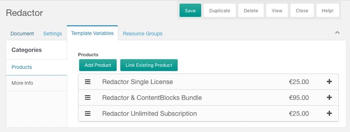
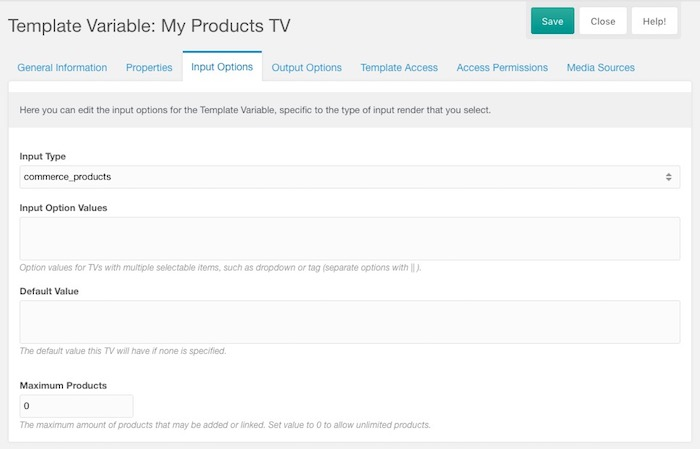
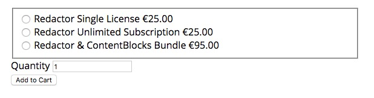

Introduced in v0.8, the Commerce Products Template Variable is the recommended approach to manage products for most webshops. It allows you to connect multiple products to a single resource (and a product to multiple resources), and to output those with the [commerce.get_products snippet](../Snippets/get_products). 

For larger shops, it's recommended to use [Collections](https://modx.com/extras/package/collections), and optionally [Tagger](https://modx.com/extras/package/tagger), to build up the catalog. 

[TOC]

## A first look at the Products TV

The Products template variable is available with the Commerce install. When set up and given a couple of product options, it might look like this:



The _Add Product_ button allows you to create a new product, directly from the resource, which will also be added to the resource when saved. The _Link Existing Product_ lets you search through the existing products stored in Commerce, to add it to the resource. 

Products are sortable with drag & drop, so you can easily reorder how the products are shown.

The products function as an accordion, so you can click on the bar to expand it to see more product information and product actions. 
 


The left side of the product content is always the same, while the right side is determined by the product type. For example the listed bundle product shows what products it contains, and subscription products might give more information about the subscription terms.

The _Edit Product_ button allows you to change the product information. With _Unlink_ you can remove the product just from the current resource, and with _Delete Product_ you can delete it completely. 

## Setting up the Template Variable

Creating the Products TV is really simple. Just go to Elements > Template Variables in your MODX installation and create a new TV. 

On the _Input Options_ tab, set the _Input Type_ to _commerce_products_. 

If desired, you can set the maximum amount of products as well. This allows you to restrict a products TV to just one product for example. When the maximum has been reached, the _Add Product_ and _Link Existing Product_ buttons are hidden from view. 



## Setting up the Add to Cart Form

Depending on how you want your add to cart form to look, you can use different methods to show the different products assigned to a resource.

All of these methods use the [commerce.get_products snippet](../Snippets/get_products). Take a look at that snippet for more information on how you could output the product information.

For generic instructions in adding products to the cart, see [Add to Cart Form](Add_to_Cart_Form). That covers the two main ways to draft your forms, as well as some example code to do it with AJAX.
 
### Radio Buttons

To show product options as radio buttons, you can use something like this. This assumes the template variable is named `products`, change accordingly.

```` html
<form method="post" action="[[~[[++commerce.cart_resource]]]]">
    <input type="hidden" name="add_to_cart" value="1">
    
    <fieldset>
    [[!commerce.get_products? 
        &products=`[[*products]]`
        &tpl=`product_as_radio`
    ]]
    </fieldset>
    <div class="product-quantity">
        <label for="add-quantity">Quantity</label>
        <input type="number" id="add-quantity" name="quantity" value="1">
    </div>
    
    <input type="submit" value="Add to Cart">
</form>
````

With the following in the chunk `product_as_radio`:

```` html
<div class="product-option">
  <label>
    <input type="radio" name="product" value="[[+id]]">
    [[+name]]
    <span class="right">[[+price_formatted]]</span>
  </label>
</div>
````

To get a result like this:



Obviously, you'd use CSS to make it look a lot nicer!

### Options as a dropdown

Similarly, to offer options in a dropdown, use something like this:

```` html

<form method="post" action="[[~[[++commerce.cart_resource]]]]">
    <input type="hidden" name="add_to_cart" value="1">
    
    <div class="product-variation">
        <label for="choose-variation">Product</label>
        <select id="choose-variation" name="product">
            [[!commerce.get_products? 
                &products=`[[*products]]`
                &tpl=`product_as_select`
            ]]
        </select>
    </div>
    <div class="product-quantity">
        <label for="add-quantity">Quantity</label>
        <input type="number" id="add-quantity" name="quantity" value="1">
    </div>
    
    <input type="submit" value="Add to Cart">
</form>
````

With the following in chunk `product_as_select`:

```` html
<option value="[[+id]]">[[+name]] ([[+price_formatted]])</option>
````

### Adding Multiple Products to the cart

If you'd like the customer to add all the products to the cart in a single swoop, you can do something like this instead.

```` html
<form method="post" action="[[~[[++commerce.cart_resource]]]]">
    <input type="hidden" name="add_to_cart" value="1">
    
    [[!commerce.get_products? 
        &products=`[[*products]]`
        &tpl=`product_all_at_once`
    ]]
    
    <input type="submit" value="Add to Cart">
</form>
````

With the following in chunk `product_all_at_once`:

```` html
<div class="product-variation">
    <label for="choose-variation">[[+name]], [[+price_formatted]]
 ([[+stock]] in stock)</label>
    <input type="number" name="products[ [[+id]] ][quantity]" value="0">
</div>
````
