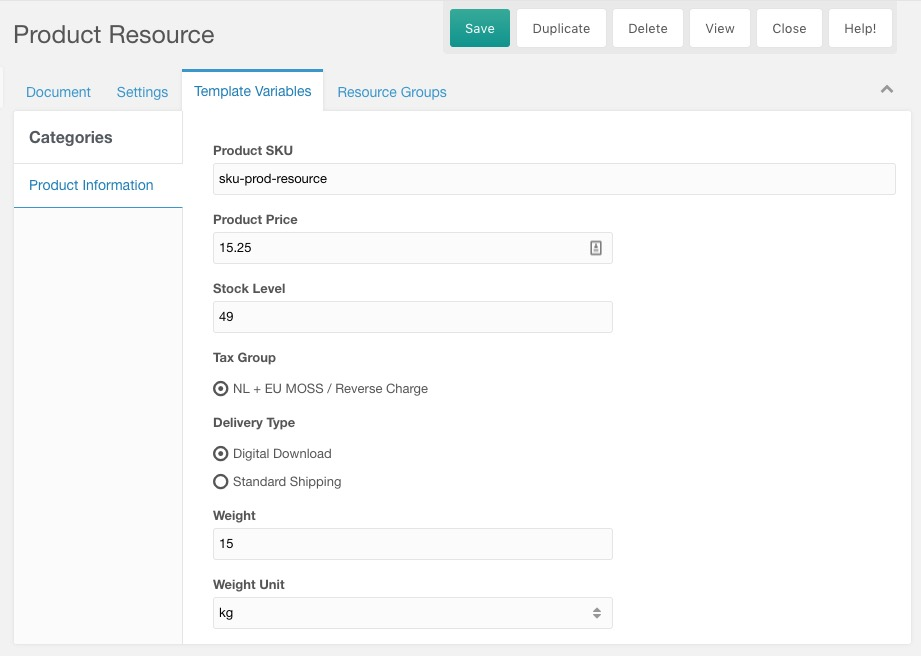

When you're building a resource-based product catalog, each product record in Commerce is associated with a single resource in MODX. This means you can only have product variation per resource.

[TOC]

## Pros 

- Easy to integrate into templates with its use of TVs
- Fairly flexible - you can associate more data with the product
- Easy to add to an existing site that already has resources

## Cons

- One resource = one product, with no variations
- Having tons of resources is not ideal if they don't also serve an existing function for browsing products. 

## Setup

You'll need to set up either existing resource fields, or template variables, to hold the product information. This includes the SKU, name, description, price and more. You'll also need to point Commerce to the right fields through system settings. 

Set up the following MODX System Settings to point to a resource field or template variable:

- `commerce.resourceproduct.delivery_type_field` - see Delivery Type and Tax Group section below
- `commerce.resourceproduct.description_field` - should be a text field, like `introtext`
- `commerce.resourceproduct.name_field` - should be a text field, like `pagetitle`
- `commerce.resourceproduct.pricing_field` - should be the name of a Product Pricing TV (including the `tv.` prefix), which will contain the pricing for the resource product.
- `commerce.resourceproduct.price_field` - **Deprecated in favour of the pricing field** - should be a number TV. By default this accepts decimals, but you can set `commerce.resourceproduct.price_field_decimals` to no to use integer values (e.g. 100 = €1) instead. 
- `commerce.resourceproduct.sku_field` - should be a text field, like `alias`
- `commerce.resourceproduct.stock_field` - should be an integer number TV
- `commerce.resourceproduct.tax_group_field` - see Delivery Type and Tax Group section below
- `commerce.resourceproduct.weight_field` - should be a number TV, can accept decimals. 
- `commerce.resourceproduct.weight_unit_field` - should be a text or select that offers units like `kg`, `g`, `lbs`, etc. For example this could be a listbox TV with input option values set to `g||kg||t||lb||oz||st`. Alternatively if all your products use the same weight unit, you can skip this field, and set the `commerce.default_weight_unit` system setting instead. 

The values of each setting should be the name of a standard resource field (e.g. `pagetitle`, `alias`, or `introtext`), or the name of a TV prefixed with `tv.` (e.g. `tv.price` or `tv.product_sku`). 

Once setup, product information is synchronised when a product is added to the cart, or when the product record is saved in the Commerce merchant dashboard. See Add to cart form below for how you should set up your add to cart to automatically generate the product records in the Commerce database.

### Prices

As of v1.0.0-rc3, you should configure your resources products with a Pricing TV. This replaced the old Price field, which lacked multi-currency support. By using the Pricing TV, you also get access to [Price Types](../Products/Price_Types) on resource products.

To set it up, create a new template variable of type "[Commerce] Resource Product Pricing". Give it an appropriate caption, set the name to "pricing", and on the Template Access tab assign it to the right templates. 

(You can also set a different name for the TV, in which case you need to set the `commerce.resourceproduct.pricing_field` system setting accordingly.)

Now, when you edit a resource with this template, you should see the Pricing TV allowing you to set prices in each [enabled currency](../Currencies).

### Delivery Type and Tax Group

For the delivery type and tax group fields, it's best to use a template variable that reads the Commerce tables to dynamically present the different options to the manager user. 

When creating a template variable, on the Input Options tab, set the input type to `Radio Options` or `Listbox (single select)`. In the `Input Option Values`, enter the `@SELECT` binding shown below.

For delivery types:

```
@SELECT name,id FROM [[+PREFIX]]commerce_delivery_type WHERE `removed` = 0 ORDER BY name
```

For tax groups:

```
@SELECT name,id FROM [[+PREFIX]]commerce_tax_group ORDER BY name
```

When all is setup, you may get a resource form like in the screenshot below to manage your product information.




## Add to cart form

[See _Add to Cart Form_](Add_to_Cart_Form) for the general form and information about how it works.

When you're using resource products, you can use the [commerce.get_resource_product_id snippet](../Snippets/get_resource_product_id) to retrieve the Commerce product ID in your template. You need this ID to add a product to the cart.

If the Commerce product record for the resource can't be found, the get_resource_product_id snippet will automatically create it for you. This can be disabled on the snippet if needed. 

```` html
<form method="post" action="[[~[[++commerce.cart_resource]]]]">
    <input type="hidden" name="add_to_cart" value="1">
    <input type="hidden" name="product"
        value="[[commerce.get_resource_product_id]]">
    
    <label for="add-quantity">Quantity:</label>
    <input type="number" name="quantity" value="1">
    
    <input type="submit" value="Add to Cart">
</form>
````

Should you need to use an add to cart form on a collection page, where the product ID for a different resource should be fetched, you can provide the `&resource` property. For example in a getResources chunk you might do:

```` html
<form method="post" action="[[~[[++commerce.cart_resource]]]]">
    <input type="hidden" name="add_to_cart" value="1">
    <input type="hidden" name="product"
        value="[[commerce.get_resource_product_id? &resource=`[[+id]]`]]">
    
    <label for="add-quantity">Quantity:</label>
    <input type="number" name="quantity" value="1">
    
    <input type="submit" value="Add to Cart">
</form>
````

You can also use the add to cart form structure that allows multiple products to be submitted to the cart at once. That would look like this:

```` html
<form method="post" action="[[~[[++commerce.cart_resource]]]]">
    <input type="hidden" name="add_to_cart" value="1">
    
    <label for="add-quantity">Quantity:</label>
    <input type="number" name="products[ [[commerce.get_resource_product_id]] ][quantity]" value="1">
    
    <input type="submit" value="Add to Cart">
</form>
````

or like this for a different resource:

```` html
<form method="post" action="[[~[[++commerce.cart_resource]]]]">
    <input type="hidden" name="add_to_cart" value="1">
    <h3>[[+pagetitle]]</h3>
    <label for="add-quantity">Quantity:</label>
    <input type="number" name="products[ [[commerce.get_resource_product_id? &resource=`[[+id]]`]] ][quantity]" value="1">
    
    <input type="submit" value="Add to Cart">
</form>
````

## Displaying Product information in your template

To show product information in your template,  you can either use your template variables (e.g. `[[*pagetitle]]` or `[[*product_stock]]`), but you can also fetch the information through the [get_product snippet](../Snippets/get_product). The benefit of the get_product snippet is that the placeholders you can use are identical to the ones with the other product catalog options (e.g. [Product List TV](Products_TV)), and you also get some additional processing of values. 

The basic snippet call would look like this:

```html
[[!commerce.get_product? &product=`[[commerce.get_resource_product_id]]`]]
```

That will show you all fields that are available. You can provide a `&field` property to extract a single field, provide a chunk in `&tpl`, or set all values to placeholders you can use throughout the template with `&toPlaceholders`. [Learn more about the get_product snippet](../Snippets/get_product)

This will for example show the rendered price (which takes sale price types into account):

```html
[[!commerce.get_product? &product=`[[commerce.get_resource_product_id]]` &field=`price_rendered`]]
```


