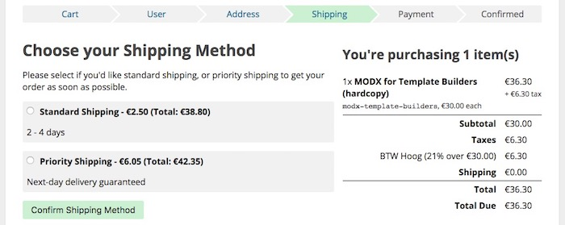
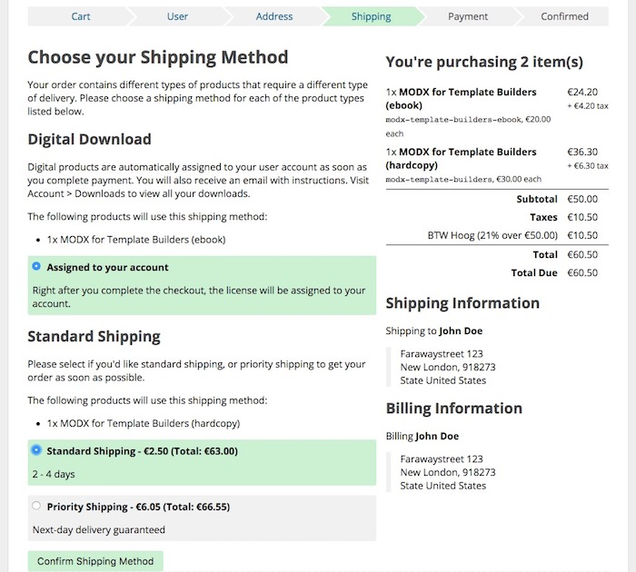

Delivery types were first added in v0.8 and are expected to be extended during the Commerce beta.

[TOC]

## What are Delivery Types?
Delivery Types are used in both [Shipping Methods](Shipping_Methods) and [Products](Products) to determine what shipping methods are available for an order containing certain products. 

During the checkout, Commerce automatically creates one or more [Order Shipments](Orders/Shipments) to group the purchased products by the delivery type the products are configured to use.

For example, if you have a book "MODX for template builders", you might assign it to a delivery type called "Standard Shipping". When you also sell the ebook version, you might assign that to a delivery type "Instant Download". 

If a customer buys just one, for example the hardcover book, they are asked to select a shipping method for just one shipment, like in the following example. The description shown below the header comes from the delivery type's checkout description, allowing you to customise the message depending on the products ordered.

Should someone purchase both the regular book, and the ebook, Commerce automatically creates 2 order shipments: one for the Standard Shipping delivery type, and one for the Instant Download delivery type. 

For each of these shipments, the customer will be asked to choose a shipping method. To help them choose the right one, an extra message is shown, and the page is divided by headers with the delivery type name. The _Checkout Description_ on each delivery type is also shown.

The different products the delivery types apply to are also shown, and of course the applicable shipping methods.

## Setting up Delivery Types

Delivery types are managed in the Commerce dashboard under Configuration > Delivery Types. New types can be added, and existing ones can be edited and deleted (soft delete).

## Custom Delivery Types

Aside from creating custom instances, it's also possible to extend the `comDeliveryType` class with a derivative to add more custom logic, however currently (v0.8), that is not yet very useful. Later in the Commerce beta, we will be adding more functionality to the delivery types to allow automatic delivery of digital goods like ebooks and other integrations.

## Connecting Shipping Methods and Delivery Types

To connect shipping methods to a delivery type, go to Configuration > Shipping Methods and edit (or add) a shipping method. Right at the top is the dropdown to select from configured delivery types. Choose one, and save. 

Note that if you only have a single delivery type configured, that the dropdown will not appear. Instead it will be set to the single delivery type you have configured.

## Connecting Products and Delivery Types

To connect products to a delivery type, find the product in the Products tab of the component and click Edit Product in the Actions menu. Or, if you use the Products TV, click on Edit Product in the product list.

On products the delivery type dropdown is near the bottom of the form.

Note that if you only have a single delivery type configured, that the dropdown will not appear. Instead it will be set to the single delivery type you have configured.