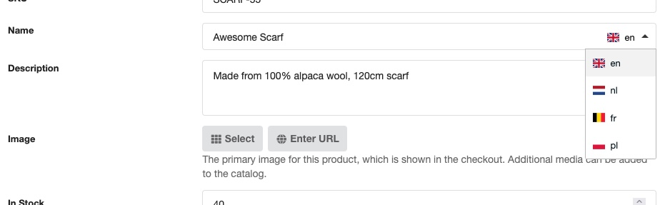

Commerce has various ways of internationalising content in your multilingual shop.

This assumes you'll use either contexts with Babel (one context per language, product records being shared across languages through connected TVs), or a solution like Lingua to manage multilingual content on single resources with dynamic switching.

Most importantly, the **cultureKey** is determined by something outside of Commerce.

For data in Commerce that is translated, you'll find language switches embedded in the translatable fields, like so:



[TOC]

## Supported multilingual options


The Commerce dashboard and front-end (cart, checkout, etc) are translated through lexicons into various languages. [You can see the status and help translating on CrowdIn](https://crowdin.com/project/modmore-commerce). If you want to make changes to these translations specific to your site, you can do so via System > Lexicon Management and selecting the commerce namespace.

Commerce also provides a translated list of country names out of the box, based on the `locale` system setting. The list of countries can be accessed programmatically through the Countries service and is automatically made available in the checkout and back-end forms that have a country selector.

The following types of content can be translated within Commerce as of v1.3:

- Product name and description, for all product types **except resource products**
- Delivery type name and checkout description
- Payment method name, description, and email note
- Shipping method name, description, and email note
- Tax group name
- The name of the manual tax rule

This list may not be exhaustive. Modules and extensions may also incorporate the multilingual capabilities; please refer to their respective documentation for details.

If you'd like us to enable translations for any other fields, please email support.

## Getting started

To enable multilingual support, you need to:

- Set the primary language in the `commerce.primary_lang` system setting. This can be set to a single language (culture) key like `nl` or `fr`, or a compound string where the first key is the language and the second key is the flag icon to show, e.g. `en:gb` versus `en:us`.
- Add any additional languages you want to support as a comma-separated string to the `commerce.translation_langs` system setting. This can also be a single culture key, or compound string to specify the flag separately.

For example, if `en:gb` is my primary language, I might add `nl,fr:be,pl` to the `commerce_translation_langs` setting, and end up with the example as shown at the start of the page with 4 languages to choose from.

Selecting a language from the dropdown will immediately update the language across all translatable fields in the form.

## Accessing translations

In almost all cases, you should find that the translatable fields (e.g. a product name) is automatically shown in the currently active language, based on the configured/dynamically switched `cultureKey` setting. Commerce automatically overrides translatable fields with their currently set language for easiest implementation.

If you do need some finer control, or perhaps use a client-side language switcher that does not affect the `cultureKey`, available translations are available as well in most cases. These are added dynamically to the output using the format `{translated-field-name}_{language-key}`, for example `name_fr` or `description_en`.

> Note the difference here between the LANGUAGE and FLAG keys. The LANGUAGE keys are the first in a compound setting configuration, for example if you configure `en:us`, the language is `en` while the flag icon used is `us`.

For example when listing products with the commerce.get_products snippet, you can use something like this in the chunk:

```
EN: [[+name_en:default=`[[+name]]`:htmlent]]
<br>
NL: [[+name_nl:default=`[[+name]]`:htmlent]]
```

We're making sure to fall back to the standard `[[+name]]` just in case the product has not been edited with the translations active. The `:htmlent` output modifier is just a standard security practice to avoid manager-entered content containing code or XSS attacks.

## Accessing translations programmatically

If you're working with products or other translatable objects in code, take note of the following utilities provided to you. What they do is largely self-explanatory, but see [the developer documentation for more information](Developer/I18n).

Keep in mind:

- The object you're working with **must be saved** before using these methods
- Translations **must be active** (with both a primary and additional languages set); if translations are not active, retrieving data will either be empty or the standard non-translated value, **and setting data will fail silently**

```php
$lang = 'en';
$name = $product->getTranslation('name');
$product->setTranslation('name', $lang, 'Awesome Scarf');

$includePrimary = true;
$array = $product->getTranslations('name', $includePrimary);
// [ ['lang' => 'translation'] ]
```

## Accessing product values on order items

One special case is the order item.

The `name` and `description` value on a product will contain the **translated value at the time it was added to the cart**.

The `name_primary` and `description_primary` **MAY** contain the **value in the primary language**, however **this is not guaranteed** and should always fall back to the `name`/`description`. The reason this is not guaranteed is that there are many ways an order item may be created; some of those ways may not support multiple languages or were created before Commerce 1.3.

We decided not to make the cart update the order item names and descriptions if the language is changed in the cart or checkout, as that would add significant performance considerations and complexity.

## Raw translation data

For values **that have a translation or have been edited since multiple languages were enabled**, a record is added to the `commerce_i18n` database table for each language.

We're planning to add tooling to export and import translations in a future update.


