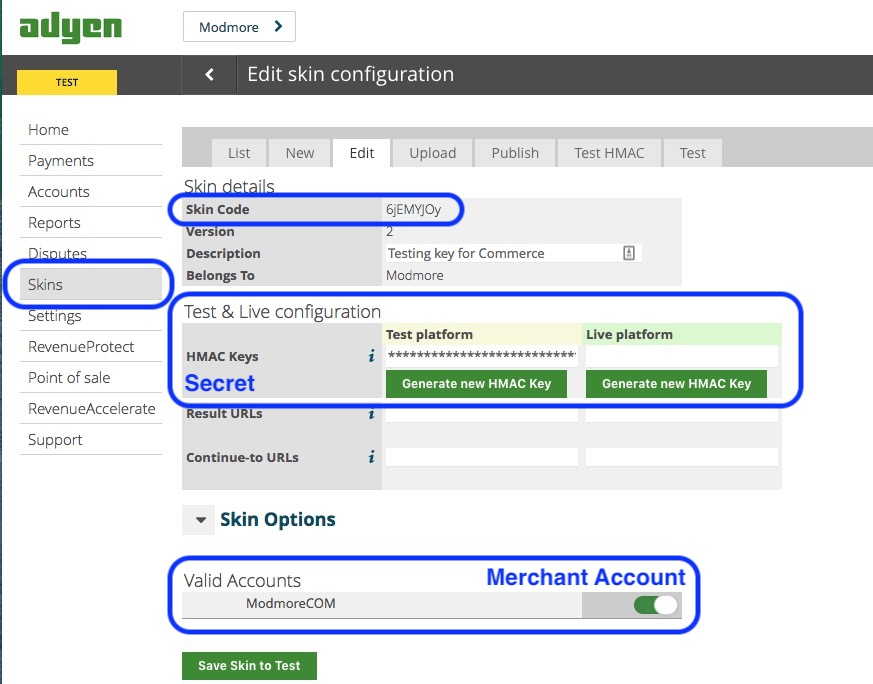

The Adyen (HPP) payment gateway ships with [Gateway Pack 1](../Modules/Payments/GatewayPack1) and offers the hosted payment page checkout option for [Adyen](https://www.adyen.com). Adyen offers tons of different payment options, including lots of local or regional options.

The gateway integrates with the hosted payment page offered by Adyen, allowing you to use any of their payment options from a single integration. For styling of those pages, you can configure _Skins_ in the adyen dashboard.

[TOC]

## Creating the Payment Method

First make sure you have [Gateway Pack 1](../Modules/Payments/GatewayPack1) installed. This is a free package available from modmore.com. After installation, to to Configuration > Modules in the Commerce dashboard, and enable the GatewayPack1 module.

Next, navigate to Configuration > Payment Methods. Click the Add a Payment Method button and choose Adyen in the Gateway dropdown. Fill in the other fields and save. 

After having saved the payment method, you'll get access to the Gateway Options for Adyen. These are:

- Merchant Account
- Secret
- Skin Code

The value for each of these options can be found in the Adyen dashboard under Skins, when editing the skin you'd like to use. 

## Locating your Credentials

Use the HMAC key (secret) for the mode you're trying to use. The Result URL and Continue-to URL will be set per-transaction by Commerce so you can leave those empty in your Skin configuration.

You'll likely need to create two payment methods; one for testing using your test credentials, and one for live with the live credentials. Set the availability appropriately.

