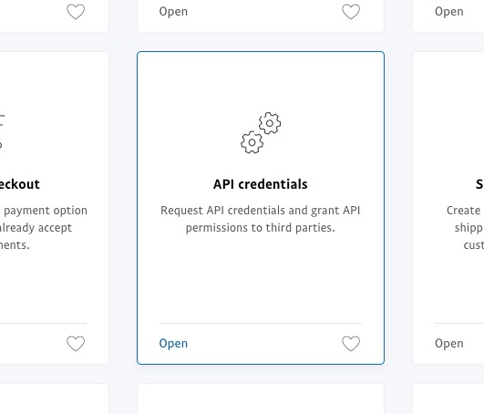

The [PayPal](https://www.paypal.com/) integration offers off-site payments with a Credit Card, or a PayPal account. Customers are redirected to PayPal to complete their payment. 

## Creating a PayPal Payment Method

See [Payment Methods](../Payment_Methods) for the basics of creating a payment method.

For PayPal, you'll need to configure:

- Username
- Password
- Signature
- Test Mode

## Live API Keys

To get your Live API Keys, login to the PayPal dashboard. Go to Tools > All Tools in the top menu, and find **API Credentials** in the list.

On the page, find the **NVP/SOAP API integration (Classic)** item under Custom checkout experience and click **Manage API credentials**. 

Generate the API Signature and copy the username, password, and signature into the payment method.

## Sandbox API Keys

Login to the [PayPal Developer Site](https://developer.paypal.com/developer/accounts/), and browse to Sandbox > Accounts. Create a new account with type Business (Merchant Account). In the list of accounts, expand the merchant account and click on Profile. In the modal window, you can find the Username, Password and Signature on the API Credentials tab.

