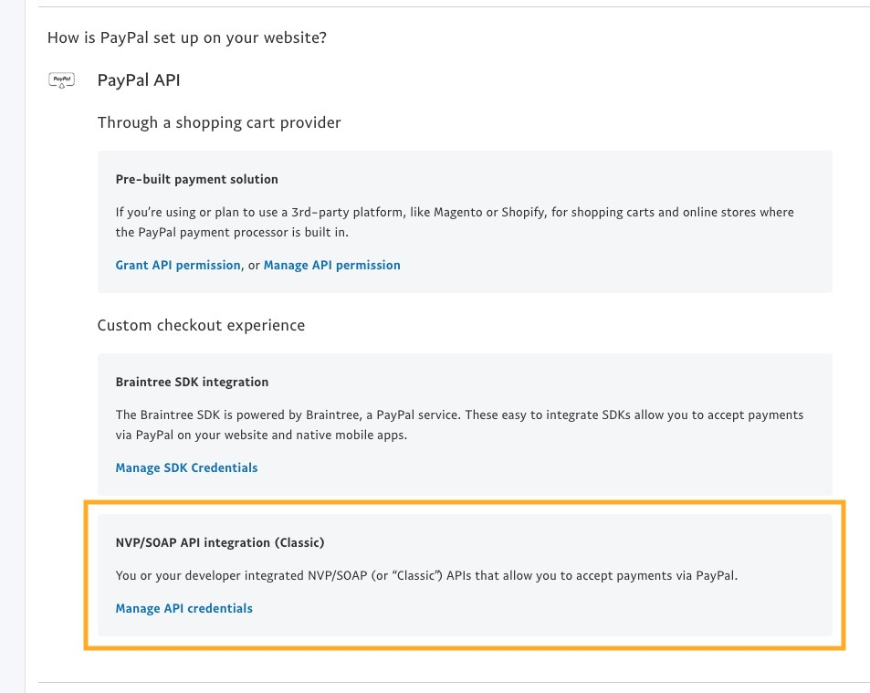

The [PayPal](https://www.paypal.com/) integration offers off-site payments with a Credit Card, or a PayPal account. Customers are redirected to PayPal to complete their payment. 

## Creating a PayPal Payment Method

See [Payment Methods](../Payment_Methods) for the basics of creating a payment method.

For PayPal, you'll need to configure:

- Username
- Password
- Signature
- Test Mode

## Live API Keys

> Note: PayPal tends to shuffle around their menus from time to time. [Here's the official guidance for creating the relevant credentials.](https://developer.paypal.com/docs/nvp-soap-api/apiCredentials/#api-signatures)

To get your Live API Keys, login to the PayPal dashboard. Hover your name in the top right and choose **Account Settings**. Under **Account Access** click on update for the **API Access** entry.

Find the **NVP/SOAP API integration (Classic)** item under Custom checkout experience and click **Manage API credentials**. 

Generate the API Signature and copy the username, password, and signature into the payment method.

## Sandbox API Keys

Login to the [PayPal Developer Site](https://developer.paypal.com/developer/accounts/), and browse to Sandbox > Accounts. 

Create a new account with type Business (Merchant Account). In the list of accounts, expand the merchant account and click on Profile. In the modal window, you can find the Username, Password and Signature on the API Credentials tab.

