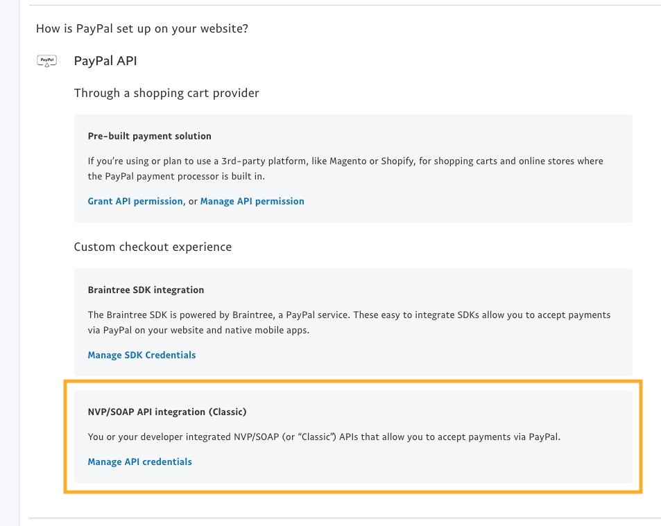

The [PayPal](https://www.paypal.com/) integration offers off-site payments with a Credit Card, or a PayPal account. Customers are redirected to PayPal to complete their payment.

There are two versions of the PayPal gateway available in Commerce:

1. **PayPal** (Recommended): This is the modern integration using the PayPal REST v2 API. It supports modern features like [authorizations and captures](#authorization-and-captures) and [payment tokens](#payment-tokens) (vaulting). **New PayPal accounts must use this version** as PayPal no longer issues the NVP/SOAP credentials required for the classic integration. **This integration was added in v1.11.0-rc2.**
2. **PayPal (Legacy)**: This uses the older NVP/SOAP API. It is maintained for legacy accounts that already have these credentials, but it does not support newer features and is not recommended for new setups.

## PayPal (REST)

This is the recommended integration for all users.

### Creating the Payment Method

See [Payment Methods](../Payment_Methods) for the basics of creating a payment method. Select **PayPal Checkout** as the gateway.

For PayPal Checkout, you'll need to configure:

- **Client ID**: The OAuth 2.0 Client ID for your PayPal REST App.
- **Client Secret**: The OAuth 2.0 Client Secret for your PayPal REST App.
- **Webhook ID**: (Optional but recommended) Used to verify webhook events from PayPal.
- **Shipping Preference**: Controls how PayPal handles shipping addresses (e.g. use the address from Commerce, or let the user choose in PayPal). Generally, use set_provided_address to pass what the user entered in checkout to PayPal.
- **Use Authorization**: Whether to use PayPal's authorization and capture flow. This places a hold on the customer's funds during checkout and allows you to capture the payment later from the Commerce dashboard.

Test vs live mode is controlled by the Commerce mode. This means you'll want to set up a Test PayPal payment method for testing in the sandbox, and a Live PayPal payment method for production.

### Getting API Keys

1. Log in to the [PayPal Developer Dashboard](https://developer.paypal.com/dashboard/applications).
2. Navigate to **Apps & Credentials**.
3. Ensure you are in the correct mode (**Sandbox** for testing, **Live** for production) at the top.
4. Click **Create App**.
5. Give your app a name, choose **Merchant** as type, and click **Create App**.
6. You will now see your **Client ID** and **Client Secret**. Copy these into the Commerce payment method settings. Save, and you should see if it succeeded to connect to your account.

In the sandbox, you will need to use [a sandbox account](https://developer.paypal.com/dashboard/accounts) for test payments.

### Webhooks

To receive updates from PayPal (for example, when a payment is captured or a dispute is opened), you should configure a Webhook. Commerce will work without it too – but it's advisable to set up in case customers have trouble returning to the checkout.

1. In your App settings on the PayPal Developer Dashboard, scroll down to the **Webhooks** section and click **Add Webhook**.
2. For the **Webhook URL**, copy the **Shared Notify URL** shown in the Commerce payment method configuration.
3. Select **All events** (or at least all Checkout and Order related events).
4. Save the webhook and copy the **Webhook ID** back into Commerce.

### Authorization and Captures

PayPal Checkout supports the [Authorization and Capture](../../11_Transactions/Authorizations) workflow. When enabled in the payment method settings:

- Commerce will only **Authorize** the payment during checkout. This places a hold on the customer's funds.
- You can later **Capture** the payment from the Commerce dashboard (e.g. when shipping the order).
- PayPal Checkout supports capturing any amount up to the authorized total.

- Note that only a single capture is supported per transaction; any capture sent is marked as the "final" capture to PayPal.

PayPal keeps a hold on the customer's funds for up to 29 days.

### Payment Tokens

PayPal Checkout supports [Payment Tokens](../../11_Transactions/Payment_Tokens). This allows customers to "Save their PayPal account for future use" and for recurring billing.

When a customer opts to save their account, Commerce securely stores a reference (vault ID) via PayPal's Vault. On future orders, the customer can select their saved PayPal account and complete the checkout without being redirected to PayPal for login again.

---

## PayPal (Legacy)

> **Warning:** Only use this if you have an existing PayPal account with NVP/SOAP credentials. PayPal is no longer giving out these credentials to new users.

### Creating the Payment Method

Select **PayPal (Legacy)** (not PayPal) as the gateway. You'll need to configure:

- Username
- Password
- Signature
- Test Mode

### Live API Keys

> Note: PayPal tends to shuffle around their menus from time to time. [Here's the official guidance for creating the relevant credentials.](https://developer.paypal.com/docs/nvp-soap-api/apiCredentials/#api-signatures)

To get your Live API Keys, login to the PayPal dashboard. Hover your name in the top right and choose **Account Settings**. Under **Account Access** click on update for the **API Access** entry.

Find the **NVP/SOAP API integration (Classic)** item under Custom checkout experience and click **Manage API credentials**.

Generate the API Signature and copy the username, password, and signature into the payment method.

### Sandbox API Keys

Login to the [PayPal Developer Site](https://developer.paypal.com/developer/accounts/), and browse to Sandbox > Accounts.

Create a new account with type Business (Merchant Account). In the list of accounts, expand the merchant account and click on Profile. In the modal window, you can find the Username, Password and Signature on the API Credentials tab.

