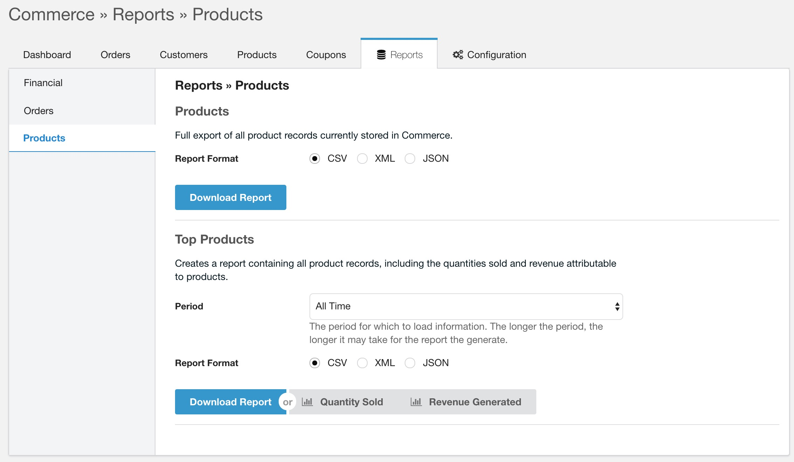

Reports and exports offer you a variety of views into your shop. There are a number of reports included in the Commerce core, and additional reports may be installed or enabled through modules.

All reports offer tabular data (a set of headers with rows), which can be downloaded in a number of formats:

- CSV: comma separated flat text file, useful for importing into Excel or Numbers. Array values within a field are encoded as JSON. 
- XML: simple XML with a `<data>` root node, and each row within an `<item>` element with the key value pairs.
- JSON: encoded javascript array containing objects with the key value pairs. 

Reports may also offer a set of options, such as a time period or type of data to load, as well as charts that can be generated. This is all offered through a simple interface in the merchant dashboard.

## Table of Contents

[TOC]

## Available Reports

Reports are grouped into categories. Some reports need a module to be installed and enabled for their reports to show up.

### Discounts Reports

The **Coupon Codes** report is only available if the [Coupons module](Modules/Cart/Coupons) is enabled. It will export a list of coupon codes, created in a certain timeframe, including how often they were used to date.

### Financial Reports

The **Daily Sales** report summarises the daily shop revenue over a period of time. The report allows selecting a period for which to load the data, varying from 24 hours to 1 year, or all sales. The Sales report offers a Sales Chart, which is a line chart showing the sales data.

The **Taxes Collected** report will create an export containing all individual order item tax records (i.e. the tax charged on each individual order item). 

The **Transactions** report creates an export with all transactions during a certain timeframe.

### Order Reports

The **Orders** report acts as a full export of order metadata. It's possible to limit this to a particular order type. The export does not include order items or used addresses, only the order totals. 

The **Addresses** report is shown if the [Customers module](Modules/Admin/Customers) is enabled. It will create an export of all customer addresses in the system. This will include addresses used by guest checkout, as well as addresses attached to registered customers. 

### Product Reports

The **Products** report creates a full export of product information in Commerce. This does not include your catalog, just the product records. 

The **Top Products** report summarises quantities sold and revenue attributed to specific products. This report does not include the full product information. The report has 2 bar charts, one which displays the total quantity sold for a product and another that shows the gross revenue for the product. 

