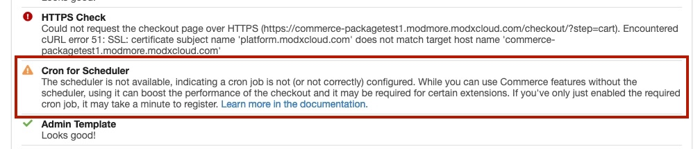
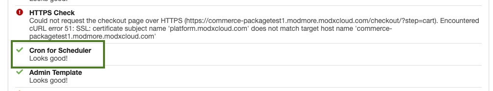

As of Commerce v1.3 a built-in scheduler can be used to process background or asynchronous tasks. The standard scheduler runs with a cron-job, which requires one-time configuration on the server.

The scheduler can support a few distinct use cases:

1. One-time tasks to execute asynchronously (e.g. "send this email at the first opportunity")
2. One-time tasks to execute at a specific time later (e.g. "send a reminder email in two days")
3. Recurring tasks that happen on a fixed schedule (e.g. "import product data at 1am every night")

The scheduler is used for, among other things:

- Sending emails asynchronously so the order processing isn't delayed; note that this needs to be enabled on the email messages in your status workflow.
- Automatically plan the [TimeSlots schedule](../50_Modules/TimeSlots) nightly

Modules can also hook into it for

[TOC]

## Installation

The scheduler ships with Commerce v1.3+, but does need to be enabled on the server level through a cron job that runs **every minute**.

For example (replacing `/path/to/core/` with the actual path to your core directory):

````
* * * * * php /path/to/core/components/commerce/cron.php
````

Most servers will offer a visual interface for setting up cron jobs (e.g. in cPanel or DirectAdmin). In those cases, set the schedule to every minute (`* * * * *`) and the command to `php /path/to/core/components/commerce/cron.php`.

On servers that don't offer a visual interface to manage cron jobs (including MODX Cloud), connect to the server via SSH and use `crontab -e` to `e`dit the cronjob for the user, and add a new line with the above. If you're not sure how to manage the cron jobs on your server, please contact your host or server admin.

To make sure it's set up correctly, wait a minute, and then go to Commerce > Configuration.

If it shows a warning, like in the screenshot below, it doesn't seem to be correct just yet.



If it is executing correctly, you'll instead get a checkmark:



Internally, we check the `core/components/commerce/.crontime` file to see if the cron job is working; every call to the cron job will update that file with a new timestamp. If you're sure the cron job is working but it's not showing up as such, check that PHP has permission to write to that file/location.

## Inspecting task execution

In Commerce > Configuration > Scheduled Tasks you can find a list of tasks.

The first table, Scheduled Tasks, shows active recurring tasks. Any module that runs nightly, for example, will show up in the first table.

The second table, Task Log, will show only _failed_ recurring tasks, and any individually scheduled tasks.

[Learn more about the task logs here](Log.md).

## Deleting old tasks

By default, Commerce will delete any completed and failed task records after 90 days. If you wish to change that, change the `commerce.scheduler_delete_tasks_before` system setting to a string that [strtotime](https://www.php.net/manual/en/function.strtotime.php) understands. For example `30 days ago`.

The old task deletion is invoked every 30 minutes automatically.

## Scheduling tasks

Scheduling tasks is easy to do from within modules or custom code.

There are 2 ways of going about scheduling a task.

1. To run a task at a fixed schedule (every X minutes, nightly, etc), use the `$scheduler->repeat()` method.
2. To run a task that only runs once, whether that needs to run at the first opportunity or at a specific date/time in the future, use $sche ASAP or

Regardless of approach, access the Scheduler class with Commerce::scheduler(). For example in a module or model class:

````php
$scheduler = $this->commerce->scheduler();
````

Or in a snippet:

````php
$path = $modx->getOption('commerce.core_path', null, MODX_CORE_PATH . 'components/commerce/') . 'model/commerce/';
$params = ['mode' => $modx->getOption('commerce.mode')];
/** @var Commerce|null $commerce */
$commerce = $modx->getService('commerce', 'Commerce', $path, $params);
if (!($commerce instanceof Commerce)) {
    return 'Error loading Commerce.';
}

if ($commerce->isDisabled()) {
    return $commerce->adapter->lexicon('commerce.mode.disabled.message');
}

$scheduler = $commerce->scheduler();
````

Once you have the scheduler instance, you can trigger tasks.

### Repeating tasks on a certain interval

Typically done in the `initialize()` method of a module. Useful for when you need to do stuff on a fixed schedule.

````php
$scheduler->repeat(static callable, interval instance);
````

The `static callable` must be a function or method you want to run. **This MUST be a static function/method!** The PHP instance that calls the callable may not have your existing state. For example, provide `[MyClass,myMethod]` or `MyClass::myMethod` instead of `[$this, myMethod]`.

The callable must accept the following signature:

````php
function (Commerce $commerce, array $data = [])
````

The interval is defined as an instance of `modmore\Commerce\Services\Scheduler\Interfaces\IntervalInterface`. For convenience, a number of static methods are provided for common use cases:

````php
$scheduler->repeat('MyModule::nightlyAt1am', \modmore\Commerce\Services\Scheduler\Interval::daily(1, 00));
$scheduler->repeat('MyModule::everyHourAt35Past', \modmore\Commerce\Services\Scheduler\Interval::hourly(35));
$scheduler->repeat('MyModule::firstOfMonth1120', \modmore\Commerce\Services\Scheduler\Interval::monthly(1, 11, 20));
$scheduler->repeat('MyModule::tuesday8pm', \modmore\Commerce\Services\Scheduler\Interval::weekly(2, 8, 00));
````

Alternatively, you can create an Interval object directly. This mimics cron definitions.

````php
$interval = new \modmore\Commerce\Services\Scheduler\Interval(
    $minute = '*',
    $hour = '*',
    $dayOfMonth = '*',
    $month = '*',
    $dayOfWeek = '*'
);
$scheduler->repeat('MyModule::custom', $interval);
````

Repeating tasks do not take task-specific data. If needed, use system settings or multiple calls to `repeat()` to schedule "variations" of tasks.

#### Custom IntervalInterface implementations

If you have a particularly specific interval in mind, create your own instance of the `modmore\Commerce\Services\Scheduler\Interfaces\IntervalInterface` interface instead.

You'll need to define 2 methods: one that returns a boolean indicating if the current time requires it to run, and one that returns null or a DateTimeImmutable for when it is next expected to run.

Here's a hypothetical example that only runs in the minute the moon reaches full phase.

````php
<?php
// composer require solaris/php-moon-phase
class FullMoonInterval implements modmore\Commerce\Services\Scheduler\Interfaces\IntervalInterface
{
    /**
     * @param DateTimeImmutable $now
     * @return bool
     */
    public function shouldRun(DateTimeImmutable $now)
    {
        $nowUnix = $now->getTimestamp();
        $moonPhase = new Solaris\Moonphase($now);
        $fullMoon = $moonPhase->getPhaseFullMoon();

        // True when in the 60-second window it is the full moon
        return $nowUnix >= $fullMoon &&
            (($nowUnix + 60) < $fullMoon);
    }

    /**
     * @return DateTimeImmutable|null
     */
    public function getNextRunDate() : ?DateTimeImmutable
    {
        $moonPhase = new Solaris\Moonphase($now);
        $next = $moonPhase->getPhaseNextFullMoon();
        return new DateTimeImmutable('@' . $next);
    }
}
````

And then provide an instance of the interval to the repeat() method:

````php
$scheduler->repeat('MyModule::fullMoonAlert', new FullMoonInterval());
````

As the shouldRun() method will be executed every minute, it's advisable to **not** rely on third party APIs or such things in a shouldRun() method. If you rely on a third party, consider implementing a webhook-style solution where you get a ping from the third party which sets the value of a file, and only read that file in shouldRun().

### Repeating a single task

To run a single task exactly once, use the run() method:

````php
Scheduler::run(callable $callback, array $data = [], DateTimeImmutable $at = null): void;
````

For example, providing again a static callable, some optional data, and an immutable DateTime object that tells it to run in 5 minutes from now:

````php
$scheduler->run(
    'MyModule::doThing',
    [
        'id' => 1234,
    ],
    new DateTimeImmutable('@'. strtotime('+5 minutes'))
);
````

If you want it to run at the first possible opportunity, leave off the date 3rd property entirely.

### Ensuring the scheduler is available

At the moment, we don't have a hard requirement for the scheduler in Commerce, so it may not be available on some servers.

