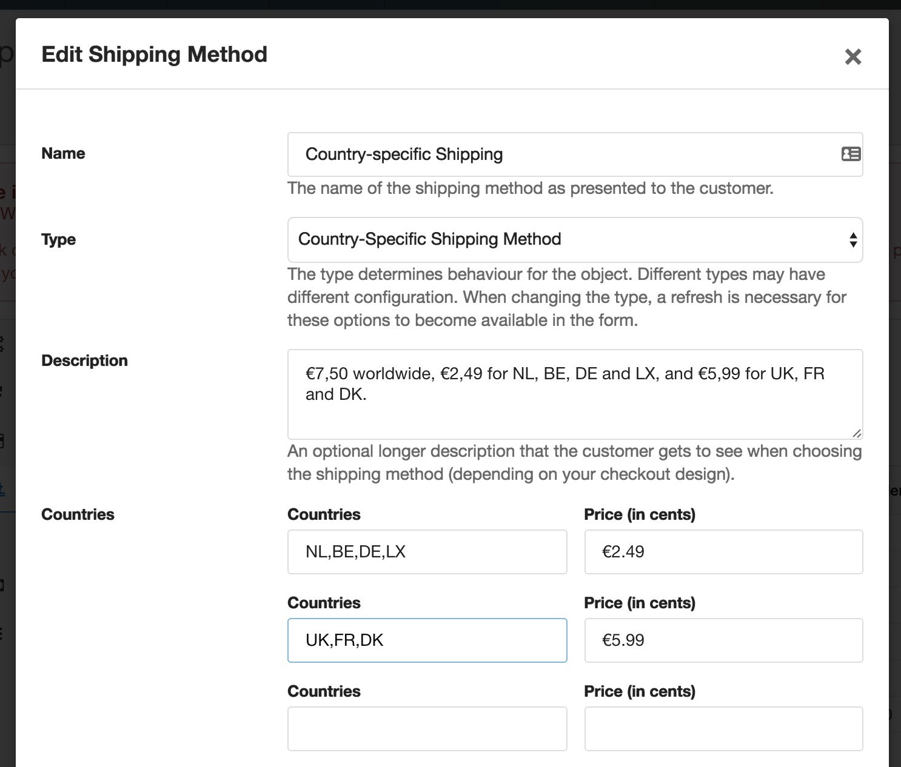
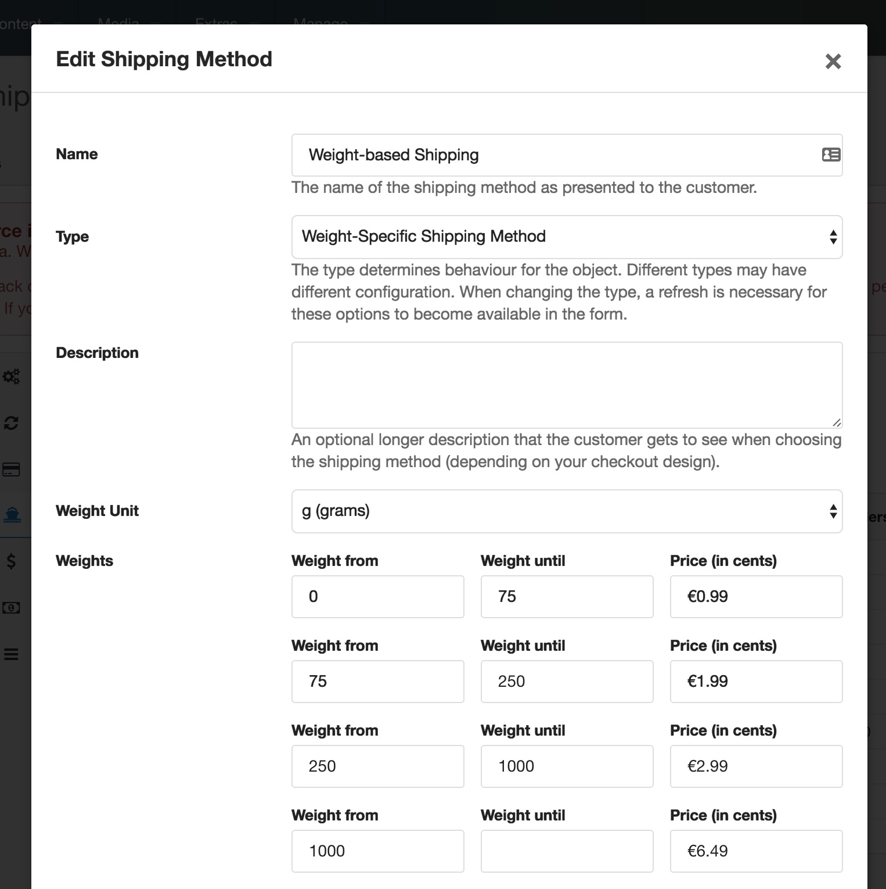

Shipping Methods are configured through the merchant dashboard, under Configuration > Shipping Methods. 

Each shipping method can be configured to be available on specific order totals by specifying minimum or maximum totals. For example you might charge a small shipping fee until an order total of €20, and offer free shipping after that. Or perhaps you want to provide insured or expedited shipping options over €100. 

All shipping methods can also be enabled only for specific countries, by providing a comma separated list of allowed country codes when editing the shipping method.

## Standard Shipping Method

The standard shipping method defines costs as either a fixed price in cents, a percentage of the order total, or both. 

## Country-Specific Shipping Method

For shops that sell internationally, the country-based shipping method will allow you to set fixed shipping prices for specific countries. Specify comma-separated country codes for each row. 

When creating a country-based shipping method (`comShippingMethodByCountry`), you can specify as many countries as you'd like. There are always 5 empty rows, if you need more just save the shipping method and it will add another 5 empty rows.

## Weight-Specific Shipping Method

The weight-specific shipping method calculates the total order weight. This relies on the products defining their weight and the relevant weight unit to allow for automatic conversions. 

The shipping method defines its own weight unit which is used in the conversion and for matching the specified weight brackets.
 

## TableRates Shipping Method

Installable as a separate (free) module, the [TableRates shipping method](Modules/Shipping/TableRates) allows you to manage more complex customer-location-plus-weight rules as CSV, inspired by the Magento feature with the same name.

## Custom Shipping Methods

If the provided shipping methods don't provide sufficient flexibility, for example if it has to be integrated with a shipping partner API, it's possible to develop custom shipping methods. [The developer documentation on this topic](Developer/Custom_Shipping_Methods) has instructions and example code. 
