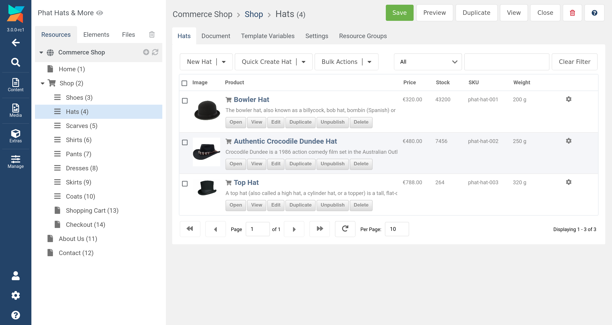
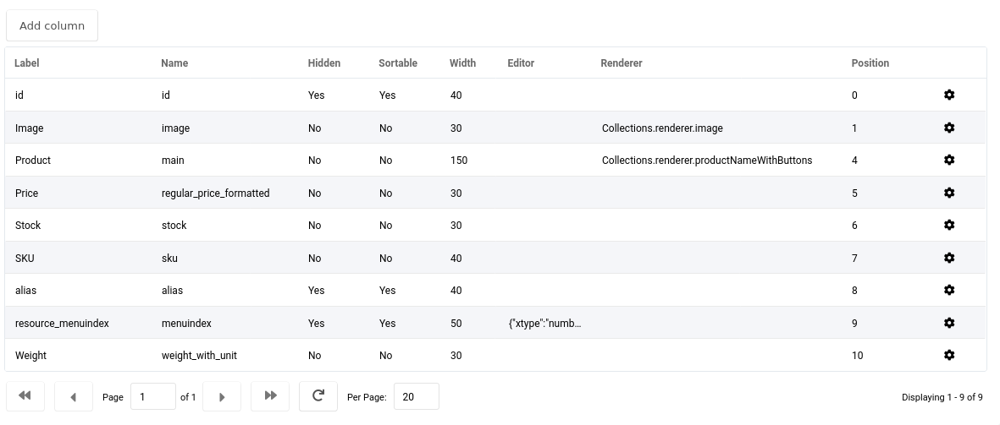
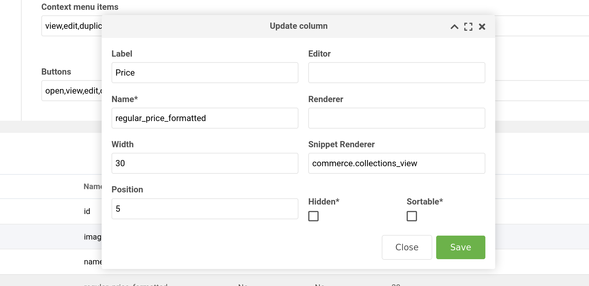
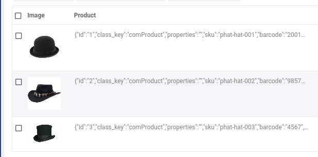
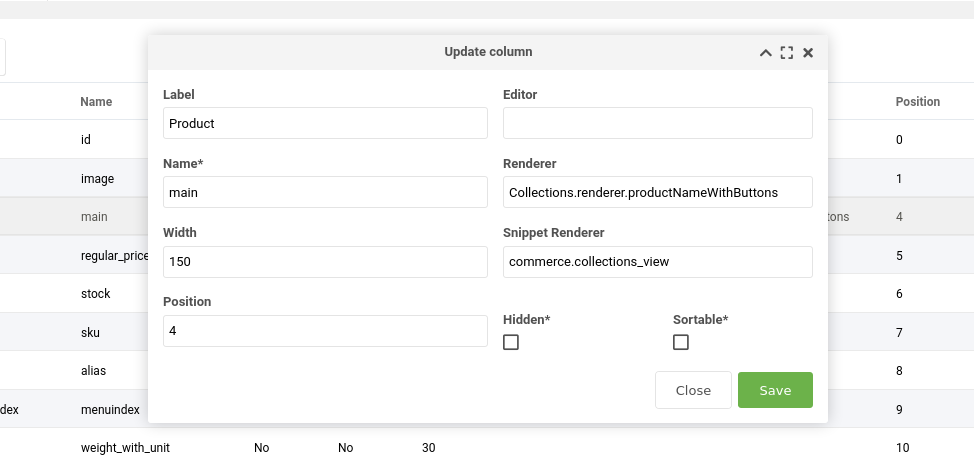

The `commerce.collections_view` snippet can be used as a Snippet Renderer with the popular MODX extra 
[Collections](https://docs.modx.com/3.x/en/extras/collections/index).

Collections allows for displaying resources in grids, rather than relying on the resource tree. In the Collections
configuration options, you can choose which resource fields to display on each row; this includes Template Variables.

Commerce has a handy [Product List TV](https://docs.modmore.com/en/Commerce/v1/Product_Catalog/Products_TV.html) which helps you link your products to resources. This snippet enables
displaying that product information in the TV on your collections grid.


_In the image above all the product information is coming directly from the product list TV rather than resource fields!
We've also built a custom renderer for the product name and description with the buttons... more on that down below._

Added in v1.3

[TOC]

##Usage

The `commerce.collections_view` snippet is not used in the regular way, in a template or chunk. It's instead
used when setting up columns on the _Collection Views_ manager page. 

Once on the Collection Views manager page `MODX -> Extras -> Collection Views`, select the view you want to edit from the grid
(you might have one called products for instance), and then scroll down to the bottom section where there's a grid 
that lets you edit the various columns that will be displayed.


_In this image you can see all the columns we're using for the grid above!_

Either press the _Add Column_ button, or edit one of the existing ones. Once the window has opened,
have a look for the **Snippet Renderer** field. This is where we type in the name of our snippet 
`commerce.collections_view`that will get the value we need for this column.



The **Name** field is the other important field on this screen. The product value the snippet returns
depends on what you name this column. In the example above you can see we've named our column 
`regular_price_formatted`.

You can find a list of available names in the next section.

##Column Names

The following names can be used as column names:

- `name`
- `product_name`
- `description`
- `product_description`
- `image`
- `price`
- `price_rendered`
- `regular_price_formatted`
- `sku`
- `stock`
- `stock_infinite`
- `stock_unlimited`
- `weight`
- `weight_unit`
- `weight_with_unit`

The above names can be used with the Collections [inbuilt Renderers](https://docs.modx.com/3.x/en/extras/collections/index#renderers).
For example, with the column name **image**, you would want to render it by using **_Collections.renderer.image_**
in the _Renderer_ field (not the Snippet Renderer field!).

NOTE: You can also use any other column name you like while using the `commerce.collections_view` snippet renderer. 
If it's not one of the names specified above, then all the product fields will be returned together as JSON.

Look at the Product column in this image:



To be able to use this output in a meaningful way, we need to create our own custom Collections renderer to display
exactly what we want, how we want.

We'll discuss how to use this below in the advanced section.

##Settings

By default, the snippet will look for a product list TV called **_products_**, but that can be changed in
the `commerce.collections_view_tv_name` system setting.

##Advanced - Customization

Collections allows developers to add their own [custom JavaScript renderers](https://docs.modx.com/3.x/en/extras/collections/index#custom-renderers)
to display columns however they like.

In this example, in our _assets_ directory, we'll create a file called `custom.js` and one called `custom.css`.
Now go to the Collections system settings and set the following:
- collections.user_css : `{assets_url}custom.css`
- collections.user_js : `{assets_url}custom.js`

One of Collection's renderers is called `Collections.renderer.pagetitleWithButtons` and it's applied by default on install. 
We decided we'd like to have the product name rather than the resource title and also include the 
product description as well. 

So we're going to copy it and modify it slightly to do so. And at least for this example, we'll use `main` as the 
column name. As mentioned above in the Usage section, if we use any column name other than the ones listed above,
all the product fields are returned together as a JSON string. This is good for our purposes, because we want 
access to both the product name, and the product description in the same column for this.

In your `custom.js` file, add the following:
```js
var productNameWithButtons = new Ext.XTemplate('<tpl for=".">'
    +'<div class="collections-title-column">'
        +'<span class="collections-children-icon x-tree-node-collapsed"><i class="{icons}"></i></span><h3 class="main-column buttons"><a href="{[ parent.self.getEditChildUrl(parent) ]}" title="Edit {pagetitle}">{name}</a></h3>'
        +'<span class="collections-commerce-desc">{description}</span>'
        +'<ul class="actions">'
            +'<tpl for="actions">'
                +'<tpl if="values.urlFunction">'
                    +'<li><a href="{[ parent.self[values.urlFunction](parent) ]}" class="{className}">{text}</a></li>'
                +'</tpl>'
                +'<tpl if="!values.urlFunction">'
                    +'<li><a href="javascript:void(0);" class="controlBtn {className}">{text}</a></li>'
                +'</tpl>'
            +'</tpl>'
        +'</ul>'
    +'</div></tpl>',{
    compiled: true
});
Collections.renderer.productNameWithButtons = function(value, metaData, record, rowIndex, colIndex, store) {
    var data = JSON.parse(JSON.stringify(record.data));
    var val = JSON.parse(value);
    data.name = val['name'];
    data.description = val['description'];
    data.self = this;
    return productNameWithButtons.apply(data);
};
```
You might be able to see that this renderer is almost the same as the regular Collections renderer `Collections.renderer.pagetitleWithButtons`.


We also want to change the styling slightly to make room for the product description. In your custom.css file, put this:
```css
.collections-title-column {
    min-height: 70px;
}
.collections-grid h3.main-column.buttons {
    height: inherit !important;
}
.collections-grid .collections-commerce-desc {
    height: 30px;
}

```

You can see we've changed the name to `Collections.renderer.productNameWithButtons`. So that is the name you would 
put in the column _Renderer_ field.


_Take note of the Name, Renderer and Snippet Renderer columns._

The final result is in the original image at the top of this page. We have all the buttons as normal,
but now we also have the product name and description included rather than the resource pagetitle.