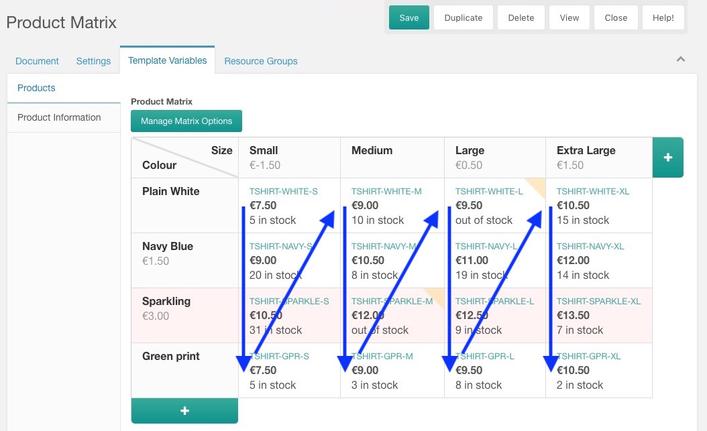
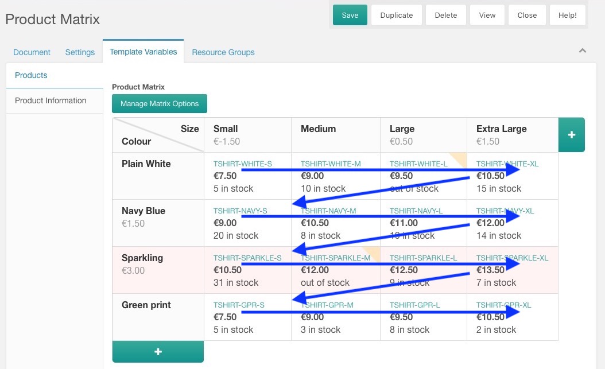

The `commerce.get_matrix_first_product` snippet is used to fetch the first product inside a [product matrix](../Product_Catalog/Product_Matrix). 

Alternatively:

- Use [commerce.get_matrix](get_matrix) for outputting the full range of products your matrix contains. 
- Use [commerce.get_matrix_price](get_matrix_price) if you want to return the price (range) of products in your matrix.

Retrieving the first product is something you usually do for a product listing on a category page, so you can display product information for a "default" product before a selection was made. 

Added in 0.12.0-pl.

## Usage

```` html
[[!commerce.get_matrix_first_product? 
    &matrix=`123`
]]
````

Replace 123 with the ID of the matrix, stored in the TV value. Usually that's available as `[[*product_matrix]]` in a product page template:

```` html
[[!commerce.get_matrix_first_product? 
    &matrix=`[[*product_matrix]]`
]]
````

Or `[[+tv.product_matrix]]` in a chunk used for listing resources with getResources/pdoResources (Make sure you specified `&includeTVs`, and check the value for `&tvPrefix` if you don't get a value):

```` html
[[!commerce.get_matrix_first_product? 
    &matrix=`[[+tv.product_matrix]]`
]]
````

Get the image URL for the first product that both has an image and is in stock:

````html
[[!commerce.get_matrix_first_product?
    &matrix=`[[+tv.product_matrix]]`
    &withImage=`1`
    &withStock=`1`
    &field=`image`
]]
````

The snippet can be called cached or uncached. When you retrieve stock or pricing, using uncached is probably better. 

## Properties

- `&matrix`: the ID of the product matrix to load products from. 
- `&sort`: the way to sort products to determine what the first product is; see below
- `&toPlaceholders`: Prefix to set product information to placeholders; see below
- `&tpl`: Name of a chunk to return the output with; see below
- `&field`: Name of a product field to return; see below

## Returning information

Depending on which property you've provided to the snippet (`&toPlaceholders`, `&tpl` or `&field` in that order), the snippet will return the product information as follows:

1. `&toPlaceholders` will set placeholders with the prefix provided. For example ```&toPlaceholders=`product` ``` will set placeholders like `[[+product.sku]]`, `[[+product.price_formatted]]`, `[[+product.name]]` etc.
2. `&tpl` can be set to the name of a chunk. The product information (without prefix) will be parsed through that chunk. 
3. `&field` allows to immediately return a single product field. For example ```&field=`price_formatted` ``` to return just the formatted product price.
4. If none of the above are provided, all available product information is dumped to screen in a `<pre>` tag. Useful for debugging. 

## What is the "first" product?

The first product.. isn't that just the one in the top left? Not quite! When determining the first product, there are a number of factors that can exclude a product from potentially being the first:

- Rows or columns that are deactivated (shared orange-ish in the matrix) are skipped
- If you specify `&withStock`, only products where the stock is larger than 0 are included
- If you specify `&withImage`, only products with an image are included

So, what would be the first product when your top-left product does not meet those requirements? Specify the `&sort` property to determine that. It accepts 3 values, each described below. 

#### &sort = columns (default)

By default, products in the matrix are sorted by **column**, and then by row by default. Products in column 1 come before products in column 2. 

Put differently, the snippet starts in the top left, **works its way down** through the first column, and then checks the second column. Visualised, that looks like this:



#### &sort = rows

When you set `&sort` to `rows`, the order is flipped. Products in row 1 come before products in row 2. It still starts in the top left, but **moves to the right** before going to row 2. 



#### &sort = price

If you set `&sort` to `price`, the products are sorted **by the product price with the cheapest first**. 

If multiple products share the same price, which is fairly likely if you use the column/row base prices, the "columns" order (the default) is applied.   

