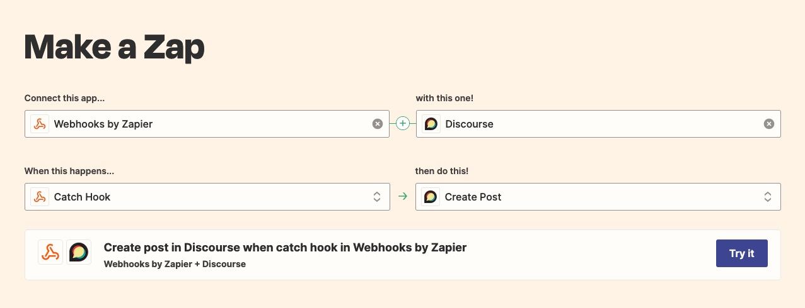
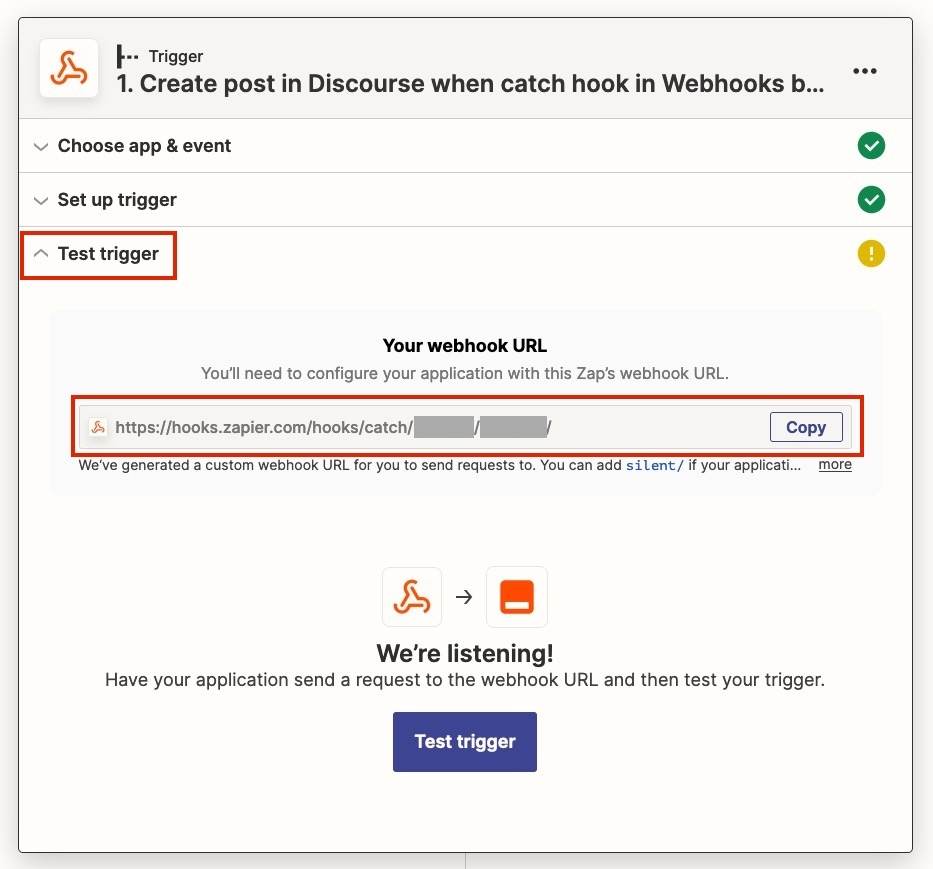

The Webhook Status Change Action can send a GET or POST request to any configured URL. This allows you to notify third party systems of a new order placed in Commerce (or on any other status change).

The Webhook action also works really well with [Zapier webhooks (requires paid plan)](https://help.zapier.com/hc/en-us/articles/8496288690317) to integrate with any of its 5000+ apps. If you're looking to push order data into a CRM, ERP, or other platform that Commerce does not natively integrate with yet, it's worth checking [if it is supported by Zapier](https://zapier.com/apps).

> The Webhook action was added in Commerce 1.3.

To create the webhook, go to Commerce > Configuration > Statuses and click on the name of the status change you want to run the webhook on (e.g. Payment received). Choose _Send Webhook_ in the overflow menu on the _Add Status Change Action_ button, and configure the options.

[TOC]

## Options

The following options are available when creating or updating a Webhook status change action.

- **Target URL**, a fully qualified HTTP(S) URL that you want to send a webhook request to. This URL has to be accessible from Commerce.
- **Request Method**, either `GET` or `POST`. Note that only `POST` webhooks will include the JSON body with order details. `GET` can still useful for simple implementations that only need to ping a third-party service that a new order arrived, for example.
- **Include order details** will add a JSON body to `POST` requests with the basic order details, including order ID, reference, totals, origin, etc.
- **Include order items**, **Include addresses**, **Include transactions**, and **Include shipping methods** allow you to add further information to the POST body. From a data protection standpoint, it is best to only select the information that the third-party service actually requires.
- **Send test request** allows you to choose one of your 10 most recent orders to send a webhook request for when saving the action.
- **Log webhook response** will log the response that the webhook received at the Target URL to your MODX log for debugging. If a non-200 response is received, an error is logged to the error log regardless of this option.

## Setting up with Zapier

Combining the webhooks in Commerce with Zapier makes for a very powerful combination. Zapier has integrations with over 5000 apps, and allows you to map inbound data to wherever it needs to go.

> The Webhooks feature of Zapier is a premium zap that requires a paid Zapier plan.

### Create the Zap

[Login to your Zapier dashboard](https://zapier.com/app/dashboard).

Under "Connect this app", search for `webhook` and choose the `Webhooks by Zapier` option.

For "with this one", search for the app you would like to send data to. For example, you could send the data to Slack, Email, Odoo CRM, etc. In the example, we chose Discourse.

For "When this happens", select "Catch Hook", and for "then do this", select what you would like to do on the receiving end. In our example we're creating a post on the Discourse forum.

Click the "Try it" button to continue.

In the new window, click on the Trigger to expand it, and open Test Trigger to find your webhook URL. Copy it.

### Create the Status Change Action

In Commerce, navigate to Commerce > Configuration > Statuses and click on the name of the status change you would like the webhook to be triggered by, for example _Payment received_. Choose _Send Webhook_ in the overflow menu on the _Add Status Change Action_ button.

In the window that opens, paste your Zapier webhook URL into the Target URL and set the Target Method to `POST`.

Check which data you would like to send to Zapier, and in the _Send test request_ dropdown select one of your recent orders to send a test request for.

Save the action, and return to Zapier.

### Test & configure further

After having sent a test request, click on _Test Trigger_. If all went well, the page will refresh and will now show you "request A" with all the data that was sent over.

You can repeat sending the test request from the status change action in Commerce as needed.

Click Continue.

The rest of the configuration is now up to you, and depends on what service you're sending the data to.

