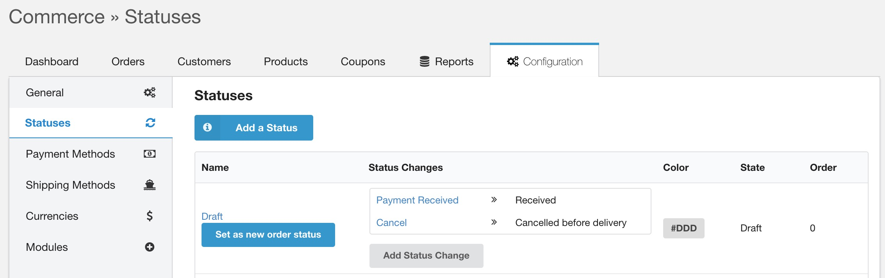
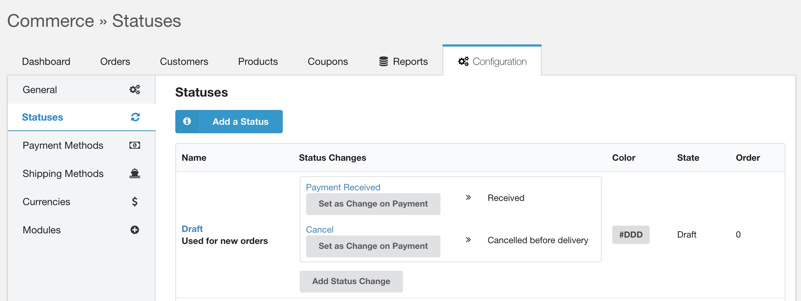
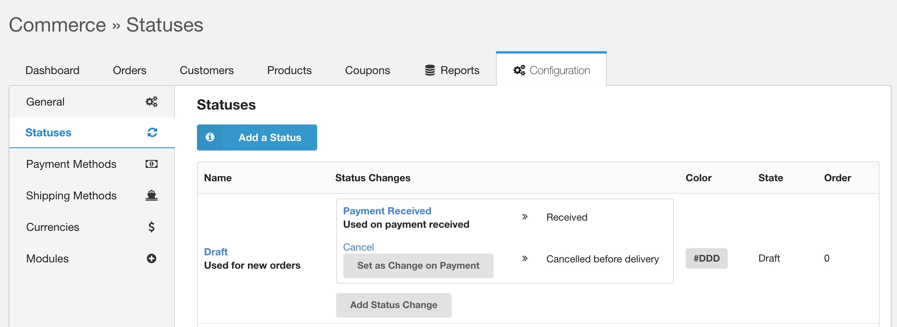

Commerce contains a very flexible system to allow custom status workflows. These are primarily meant to make the system match your business requirements for the fulfillment stage. Basically, everything between when a customer checks out and when the order is marked as completed in the back-end.

[TOC]

## Concepts

There are a couple of core concepts when it comes to the status workflow in Commerce.

1. **State**. The [order state](States) is hardcoded in Commerce and can be `draft`, `processing`, `completed` or `cancelled`. The state is linked to specific order code. The state is also how orders are grouped in the Orders section of the merchant dashboard.

2. **Status**. We do need to have the actual status, too. These are configured by the merchant. Each status is assigned to a specific state. Examples of statuses are _New Order_, _Collecting Items_ and _Completed_; but also more advanced use cases like _In backorder_ or _Awaiting return_ can be added. The statuses have a color and description to provide additional context and recognisability to the merchant. An order can only be in one status at a time.

3. **Status Change**. To control exactly how an order flows through the process, the status changes restrict movement from one status to the next. This can be configured as a simple linear flow ("New Order" => "Processing" => "Completed"), but also as a more complex flow with loops or reverting back to earlier or even the same status ("New Order" => "Processing" => "In backorder" => "Processing" => "Completed"). It is only possible to change an order from one status to the next if there is an appropriate Status Change configured; randomly jumping between statuses is not supported in Commerce.

4. **Status Change Action**. When a status change happens, it's not just a database field that is updated. Depending on your business requirements, a lot more can happen at that point. With Status Change Actions, which are tied to a specific Status Change, you can configure certain actions to be automatically processed when an order is pushed through a status change. The most obvious example would be sending a shipping confirmation email when an order status moves from "Awaiting pickup" to "Shipped" status. There are also more advanced use cases, such as triggering a synchronization action which will synchronize data with a CRM system.

## Managing Statuses

Statuses are managed in the merchant dashboard, under Configuration > Statuses. The statuses are sorted by their state (draft > processing > completed > cancelled), and then by the order defined on the status. 

For relevant technical information, please see [Orders](../Developer/Orders), [Modules](../Developer/Modules) and [Status Change Actions](../Developer/Status_Change_Actions) in the Developers Reference.

## New order handling

The status system also controls how new orders during the checkout are handled. There are two things that need to be configured for new orders to be handled properly: a new order status and a status change to fire when an order is paid. 

The **new order status** must be one that has its state set to draft. Available statuses will show a _Set as new order status_ button in the grid, like in the screenshot included below. Clicking it will, as expected, set the new order status to that status.

Once you've set a status as the new order status, the status will be shown in bold with a note that it is used for new orders. 

Any time a new order (which includes a cart) is created by a customer, it will have this status assigned to.

The Status Changes for that status will also start showing a _Set as Change on Payment_ button, as shown below. Clicking on that button will configure the status change to be executed when payment for an order is received. 

Once selected, the status change will be shown in bold and with a note that it is used when payment is received. 

The status change will be fired when the order is paid. This means you should probably set up the status change to send the customer an email confirmation of their order, as well as other status change actions you want to run when an order is received.
