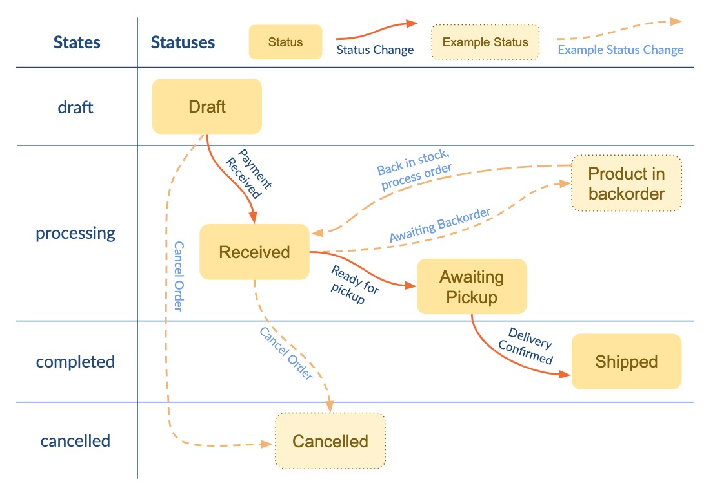

Commerce contains a very flexible system to power a custom status workflow.

This allows you to match business requirements, particularly around fulfillment of orders. When first installing Commerce, a very basic status workflow for physical products is created for you.

The status workflow is one of the more complicated aspects for first-time Commerce users. There is a lot of power and flexibility. If you find yourself getting stuck here, please do get in touch with support@modmore.com.

[TOC]

## In Brief

There are 4 primary concepts:

- **State** is a hard-coded category an order is in, which affects internal behavior and restrictions. For example the "draft" state allows an order to be changed in the cart by the customer, while "completed" is a read-only archive.
- **Status** is a merchant-defined category. Statuses don't affect internal behavior; they are primarily for the merchant to use and understand. A status is assigned to a state.
- **Status Change** is for changing an order from one status to another. It's not possible to select a status directly; instead the status change is selected.
- **Status Change Action** is an action that gets processed when a status change is executed. Sending an email is the most common action; but others are available.

These concepts together form the status workflow. 

## Diagram

It may help to visualise the workflow. In the diagram shown below, you can see the default status workflow (Draft, Received, Awaiting Pickup, and Shipped) and two example additional statuses (Product in backorder, Cancelled). 

Note how the statuses flow through the states, and what status changes are offered when an order is assigned a certain status. 

(For brevity, status change actions are not shown in the diagram. You can imagine that the "Payment Received" status change sends the customer and merchant an email, while "Ready for pickup" might interact with a shipping partner API to create a label or to schedule the pickup.)

## Deeper diving

Let's dive a little deeper into the different concepts. 

### States

States are hardcoded in Commerce. They are indicated by the internal class type for an order, and can't be changed. 

There are 4 states available:

- `draft` is used for orders that have not yet been formally placed. The customer is still checking out (or has abandoned the cart) and the order should not yet be processed by the merchant. From the `draft` state, an order can be moved into either `processing` or `cancelled` states. (Class: `comCartOrder`)
- `processing` is where an order is taken by the merchant and handled until it is complete. Most custom statuses will happen in this state. The order can no longer be changed by the customer, only by the merchant through the dashboard. From the `processing` state, an order can be moved to either `completed` or `cancelled`. Orders in the `processing` state are considered to be successfully received orders for reporting purposes. 
- `completed` is a read-only archive of completed orders. 
- `cancelled` is a read-only archive of orders that were not completed/successful.

It's not possible to transition from any state to any state. 

- From `draft` you can move to either `processing` or `cancelled` (notably that means you **cannot** move directly to `completed`). 
- From `processing` you can move to either `completed` or `cancelled`. 
- It's not possible to transition out of `completed` or `cancelled` states.

As far as reporting is concerned, all orders in the `processing` and `completed` states are considered successfully received orders. This is important to understand in the context of tax reports. Make sure to send orders which should not be included in such reports to the `cancelled` state. 

### Statuses

Statuses are merchant-configured through Extras > Commerce > Configuration > Statuses. Statuses are shown in the left-most column, followed by the associated status changes.

Each status is assigned to a specific state (draft, processing, completed, or cancelled).

The status can be given a color to make it easier to identify the status in the dashboard. In the orders dashboard you can also filter on status.

### Status Change

The Status Change is how an order flows from one status to the next. 

It's not possible to change the status on an order directly; there must always be a status change for it.

When using status changes to a different state, please be aware of the restrictions in how states can be transitioned, as detailed above in the States section. 

A status change is a temporary thing - an order does not stay in a certain status change, it only processes it and ends up in the new target status when that's done. 

### Status Change Action

To power up the status workflow, you can add Actions to a Status Change.

Status Change Actions perform _something_ when a status change is processing. 

For example, in a Payment Received status change, the Email action will send an email to the customer (and another to the merchant) to confirm their order was received successfully. 

Or, if you use a dedicated fulfillment partner or bookkeeping/invoicing solution, you may have a status change action that pushes the information received by Commerce to a third-party API.

Commerce ships with [send email](Email_Action), [create PDF invoice](Invoice_Action), and [trigger event](Event_Action) actions out of the box. 

Other actions are available in extensions, such as:

- [Printing order information or invoices on a physical printer with CloudPrint](https://modmore.com/commerce/extensions/cloudprint/)
- [Sending SMS/Text messages with MessageBird](https://modmore.com/commerce/extensions/messagebird/)

[Learn more about building custom status change actions in the developer documentation.](../Developer/Status_Change_Actions)

## Configuring Statuses

Statuses are managed in the merchant dashboard, under Configuration > Statuses. 

The statuses are sorted by their state (draft > processing > completed > cancelled), and then by the order defined on the status. 

For relevant technical information, please see [Orders](../Developer/Orders), [Modules](../Developer/Modules) and [Status Change Actions](../Developer/Status_Change_Actions) in the Developers Reference.

## Cart order handling

The status system also controls how new orders during the checkout (cart) are handled. 

There are two things that need to be configured for new orders to be handled properly: a new order status and a status change to fire when an order is paid. 

The **new order status** must be one that has its state set to draft. Available statuses will show a _Set as new order status_ button in the grid, like in the screenshot included below. Clicking it will, as expected, set the new order status to that status.

Once you've set a status as the new order status, the status will be shown in bold with a note that it is used for new orders. 

Any time a new order (which includes a cart) is created by a customer, it will have this status assigned to.

The Status Changes for that status will also start showing a _Set as Change on Payment_ button, as shown below. Clicking on that button will configure the status change to be executed when payment for an order is received. 

Once selected, the status change will be shown in bold and with a note that it is used when payment is received. 

The status change will be fired when the order is paid. This means you should probably set up the status change to send the customer an email confirmation of their order, as well as other status change actions you want to run when an order is received.

**Important: the target status must have a state of processing.** It's not currently supported for an order to move directly from draft to completed.
