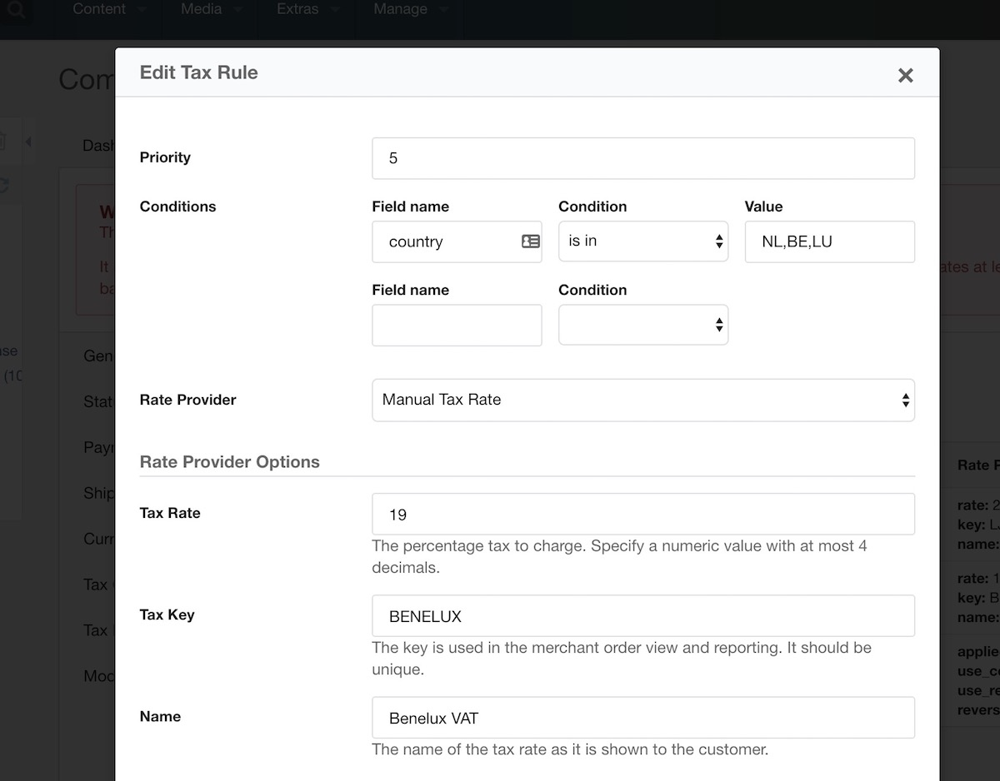

Commerce uses **Tax Groups** to define tax rates. Each product is assigned to a tax group, so you can have a tax group for physical products, digital products, products with an exemption status and so on. 

Within a Tax Group are **Tax Rules**. These are simple logical rules, with conditions like `if the country is the netherlands`. If all conditions on a rule are valid, the tax rule returns a **Rate Provider**, with some **Rate Provider Options**. 

The **Rate Provider** is an implementation that takes in the order/cart contents, and returns a **Tax Rate**. There are different types of rate providers, each with their own behaviour, such as:

- **Manual Rate Provider**: returns a fixed tax rate that you provide in its options.
- **European Union VAT Rates Provider**: returns a tax rate, based on a category (standard, reduced, etc), for either the customers' country or a country you specify in the options. 
- **TaxJar United States Sales Tax Provider**: integrates with the TaxJar service to provide accurate Sales Tax for any purchase in the United States. 

These elements make up taxes in Commerce. Below, we'll go into more detail about each of them.

[TOC]

## Tax Groups

Tax Groups can be seen as a kind of product category. While not meant for categorising your products in a way that's visible to the customer, they do divide your products into different collections that have distinct tax-related handling.

As Commerce calculates taxes per order item, you can have different products with different tax groups in a single order.

Tax Groups have a `name`, `description`, and an `active` flag. Any tax group that is marked as active will be provided to the merchant when managing a product.

Tax Groups contain one or more Tax Rules. 

## Tax Rules

Tax Rules contain basic logic. The output of this logic is a simple true or false: the conditional logic does not define an actual percentage tax rate.

If all conditions on a tax rule evaluate to being true, the tax rule returns a Tax Rate Provider. While the rules determine which rate provider to use, and with what options, the rate provider determines the actual tax rate to be charged.

Conditions in a tax rule take the basic format `if [name of field] [condition] [optional value]`. To give a few examples:

- `if [field: country] [condition: is in] [value: NL, BE, LU]`
- `if [field: country] [condition: is in the european union]`
- `if [country] [is] [US]`, and `[state] [is in] [NY, NJ]`

The following conditions are available. Conditions that accept a value are case insensitive. 

- `always`: useful as a fallback tax rate
- `never`: kinda pointless other than temporary forcing a rule to false
- `equals`: for a direct match, only one option
- `not equals`: opposite of `equals`
- `in`: for a match within a comma separated list of values
- `not in`: opposite of `in`.
- `empty`: customer provided value is empty
- `not empty`: customer provided value is not empty
- `greater than`: compares 2 numbers (decimals/floats supported), making sure that the customer provided value is greater than the value added in the rule
- `less than`: opposite of `greater than`
- `in european union`: used with the country field, this checks if the country is a member of the European Union. This uses a hardcoded list of country codes, so while countries don't join/leave the EU often, keep Commerce up to date. 
- `not in european union`: opposite of `in european union`.

For each tax rule, a Rate Provider is chosen and configured that determines the actual tax rate that will be added to the order.

## Tax Rate Providers

When a Tax Rule is found to match the order, its Tax Rate provider is used to determine the actual tax rate. These rate providers are configured per tax rule, so they can return a different tax rate per rule as well. 

Three rate providers are available in the core Commerce package. 

### Manual rate provider

Uused when you want to define the tax rate yourself. Its option accepts the rate (percentage), rate key (unique reference for reporting) and name (shown to the customer). There's very little magic in the Manual rate provider, it just returns what you put into it.

### European Union VAT Rates provider

Used for retrieving VAT rates in the EU. In the rate provider options you can provided a named rate (`reduced`, `standard` etc), and that rate will be used. 

This provider gets its VAT rates data from [jsonvat.com](https://jsonvat.com/). 

The [EUVat Module](Modules/Taxes/EUVat) needs to be enabled for this rate provider to be available.

There are several use cases for this provider. 

- It can be used for destination-based VAT rates (e.g. for compliance with the 2015 EU VAT regulations) where the customer is charged their local VAT rate. This is typically used in combination with MOSS (_Mini One Stop Shop_) reporting. 
- When selling to businesses, it can be used alongside the [EU VAT Validator module](Modules/Address_Validation/EUVat_Validator) to apply the _Reverse Charge_ mechanism. This means the customer is not charged any VAT, but instead they file taxes in their own country and pay the VAT there. To use this, set up the EU VAT Validator module and tick the _Use Reverse Charge_ checkbox in the rate provider options.
- It can also be used for using a fixed country's tax rate, without having to hardcode it. By setting the _Use Country_ option to a specific country code, it will retrieve that country its tax rates, and apply the named rate you provided. For example setting _Use Country_ to `NL`, and the rate to `standard` will apply the standard Dutch VAT rate of 21% to orders.

### TaxJar United States Sales Tax provider

For sales tax in the United States we've integrated with the [TaxJar](https://taxjar.com) SmartCalcs API. You can provide your Nexus via the MODX system settings, or in the SmartCalcs dashboard, and the system will then apply the proper sales tax automatically. Where possible, it will apply state, county and city tax separately to ease your reporting.

The [TaxJar Module](Modules/Taxes/TaxJar) needs to be enabled for this rate provider to be available.

In the provider options you can provide a product tax code. This is used for product category specific sales tax exemptions or reductions. While there are tons of possible codes, you only need to specify this for products with an exemption or reducation. [There's a list of those product categories here](https://developers.taxjar.com/api/reference/#categories). 

If you have different products which need their own exemption code, then you've found out why _Tax Groups_ are applied per product ;)

If your US Sales Tax requirements are simple (only a handful of unique combinations), you can also set them up with the manual tax rate provider, but that does not currently have the ability to provide split up rates (e.g. state/county/city sales tax). 

### Custom Rate Providers

It's possible to develop [custom tax rate providers](Developer/Custom_Tax_Rate_Providers) for when none of the available ones meet your requirements. 

## Tax Rate

The final, and most important, part of the tax puzzle is the actual Tax Rate. In Commerce this is a centralised object that just defines the percentage, a key (for reporting) and a name (for the customer). 

Tax Rates are applied to Order Items, with the calculation of the taxable and tax amounts happening there. 

Tax Rates can be reviewed, but not edited, under Configuration > Tax Rates. 

## Showing Taxes before the customer enters their address

To show the expected amount of taxes for an order before the customer entered their details in the checkout, you can use modules like [AutoFillGeoIP](Modules/Cart/AutoFillGeoIP), and [UserProfileAddress](Modules/Cart/UserProfileAddress). These pre-fill an _Expected Address_ on the order based on the customers' IP Address and MODX User profile respectively, which is available to the Tax Rules to attempt to make an early tax rate determination.

Only if all details used in the tax rule conditions is available, will its rate provider lookup be processed. 

One way to ensure there is a tax rate applied as soon as possible, is to add a rule to each of your tax groups with the condition set to _Always_ with the lowest priority (highest number). That will act as a fallback until more customer information is available. 

## Product Prices Inclusive or Exclusive of Taxes

Commerce defaults to treating product prices as exclusive of taxes. Any tax rate provided will be added on top of the product price. This is most commonly used in business-to-business sales, or if the tax rates vary so much depending on customer location that it's not realistically possible to provide the inclusive price before knowing where the customer is from. 

By configuring the `commerce.tax_calculation` system setting to `inclusive`, Commerce can be instructed to treat product prices as inclusive of taxes. In this case the product price is what the customer will pay, and the tax percentage is taken as a cut from that. Prices including taxes are most commonly used in business-to-consumer shops. 

**Note:** changing the `tax_calculation` setting will only affect new orders. Existing orders remain unchanged. If you're in the cart/checkout process and want to see the result of changing the setting, you can append `_commerce_recalculate=1` to the url to force a recalculation. Manually removing the contents of `core/cache/commerce/` and clearing your session completely may be necessary. 
