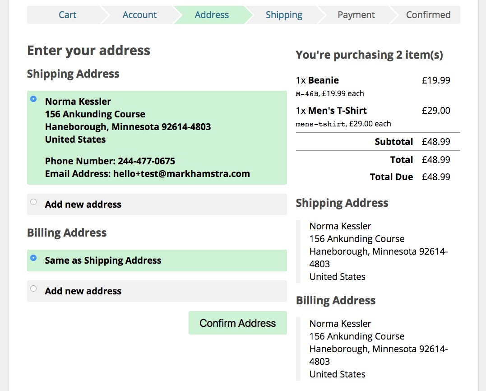

Commerce stores addresses for customers automatically. When users are logged in during the checkout, it will also associate the addresses with a user record, and allow the customer to choose from previously addresses on their next purchase.

Here's an example of how that could look:

## Setup (Checkout)

There is no additional setup needed to use this functionality. It's built into the commerce core and default templates.

## Setup (customer section)

The architecture makes it possible for address-book-like functionality for logged in users to be added to Commerce, but that's not currently (as of v0.10) available. 

## Under the hood

`comAddress` has a `user` field, which is either 0 or the ID of a user. It also has a `remember` field - if that is enabled, the address will show up in future checkouts.
 
Addresses are joined to an order through the `comOrderAddress` object, which has the order and address ID, as well as a `type` field that dictates if it is a billing or shipping address.

