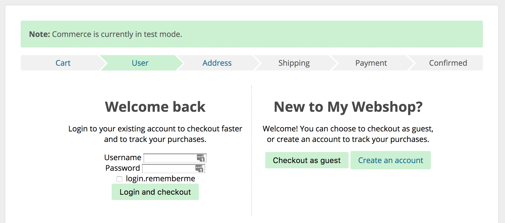

Commerce uses the standard user system in MODX. 

[TOC]

## Users in the Checkout

The standard checkout process includes an Account step where customers are given the choice of logging in, signing up for an account, or continuing the checkout as a guest. When customers log in or signup, their orders will be assigned to their account automatically.

For the login and registration to work, you need to set up a login and register resource with the standard [Login extra](https://modx.com/extras/package/login). Once setup, update the `	
commerce.login_resource` and `commerce.register_resource` system settings with the IDs of the Login and Register resource respectively. 

Read more about creating a [Login Resource](Login_Resource) and a [Register Resource](Register_Resource). 

### Make accounts optional

In the default configuration, customers are prompted to login, signup, or to continue as guests. 

This is accomplished with the setting `commerce.checkout_requires_account` being set to `no`, and `commerce.checkout_show_account_step` being set to `yes`. 

### Make accounts required

When you sell licenses or access to parts of a site, your customers will always need to be logged in during checkout. This means you do not want the option available for customers to check out as guests.

To accomplish this, set the `commerce.checkout_requires_account` system setting to yes. 

With the default checkout templates, the text on the account step will be automatically updated to tell customers they need to login or signup to continue. 

### Don't use accounts at all

In some cases, you may not need accounts to be used at all. In this case you can easily get rid of the account step in the default checkout by setting both the `commerce.checkout_requires_account` and `commerce.checkout_show_account_step` settings to `no`.  

With this configuration, all customers will be seen as guests. 

### Auto-filling customer information from user profiles

Commerce can automatically prefill address information into the checkout form, when customers are logged in. 

Go to Configuration > Modules in the Commerce dashboard, and find the User Profile Address module in the list. Click its name to edit the configuration, and enable it in test and/or live mode under _Availability_. 

This module can also update the user profile based on the submitted address information. This relies on a checkbox being available on the form, included in the default checkout templates.  

[Read more about the UserProfileAddress module](../Modules/Cart/UserProfileAddress).

## Viewing Past Orders

For logged in users, you can list their previous orders with the [commerce.get_orders snippet](../Snippets/get_orders), and individual orders with the [commerce.get_order snippet](../Snippets/get_order) snippet.

Read more about [creating a View Orders section](View_Orders). 

