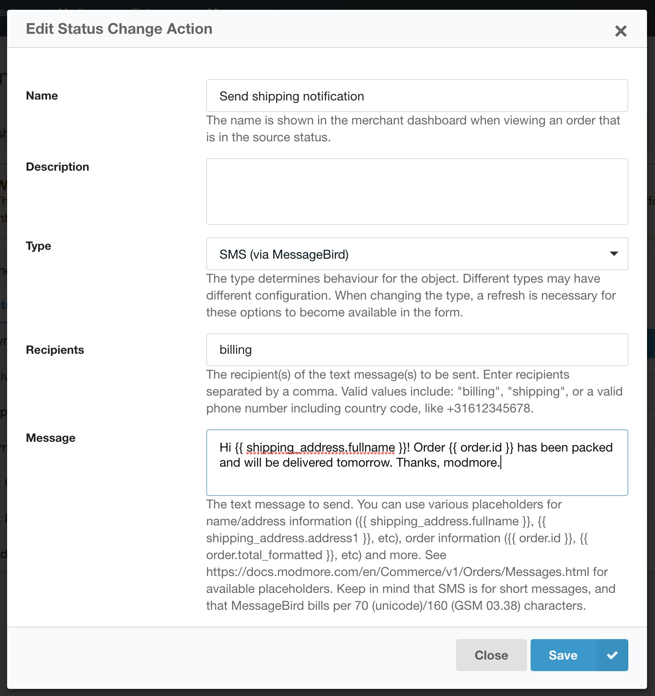
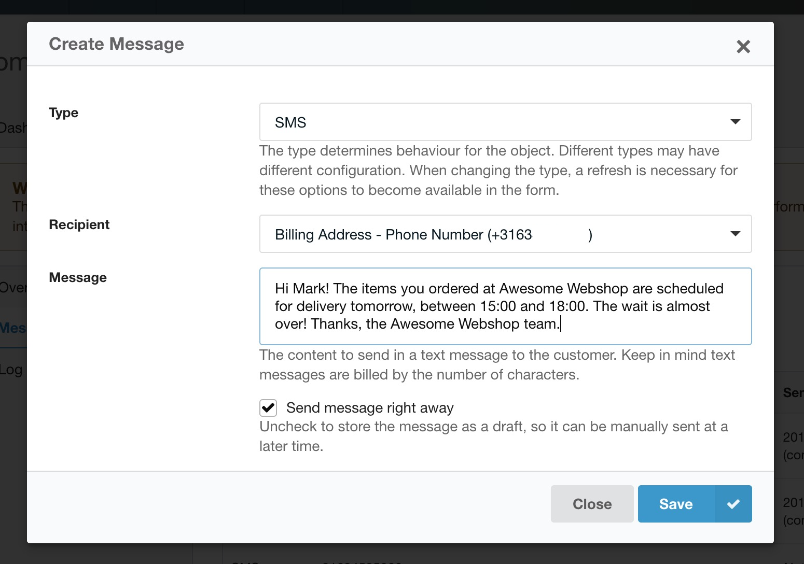

The MessageBird module, **available as a separate package** and from [GitHub](https://github.com/modmore/Commerce_MessageBird), allows sending text messages (SMS) from the Commerce dashboard, or automatically as part of your [status change](../../Statuses/index).

## Configuration

To use the MessageBird integration, first enable the module in Commerce in Configuration > Modules.

Next, update the `commerce_messagebird.access_key` and `commerce_messagebird.originator` system settings under System > System Settings with your access key and the originator ("from" name/number) respectively. 

Now you can start sending text messages from Commerce!

### Automatically as Status Change Action

As a status change action, a SMS will be automatically sent when a certain status change is triggered. This is useful, for example, to send a shipping notification. 

If you're new to the Commerce statuses system, please [start with a visit to the documentation](../../Statuses/index). 

Go to Configuration > Statuses and click on the (or create a) status change that you want to trigger the text message. In the new screen, hover over the _Add Status Change Action_ button to expose the options, and choose `Send a SMS (via MessageBird)`. (Note: if you don't see this option, make sure the MessageBird module is active in the current mode)

Make sure _Type_ is set to SMS and enter one or more recipients, separated by a comma. Use the shorthand `billing` or `shipping` to automatically use the customers' mobile/phone number on either the billing or shipping address respectively. You can also enter a phone number to always send the text to that number (for example, to notify the merchant/a logistics partner).

Enter the content to send. You can use any of the [order message placeholders](../../Orders/Messages) in the content.

Save, and texts should start going out for that status change automatically.

### Manually via the dashboard

You can also send manual texts. First navigate the Commerce dashboard to an order, then open the _Messages_ tab. There, hover the _Create Message_ button to expose _Send a SMS_. (Don't see that option? Make sure the MessageBird module is enabled!)

In the create message window, you can select the recipient. This dropdown will populate from the billing and shipping address on file, and will show the `mobile` or `phone` number(s), depending on which ones are provided.

Enter the text message in the Content field. This also supports [order message placeholders](../../Orders/Messages).

Save, and send away!

