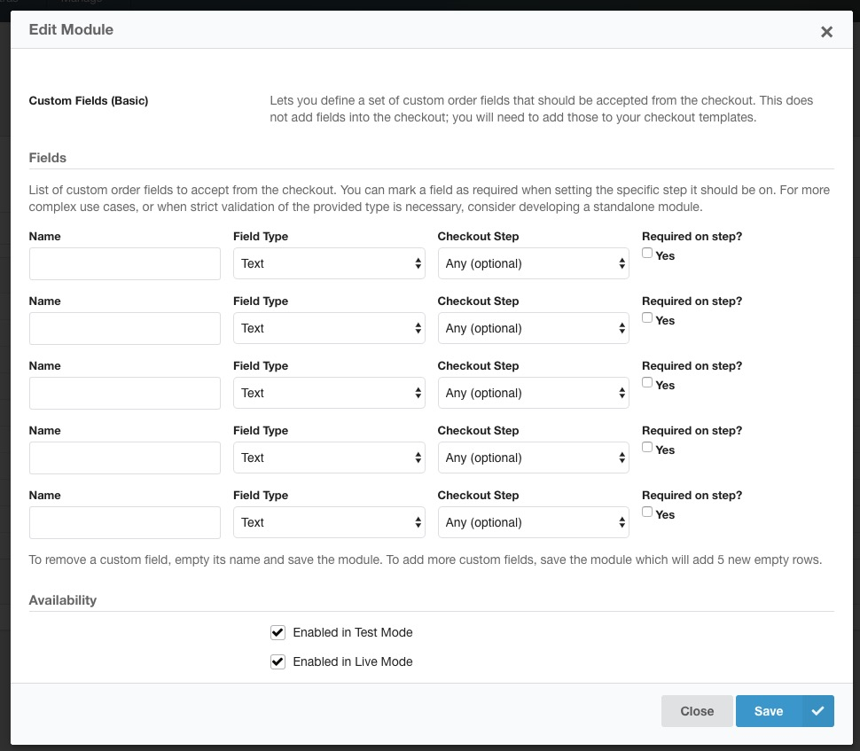

The Basic Custom Fields module makes it easy to accept [custom order fields](../Orders/Custom_Fields) without having to [write your own module to handle the logic of storing the value](../Developer/Order_Fields). 

[TOC]

## Module Configuration

The **Custom Fields (Basic)** module is bundled with Commerce as of v1.1. To configure it, go to Commerce > Configuration > Modules and find it in the list. Click its name to enable it, and to find the list of fields. 
 


A custom field has the following values:

- **Name** is the input name to listen for. 
- **Field Type** gives you some options for the field type. This includes text, number (integer or float), date, or time. The field type affects the validation and normalisation of values.  For example, a text field type automatically HTML-encodes the user-provided value, and date only accepts valid dates (any value accepted by `strtotime()`).
- **Checkout Step** lets you choose on what step in the checkout the module should look for the provided field name. When you select "Any", all requests to the checkout will accept the value. 
- With **Required on step?** you can mark the field as required, which will cause an error to be shown to the customer if they don't enter a (valid) value. This does **not** work when the checkout step is set to any. 

Note that 0 is considered an invalid value for the number field type. Anything that PHPs `empty()` considers empty is also considered invalid for the text type. 

### Friendly labels

The provided name is used as a label when viewing the custom field in the dashboard (or front-end). 

To turn the name into a friendly label, create a lexicon entry (via System > Lexicons) with the key `commerce.{YOUR NAME}`, for example `commerce.shipping_notes` if your name is `shipping_notes`.

### POST only

Note that the module only runs on POST requests, not GET. Passing URL parameters will not work with this module. 

If you need GET parameters to be stored, you either need to write a module, or have the GET parameters turned into a hidden input that is submitted with a POST request. 

## Adding fields to your Templates

The module only listens to requests - it does not automatically add the field to your checkout form.

To do that, [set up a custom theme](../Front-end_Theming) and edit the checkout templates. 

The module only requires you to **match the name to what is in the module configuration**; the exact input type or formatting doesn't matter. You can get as fancy or simple as you'd like, so long as the POST contains the right name and value.

For example if you want to provide a simple desired delivery date field on the shipping step, which you added to the module as `delivery_date` with field type `Date`, then add something like this to `frontend/checkout/shipping-method.twig`:

``` html
<label for="field-delivery_date">Preferred delivery date:</label>
<input type="date" id="field-delivery_date" name="delivery_date">
```

## Accessing custom field values

To read the value of a custom field, you can use `{{ order_fields.NAME_OF_FIELD }}`, for example `{{ order_fields.delivery_date }}`. 

That works in [email templates](../Orders/Messages) as well as checkout templates. 

## Get help

If you can't get a custom fields to work or need a bit more guidance,  we're happy to help. Email support@modmore.com or [post on the community forum](https://forum.modmore.com). 

If you have a use case that this module does not support, we're also available to build custom modules at an affordable rate. Get in touch for a quote. 
