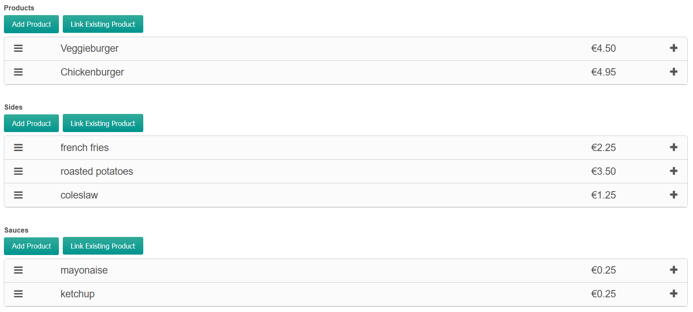
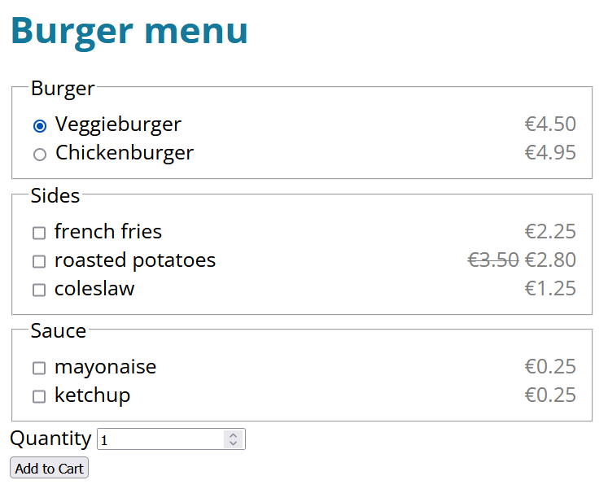
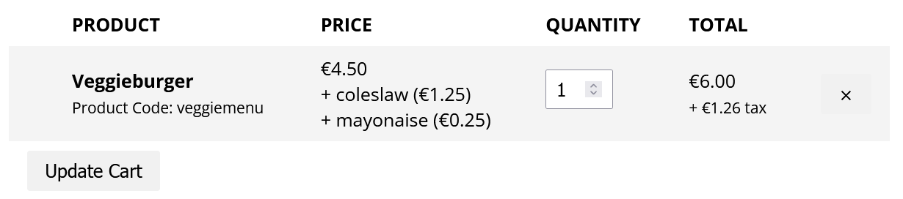

The Item Options extension for Commerce is useful for simple product configurators. It's a free and official extension available from our own package provider for Commerce 1.2.6 and up.

The module operates on a similar module as the [ItemData](Cart/ItemData) module: additional data is submitted in the add to cart request, and added to an order item. In this case the "additional data" is additional product IDs, and they are added as "order item adjustments": separate rows on a single order item with a price change and name.

## Example setup

To put it in context, let's take a look an example of configuring a burger menu. 

For **each type of product you'd like to combine** into a single menu, you create a separate products list TV, for example for burgers, sides and sauces:



Next, we render it all in the frontend.

On the resource/template, [create an add to cart form](https://docs.modmore.com/en/Commerce/v1/Product_Catalog/Add_to_Cart_Form.html). Here's some example markup:

````html
<form method="post" action="[[~[[++commerce.cart_resource]]]]">
    <input type="hidden" name="add_to_cart" value="1">
    <input type="hidden" name="link" value="[[*id]]">

    <fieldset>
        <legend>Burger</legend>
        [[!commerce.get_products? 
            &products=`[[*products]]`
            &tpl=`product_as_radio`
        ]]
    </fieldset>
    
    <fieldset>
        <legend>Sides</legend>
        <div class="product-accessories">    
            [[!commerce.get_products? 
                &products=`[[*sides]]`
                &tpl=`product_options_check`
                &name=`sides`
            ]]
        </div>
    </fieldset>
    
    <fieldset>
        <legend>Sauce</legend>
        <div class="product-accessories">    
            [[!commerce.get_products? 
                &products=`[[*sauces]]`
                &tpl=`product_options_check`
                &name=`sauces`
            ]]
        </div>
    </fieldset>
    
    <div class="product-quantity">
        <label for="add-quantity">Quantity</label>
        <input type="number" id="add-quantity" name="quantity" value="1">
    </div>
    
    <input type="submit" value="Add to Cart">
</form>
```

> In this case we're loading the sides and sauces from the current resource. However, you don't have to! If you need to reuse products across different resources, you could create a central "Sides" and "Sauces" resource, and use getResourceField/pdoField to load those product IDs into the page instead.

The **product_as_radio** chunk might contain something like this:

```
<div class="product-option">
  <label>
    <input type="radio" name="product" value="[[+id]]" [[+idx:eq=`0`:then=`checked`]]>
    [[+name]]
    <span class="product-option-price">[[+price_rendered]]</span>
  </label>
</div>
````

The **product_options_check** chunk contains something like the following. Note that accessing the scriptProperties this way, to allow the commerce.get_products snippet call to provide the name, was added in Commerce 1.2.6.

````html
<div class="product-option">
  <label>
    <input type="checkbox" name="[[+scriptProperties.name]]" value="[[+id]]">
    [[+name]]
    <span class="product-option-price">[[+price_rendered]]</span>
  </label>
</div>
````

Make sure to add `sides` and `sauces` to the Item Options module configuration as accepted field names.

So to summarise, the form data we'll be sending to the cart page this way contains:

- `add_to_cart = 1`, required to trigger the add to cart action
- `link = current resource id`, used with the ItemData module to link back items to their respective resource, optional
- `product = the ID of a burger product`, to know which product to add to the cart
- `sides = the ID of a "sides" product`
- `sauces = the ID of a "sauce" product`

> It's important to note that while we're using checkboxes in this example, each input name **may only contain one value** - arrays or comma separated options are **not supported**. This example could be improved by using a `<select>` or radio buttons instead.
> 
> If you do require multiple values from a single option, give them unique names. For example, use `name="[[+scriptProperties.name]][[+idx]]"` in the `product_options_check` chunk, and add `sides0, sides1, sides2, sides3, etc` to the module configuration.

Here's what it might look like with very minimal styling:



When we make our selection and add it to the cart, the `sauces` and `sides` will be added to the base product, like so:



Customers can change the overall quantity, but not remove or change the options from the cart. 

If you're not seeing the item options **in your cart**:

1. Make sure you have installed the Item Options module, have enabled it, and added the input names to its configuration.
2. Make sure you're on Commerce 1.2.6 or higher.
3. If your checkout theme was created prior to Commerce 1.2.0 or heavily customised, you may need to adjust the `frontend/checkout/cart/items.twig` template to render item adjustments. Compare that template to the default to see how to render adjustments.

If you're not seeing the item options **in confirmation emails** with custom themes created before 1.2.6 or which are heavily customised, add the following inside the items foreach loop:

```html


    <br>+ {{ adjustment.name }}

```

If you're not seeing the item options **in the order detail page**, make sure you are not overriding admin templates. If you have an /admin/ directory in your custom theme folder, remove or rename it.


