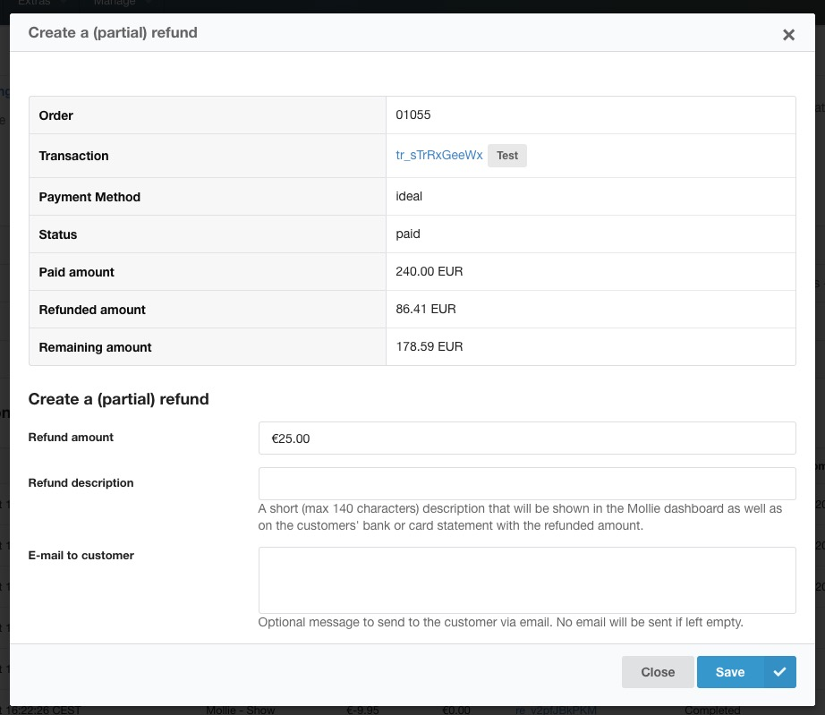

With the [MollieRefund extension](https://modmore.com/commerce/extensions/mollie-refund/), you can create refunds on transactions processed through the Mollie gateway from the Commerce dashboard.

MollieRefund requires Commerce v1.1.5 or higher.

> Special thanks to Heibel for sponsoring the development of this extension.

## Setup

The extension is as plug & play as it gets. Install the extension from the modmore package provider, enable the module under Extras > Commerce > Configuration > Modules, and you're set. The extension automatically uses the gateway configuration for the transaction you're looking to refund.

When viewing the list of transactions on an order detail page in the dashboard, you can access the "Create (partial) refund" button from the Actions dropdown. That will show you the current transaction status and give you the ability to create the refund and automatically send the customer an email.

## Limitations

- Only works for completed transactions via Mollie; refunds on other gateways are not supported. That is expected to change in Commerce v1.2, which will bring proper support for refunds to the core. Consider this extensions a short-term fix. 
- At the moment, the status of a refund is not kept up-to-date. All refund attempts that Mollie indicates were successfully created, are assumed to complete. If it is delayed or fails for some reason (e.g. the customers' bank account is no longer valid, or your Mollie account does not have sufficient balance), Commerce does not show that. Login to Mollie to check the most current status.
