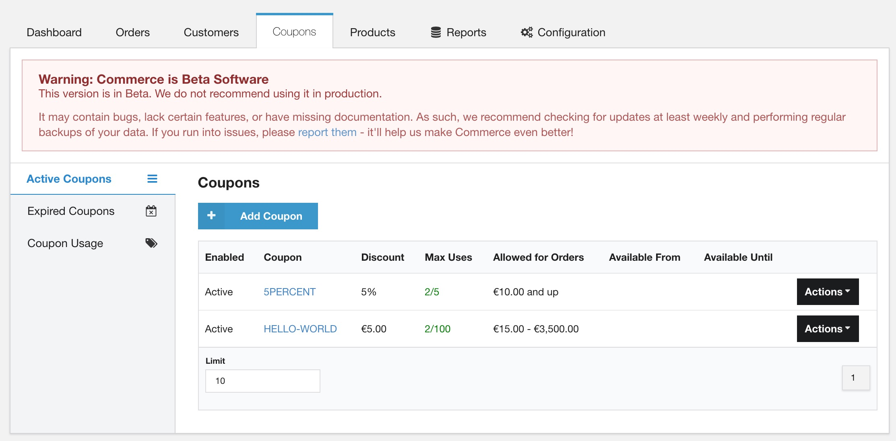
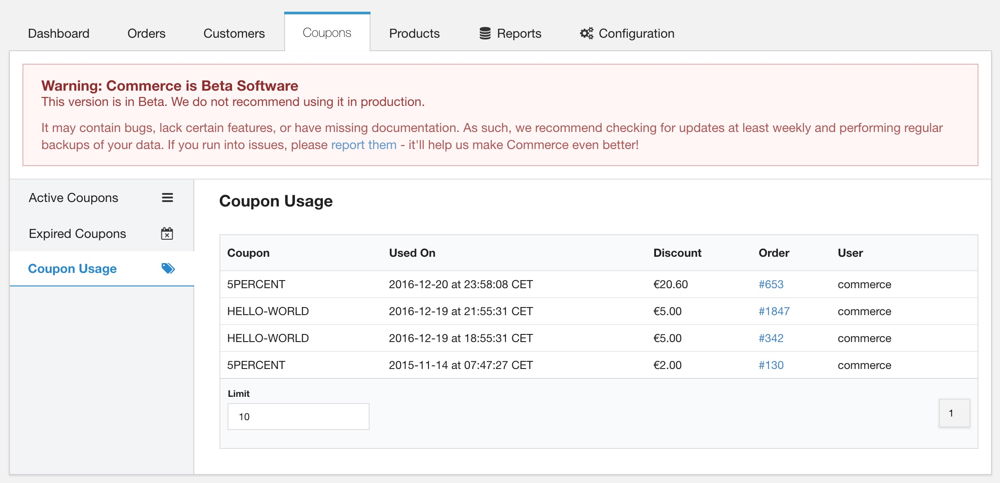

The Coupons module ships with the Commerce core. Enable it in Configuration > Modules. The current version of the Coupons module supports the following features:

- Fixed-price coupons which are added as discounted, uneditable items on the cart.
- Percentage-based coupons which calculate the percentage discount on all items in the cart. 
- Setting the maximum amount of uses on a unique coupon
- Setting specific timeframe during which a coupon can be used
- Enabling/disabling a coupon
- Allowing the order only for specific order totals (minimum/maximum)

Features such as limiting a coupon to specific products, multiple coupons per order, bulk creating unique coupons, or exporting a list of coupons, are not currently supported. If you're interested in those or other features, please let us know so we can properly prioritise it for a future release. 

## Coupon Management

After the Coupons module has been enabled, a new top menu item _Coupons_ will be available. From there the menu offers you three distinct views:

- **Active Coupons** shows all coupons that have an expiry date in the future, or no expiry date at all. 
- **Expired Coupons** shows coupon codes with a set expiry date that is in the past.
- **Coupon Usage** shows a chronological list of when coupon codes were used, and how much the total calculated discount was for that order. 

When viewing either of the Coupon grids, the actions dropdown on the right can be used to update coupons or to view the chronological usage specific to that coupon. 

