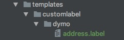

With the Dymo Address Label module you get one-click address label printing on supported Dymo LabelWriters. 

**Dymo Address Label is available as a separate (free) package from the modmore.com package provider** and is also on [GitHub](https://github.com/modmore/Commerce_DymoAddressLabel). Commerce 0.11 is required to use it.

[TOC]

## Configuration

- Download and install the Dymo Address Label for Commerce package from our package provider.
- In the Commerce Dashboard, navigate to Configuration > Modules to enable the Dymo Address Label module. You'll need to refresh the manager (ajax navigation is insufficient) to allow the new assets to be loaded.
- View an order that has at least one address. If you have a Dymo LabelWriter connected, you should see the print button show up below the customers' address. 

<iframe src="https://player.vimeo.com/video/263968503" width="640" height="360" frameborder="0" webkitallowfullscreen mozallowfullscreen allowfullscreen></iframe>

## Changing the label design

The label design (as XML) is included as a template, allowing you to override it in a theme. 

You can use the Dymo LabelWriter Software to create a label design. Choose the right label size, and add an Address element at the right position/size. **Select the element, click on Properties, and set the object name to "Address" on the Advanced tab**.

When you're happy with your label design choose "Save as template" in the "File" menu. 

Add it in your templates folder with the filename `dymo/address.label`, for example if your theme is set to `customlabel`:

Next **refresh the Commerce dashboard** so the last version of your label is loaded. You can now print your own labels!

