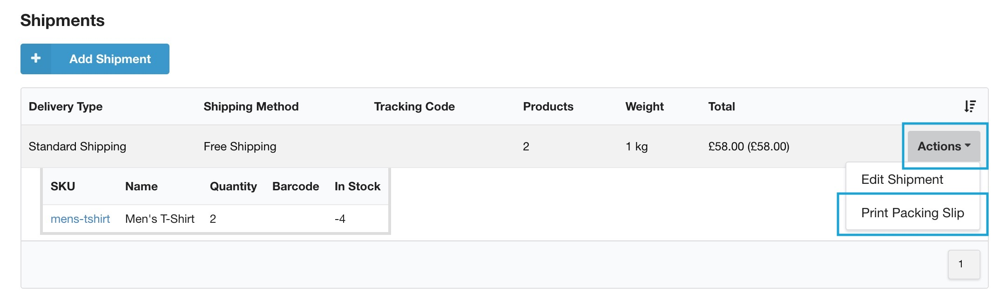
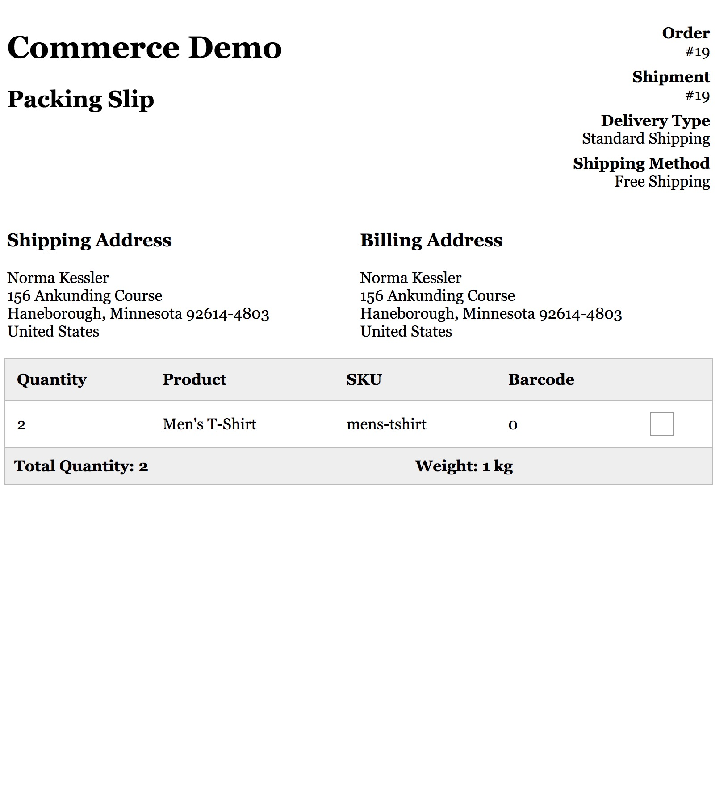

The Packing Slip module adds an action to the [order shipments](../../Orders/Shipments) grid on the order detail page that will generate, and prompt to print, a packing slip for a shipment.

**Packing Slip is available as a separate, free, package** and is also on [GitHub](https://github.com/modmore/Commerce_PackingSlip). Commerce 0.11 is required to use it.

[TOC]
 
## Configuration

Once the package is installed, and the module is enabled (via Extras > Commerce > Configuration > Modules), no configuration is needed. You'll be able of immediately printing packing slips from the order detail view.

The default packing slip design is very basic, and looks like the following.

When clicking the "Print Packing Slip" action, it will open the packing slip in a new tab, prompt you to print it, and then immediately close it. Click on the menu item while holding `ctrl`/`cmd` to open it as a regular page that doesn't auto-close.

## Customising the packing slip

The packing slip is built from a single template file, the default is located at `core/components/commerce_packingslip/templates/packingslip/standard.twig`.

If you've set up a [custom Commerce theme](../../Front-end_Theming.md), you can create a new file in your template directory named `packingslip/standard.twig` to override the default one.

