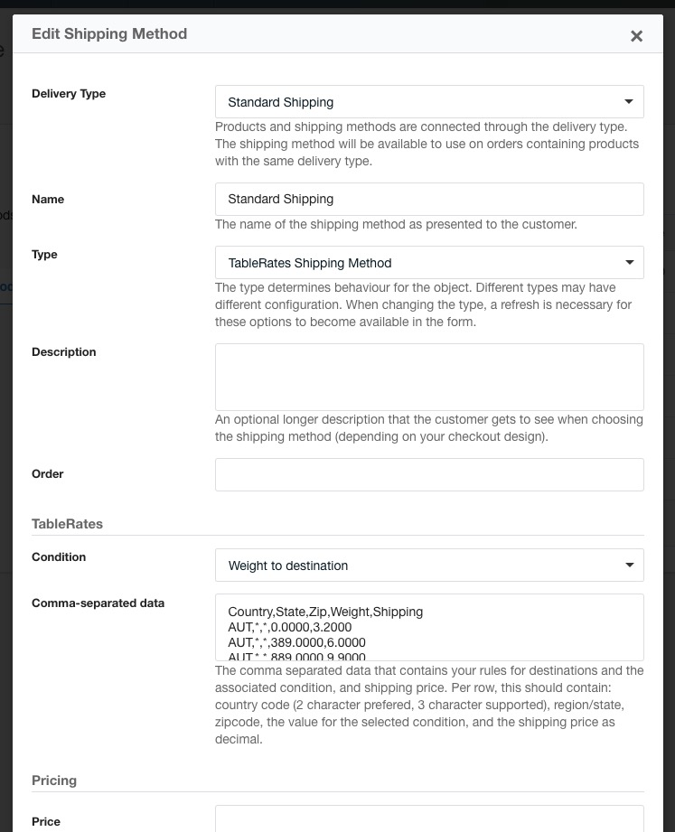

TableRates is a concept from Magento where you manage shipping costs based on both weight and destination. This database is managed outside of the ecommerce platform (with several generators available on the web), and then uploaded to Magento.

With the TableRates module for Commerce, **available as a separate package** and from [GitHub](https://github.com/modmore/Commerce_TableRates), you can use that same configuration with a special shipping method type in Commerce.

[TOC]
 
## Configuration

To use the TableRates shipping method, first install the package from the modmore package provider, and then enable the module in Commerce in Configuration > Modules.

Next, navigate to Configuration > Shipping Methods and create a new shipping method of type TableRates. 



At time of writing, TableRates only supports the weight-to-destination condition. 
 
Where in Magento you upload the file containing the shipping fees, for Commerce you'll need to paste the comma separated contents into the "Comma-separated data" field. 

## CSV Data

The CSV data contains 5 values per line. These are:

- The country code. Commerce uses 2-character country codes, however for compatibility with Magento generators and data files, Commerce also supports the 3-character country codes here.
- The state/region.
- The zip code.
- The condition value to compare against. For the "Weight to destination" condition, this is the shipment weight in gram. 
- The shipping fee as a decimal number.

The destination fields (country, state, zip) can set to an asterix (`*`) to accept any value. For example, to match shipping to Belgium no matter the province or zip code, for shipments that weigh at least 50 grams and cost €1,20 to ship, add a line `BE,*,*,50,1.20`. 

Commerce will loop over the CSV data from top to bottom to find matching rules. If it finds multiple rules, it will use the **last applicable one** that appears in the data. You can use this to your advantage by putting more specific rules lower in the file. For example:

````
Country,State,Zip,Weight,Shipping
*, *, *, 0, 15.00
US, *, *, 0, 7.50
US, NJ, *, 0, 2.50
US, NJ, *, 2000, 5.00
US, NY, *, 0, 1.50
US, NY, *, 2000, 3.00
````

This will apply a $15 rate to orders worldwide. The $7,50 rate to all orders from the US, except those to the status of New Jersey and New York. Shipping to NY and NJ have cheaper shipping, plus two different rates depending on the weight (under and over 2kg). 

If this CSV data were in the reverse order, all shipments would be charged the $15 rate.

## More about TableRates

- [Magento's user documentation about Table Rates](http://docs.magento.com/m2/ce/user_guide/shipping/shipping-table-rate.html)
- [Elgentos' Magento Table Rates Generator](https://www.elgentos.nl/tablerates/)
