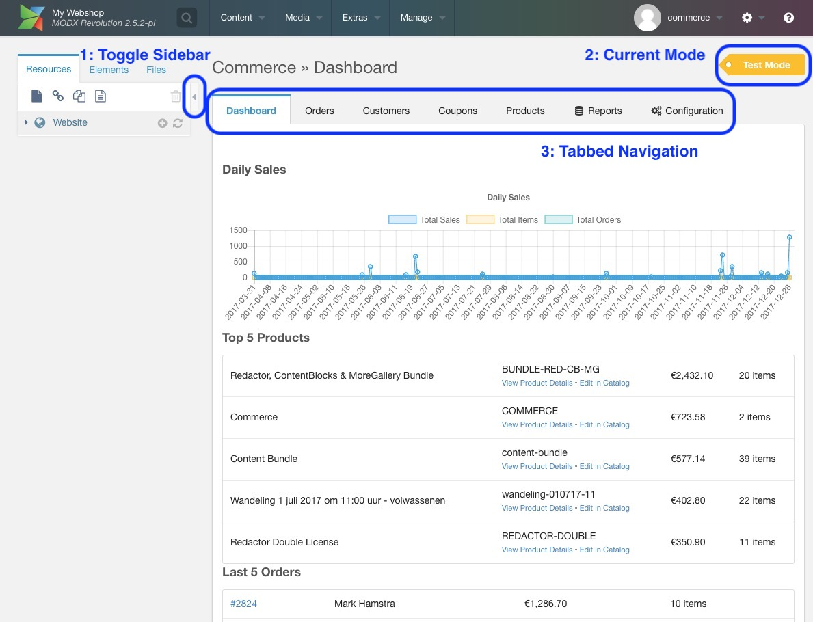

The Dashboard is what we call the Commerce area in your MODX manager. It's usually found in the top menu under "Extras", or as a top-level item called "Commerce". 

When you open the dashboard, you'll see a screen like the following.

We've highlighted a few areas in the screen capture above.

1. **Toggle Sidebar**: click on the small arrow to collapse the Resources sidebar. This gives the dashboard more space. When collapsed, you can expand the sidebar again with the same arrow, which is now fixed to the left side of your screen.

2. **Current Mode**: at the top-right of the screen you will see what mode the store is in. This can be live, test, or disabled. The mode the store is in determines which orders are visible, and, in some cases, what features are available. If you have been granted configuration access, you can click on the mode label to access the configuration checklist which will let you switch between modes.

3. **Tabbed Navigation**: the tabs at the top of the dashboard lets you switch between pages in the dashboard. These open in the same window by default. If you hold the `ctrl` or `cmd` key on your keyboard when clicking an item, it will open in a new tab or window instead. 

Below the navigation you'll find the actual information. In the screen capture above, that shows a daily sales graph, our most popular products, and a table with the most recent orders.

## Next

- [Managing Orders](Managing_Orders)

