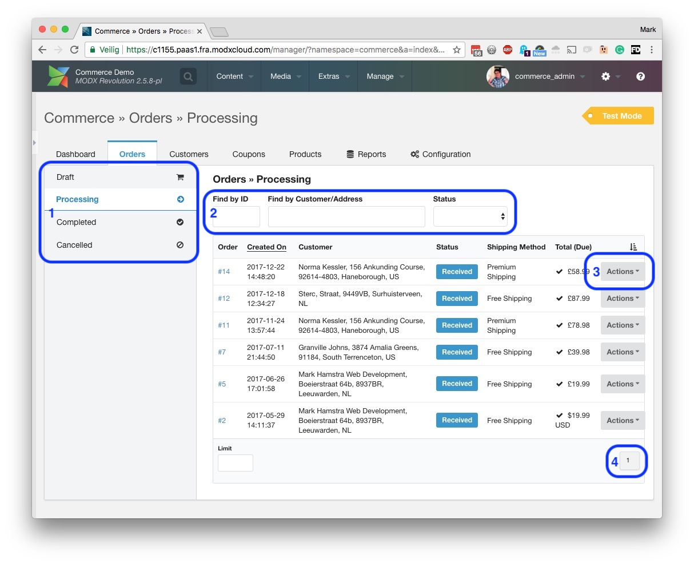
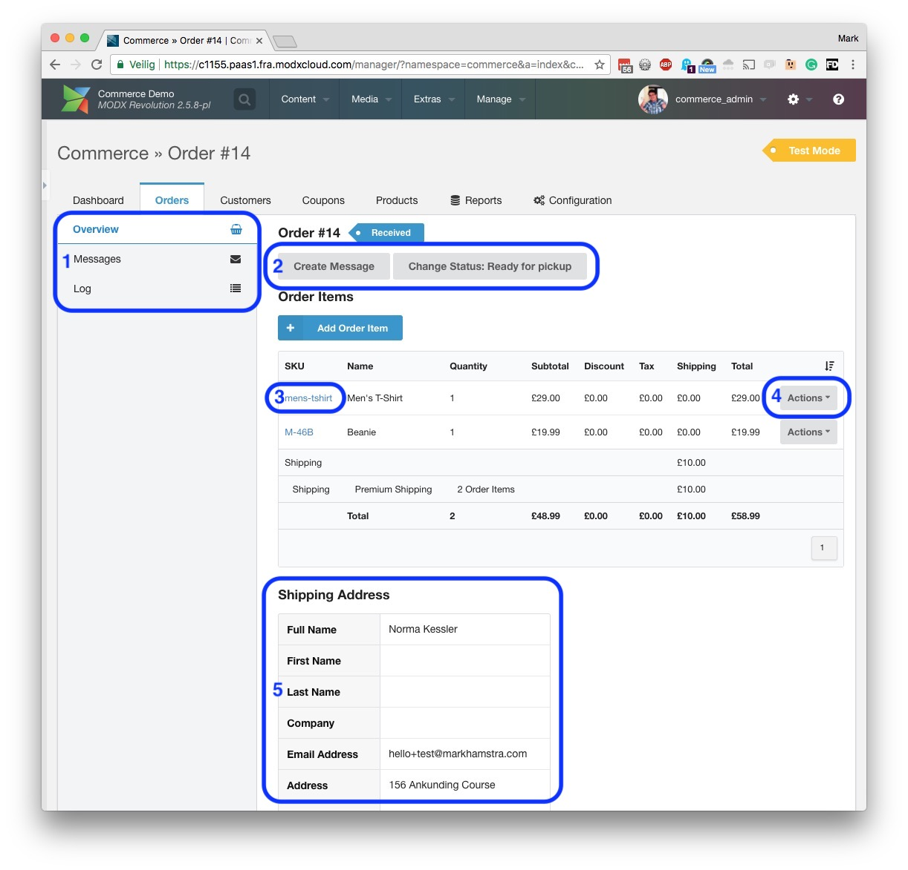
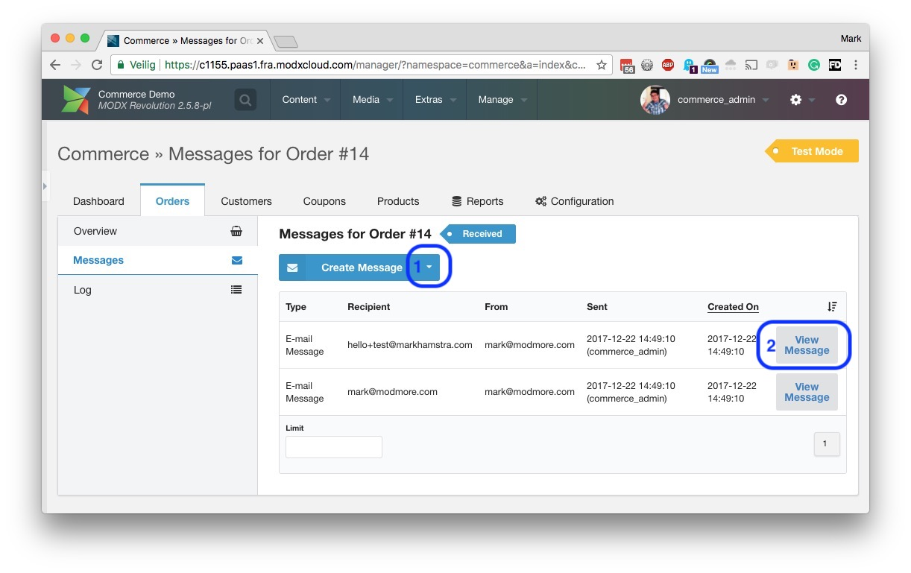
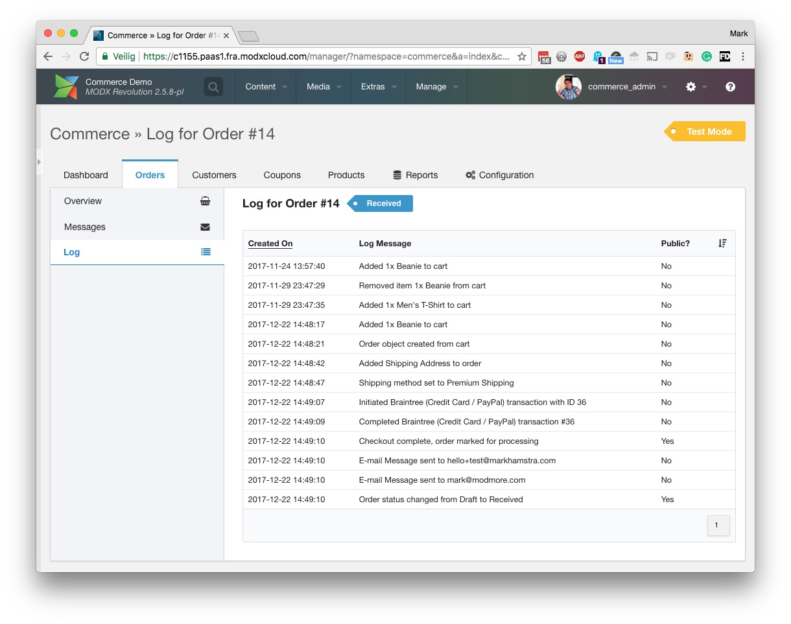

One of the most important tasks in Commerce is managing your orders. In the [Dashboard](Using_Dashboard), click on **Orders** in the tabbed navigation to view your orders.

[TOC]

## Order List

On this page, there are a few important things to note.

1. On the left of the page, you will see 4 sections: Draft, Processing, Completed and Cancelled. These are order states, and by default it will show Processing orders. These are orders that have been paid, but have not yet been fulfilled. [Learn more about Order States and Statuses](Order_States_Statuses). 

2. The filters in the center of the screen allow you to quickly find an order. If you know the order ID, enter it in the first filter. Otherwise search for a customer name or address with the second filter. The status filter allows you to narrow down the results even further if you have different [order statuses](Order_States_Statuses) configured.

3. For each order in the list, there is an Actions menu at the right. This allows you to view order information, to send the customer a message, and will also contain different status changes that you can trigger for an order.

4. If you have more than 10 orders in the current results, the pagination at the bottom right will allow you to view them all. 

The quickest way to dive into a specific order is to click on the order number, on the left of the order list. That will bring you to the order detail view.

## Order Detail View

After clicking an order ID or choosing to view order information, you will see the order detail view, which looks like the following. 

1. At the left of the page the submenu now shows options specific to the current order.
    - On the active _Overview_ tab, you will find the primary information about the order, including the purchased products, the shipping information, and transactions (further below). 
    - On the _Messages_ tab you'll find a list of messages, usually emails, that have been sent in relation to this order. This includes messages to the customer (like order confirmations, and tracking information), as well as emails that were sent to the merchant or third parties. We'll show this tab in the Messages section below.
    - On the _Log_ tab, you'll find a list of actions related to the order. See the Logs tab below.
    
2. In the center of the screen you will see different actions you can take on this order. This includes sending a message to the customer, and will also contain [available status changes](Order_States_Statuses), depending on the current order status and how your status workflow is configured. 

3. In the list of order items, you can click on the product SKU to quickly view other orders with this product.

4. The Actions menu for each item in the order, on the right side of the item list, allows you to change the order item or to remove it from the order completely. You can also add additional products with the _Add Order Item_ button above the list. Order totals are automatically updated when using these functions, but refunds or additional charges are not processed automatically.

5. Below the list of order items you will find the shipping address the customer entered. If the customer also added a separate billing address, that will be shown side-by-side. **NOTE: This view changed in v0.11, with a different address view and the addition of order shipments.** 

Further down on the order detail view, you will also find a list of transactions. If the customer attempted multiple transactions those will be shown individually in the list, and further information about possible errors are available by clicking on the _View transaction details_ button at the right of the transaction list.

### Order Messages

On the Messages tab, you can see messages that were sent related to this order. This usually includes at least an order confirmation email to the customer, and an order notification to the merchant. 

On this page:

1. Hover over the arrow on the right of the _Create Message_ button to choose the type of message to create. On a standard Commerce installation, this includes an internal note and an email message, but your development partner may have added additional options like SMS or integrations with a CRM system.

2. Click on _View Message_ to see a preview of what the message looks like. If a message has only been created as a draft, or encountered an issue while sending, you will see an _Actions_ menu instead, offering you to edit and send the message.

### Order Log

On the Logs tab, you can see everything that happened to an order. Both before and after the customer placed the order. Some of these messages may be technical in nature to help your development partner identify problems.

This log is read-only, so you cannot edit or remove log entries.

Some log entries are marked as public. These are entries that may be shown to your customer when they view order details in their customer section. This usually includes status changes.

## Next

- [Learn more about Order States and Statuses](Order_States_Statuses)
