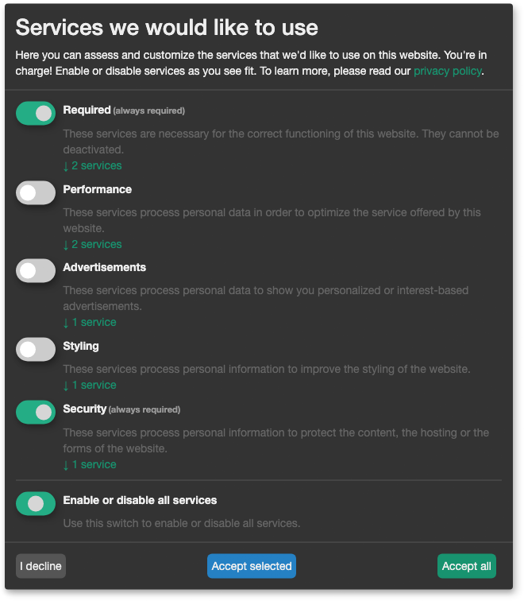

ConsentFriend uses the open source script of
[Klaro!](https://kiprotect.com/klaro) as consent management script on the
frontend. The Klaro! script automatically activates internal and external
services on the webpage. ConsentFriend prepares the html code of the page to
disable the automatic execution or loading of external services.

[](img/consent-management.png)

> **The following steps are prepared by ConsentFriend automatically**
>
> To make sure that no tracking scripts and third-party services are loaded
without consent, the HTML code of the page has to be modified: For scripts, the
type attribute has to be set to or replaced with `type="text/plain"` (this keeps
the browser from executing the script) and a data attribute with the original
type has to be added, i.e. `data-type="application/javascript"`. Also a
data-name attribute that has to match the name of the [service in the Custom
Manager Page](../03_Custom_Manager_Page/01_Services.md#service-name) must be
added, i.e. `data-name="matomo"`.

If you enter the external service code in the ConsentFriend service
configuration, the code will be prepared for the the automatic activation.
ConsentFriend will inject the code at the end of the HEAD or BODY section in the
HTML code.

> **Commercial conversion of Klaro!**
>
> ConsentFriend does not use the commercial server side version of Klaro!. It is
not needed and currently not possible to use the commercial version of Klaro!
with ConsentFriend.

## Custom external services

If you have to place the external services inline on the page, you have to
handle the code preparation on your own. External services can be i.e. called by
`script`, `img`, `link` or `iframe` tags. All those tags for an external service
must contain a `data-name` attribute, that matches the name of a
[service](../03_Custom_Manager_Page/01_Services.md#service-name) of
ConsentFriend, i.e. `data-name="matomo"`. If the original tag contains a type
attribute it has to be changed to `type="text/plain"`.

### script tags

Services with a script tag need an additional `data-type` attribute with the
original type i.e. `data-type="application/javascript"`. When the service
refererences an external script by the `src` attribute, this attribute has to be
renamed with `data-src`.

### iframe and img tags

Services with an iframe or an img tag need an additional `data-src` attribute
with the original src i.e. `data-src="https://www.youtube.com/embed/M7lc1UVf-VE"`.
The original src attribute has to be removed. Since the type attribute is not 
valid for iframe tags, it can be removed there.

### link tags

Services with a link tag need an additional `data-href` attribute
with the original href i.e. `data-href="https://fonts.googleapis.com/css2?family=Open+Sans"`.
The original href attribute has to be removed. 

## Examples

Example code for external services:

- [Google reCAPTCHA](Google_reCAPTCHA.md)
- [Youtube videos](Youtube_Videos.md)

#### Link to open the consent management window

If you want to add a link to the consent management window on a page, you could use the following code: 

```
<a onclick="klaro.show();return false;">[[%consentfriend.services.change_setting? &namespace=`consentfriend`]]</a>
```


