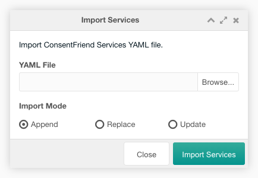

This tab contains a paginated grid with all internal or third-party services,
that could collect personal data.

With ConsentFriend can manage both inline and external scripts as well as static
tracking elements like images or stylesheet links. New services can be added
with just a few lines of code.

You can create a new service with a click on the create service button on the
top left above the services grid.

You can export the services to an xml file with a click on the export services
button above the services grid.

You can import a xml file with the services with a click on the import services
button above the services grid. In the import window you could select a file to
import and the import mode. In the append mode the entries in the file are
appended to the existing services in the grid. In the replace mode the existing
services in the grid are replaced with the entries in the file. In the update
mode the existing services in the grid are updated with the entries in the file.

The grid can be filtered by a search input on the top right above the services
grid.

Each service can be edited by a click on the edit icon in the row of the
service. It can be deleted after a confirmation with a click on the trash icon
in the row of the service.

The row of each service shows the service name, the title, some options, and the
purposes. The service title will be shown in green, when it is retrieved from a
lexicon. It will be shown in red, when no lexicon entry exist.

## Create/Edit

The create/edit window allows the user to edit the service options in three
tabs.

### Service Tab

In the service tab you have to set the name, the title and the descriptions. You
can select the service purposes and the service options like Active, Default,
Required, Opt out and Only once.

**Name:** (Required) Each service must have a unique name. ConsentFriend will look
for HTML elements with a matching "data-name" attribute to identify elements
that belong to this service.

**Title:** The title of you service as listed in the consent modal. If the
description is left blank, the title is set by the lexicon entry
"consentfriend.services.&lt;name&gt;.title" with the consentfriend namespace.

**Purposes:** The purpose(s) of this service that will be listed on the consent
notice. Do not forget to add translations for all purposes you list here.

**Desciption:** The description of the service as listed in the consent modal. If
the description is left blank, the description is set by the lexicon entry
"consentfriend.services.&lt;name&gt;.description" with the consentfriend
namespace.

**Active:** If "active" is checked, the service is shown in the consent management window
window.

**Default:** If "default" is checked, the service will be enabled by default. This
overrides the global "default" setting.';

**Required:** If "required" is checked, ConsentFriend will not allow this service to
be disabled by the user. Use this for service s that are always required for
your website to function (e.g. shopping cart cookies).';

**Opt out:** If "Opt out" is checked, ConsentFriend will load this service even
before the user has given explicit consent. We strongly advise against this.

**Only once:** If "onlyOnce" is checked, the service will only be executed once
regardless how often the user toggles it on and off. This is relevant e.g. for
tracking scripts that would generate new page view events every time
ConsentFriend disables and re-enables them due to a consent change by the
user.

### Code Tab

In the code tab you can select the code section and enter the service code.

**Code Section:** The section of the page code, where the service code is injected.

**Code:** The service code, thats injected automatically into the page code. The
service code will be automatically disabled for a direct execution before the
injection. MODX context/system settings tags could be used in the service code.

### Cookies Tab

In the cookies tab you can edit the cookies of that service in a grid. Adding
the cookies of a service allows ConsentFriend to delete the cookies of that
service, when the service is disabled.

Some example cookie settings can be found in the demo data, that are installed
during the ConsentFriend installation.

You can create a new cookie setting with a click on the add button on the top
right above the cookies grid.

Each cookie setting can be edited inline in the grid. It can be deleted
after a confirmation with a click on the gear icon in the row of the service.

In the cookie column you can enter the cookie name or a regular expression
(regex), filling the path and domain column is optional. Providing a path and
domain is necessary, when you have apps that set cookies for a path that is not
"/" or a domain that is not the current domain. If you do not set these values
properly, the cookie can't be deleted by ConsentFriend, as there is no way to
access the path or domain of a cookie in JS. Notice that it is not possible to
delete cookies that were set on a third-party domain, or cookies that have the
HTTPOnly attribute. [See the documentation](https://developer.mozilla.org/en-US/docs/Web/API/Document/cookie#new-cookie_domain)
