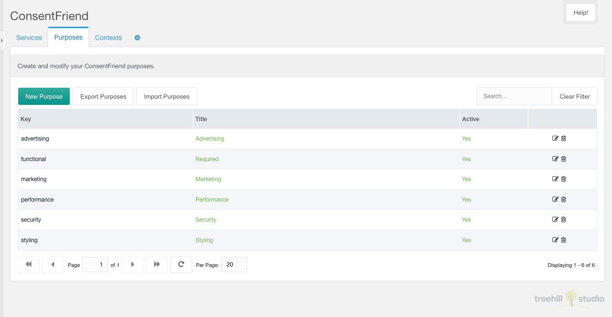

This tab contains a paginated grid with all purposes. The purposes are used to
build the consent modal in the frontend, if the system setting group by purpose
is enabled.

You can create a new purpose with a click on the create purpose button on the top
left above the purposes grid.

The grid can be filtered by a search input on the top right above the
purposes grid.

Each purpose can be edited by a click on the edit icon in the row of the
purpose. And it can be deleted after a confirmation with a click on the trash
icon in the row of the purpose.

The row of each purpose shows the key, the title and the active state of an
entry.

## Create/Edit

The create/edit window allows the user to edit the purpose options.

You can set the purpose name, the purpose alias and you can toggle it to
inactive.
