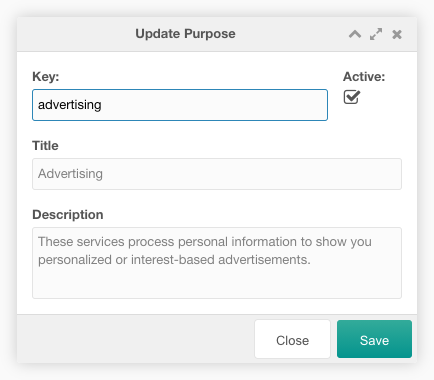

This tab contains a paginated grid with all purposes. The purposes are used to
build the consent modal in the frontend, if the [system
setting](../04_System_Settings.md) `consentfriend.group_by_purpose` is enabled.

You can create a new purpose with a click on the New Purpose button on the top
left above the purposes grid.

You can export the purposes to a YAML file with a click on the Export Purposes
button above the purposes grid.

You can import a YAML file with the purposes with a click on the Import Purposes
button above the purposes grid. In the import window you have to select a file to
import and the import mode. In the append mode the entries in the file are
appended to the existing purposes in the grid. In the replace mode the existing
purposes in the grid are replaced with the entries in the file. In the update
mode the existing purposes in the grid are updated with the entries in the file.

The grid can be filtered by a search input on the top right above the purposes
grid.

Each purpose can be edited by a click on the edit icon in the row of the
purpose. And it can be deleted after a confirmation with a click on the trash
icon in the row of the purpose. The purpose key and the active column are
editable inline.

The row of each purpose shows the key, the title and the active state of an
entry.

## Create/Edit

The create/edit window allows the user to edit the purpose options.

You can set the purpose name, the purpose alias and you can toggle it to
inactive.
