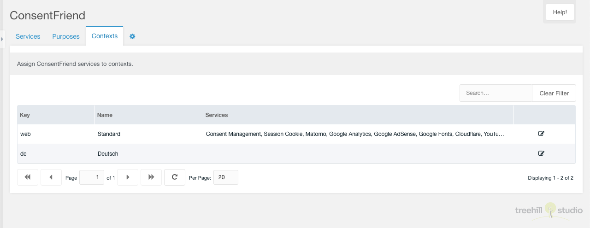
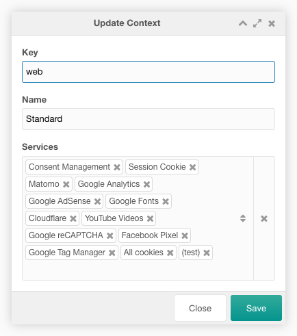

This tab contains a paginated grid with all contexts except the mgr context. It
is only visible if the MODX system setting `consentfriend.use_contexts` is
enabled.

Each context can be edited by a click on the edit icon in the row of the
context.

The row of each context shows the context key, the name and the
active services.

## Edit

The edit window allows the user to edit the context services.

You can assign and remove the available services in the services combo box.
