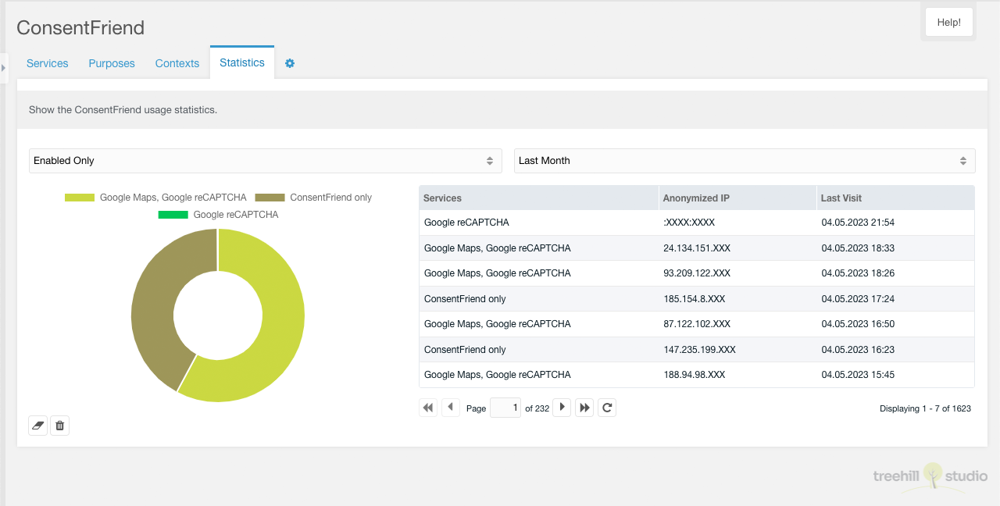

This tab contains the ConsentFriend statistics. It is only visible if the MODX
system setting `consentfriend.log_usage` is enabled.

After enabling this, the frontend usage of ConsentFriend is logged with an
anonymized IP, the browser agent, the access date and the enabled services. The
results of this logging is shown in this tab.
