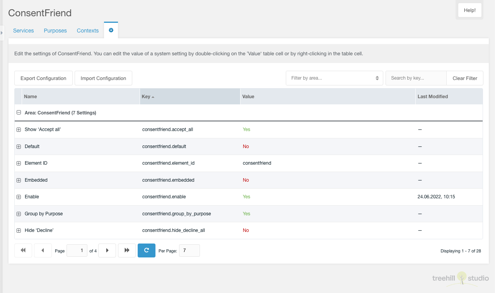

This tab contains a paginated grid with all [settings](../04_System_Settings.md) of the consentfriend
namespace.

It is only visible for a user that has the `setting` or the
`consentfriend_setting` permission enabled. Each setting can be edited the
same as in the MODX system settings panel.

You can export the ConsentFriend configuration (Services, Purposes, System
Settings) to a YAML file with a click on the Export Configuration button above the
purposes grid.

You can import a YAML file with the full ConsentFriend configuration with a
click on the Import Configuration button above the settings grid. In the import
window you have to select a file to import.

This ConsentFriend configuration file can be uploaded to
`{core_path}config/consentfriend/setup.yaml` before installing the ConsentFriend
package. Then the content of file will be prepared as initial configuration of
ConsentFriend. If you later on just need to add one service, prepare a
`{core_path}config/consentfriend/append.yaml` file with this service and the
content of file will be appended to the consentfriend settings.
