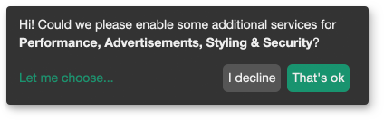
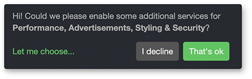
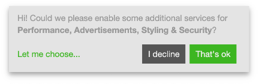
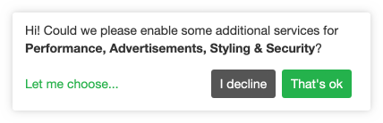

_ConsentFriend_ has five different default themes that can be activated in the
[system settings](04_System_Settings.md).

The default themes look like this:

**default (or empty)**



**black**


**dark**



**light**



**white**



## Modify the active theme

The theme (including the default) can be modified by css variables. The [klaro
variables](https://github.com/kiprotect/klaro/blob/master/src/scss/vars.scss#L71-L113)
are available with the `consentfriend-` prefix. You have to modify i.e. the
variable `--consentfriend-dark1` for the background color of the modal in your
css. The following lines set a white background for the modal:

```
:root {
  --consentfriend-dark1: #fff;
}
```

### Variables of the ConsentFriend themes

The _ConsentFriend_ themes use the following variables (and some additional
modifications for the modal shadow, that can't be modified by variables):

**black**

```
:root {
  --consentfriend-border-radius: 1px;
  --consentfriend-dark1: #060606;
  --consentfriend-dark2: #515151;
  --consentfriend-dark3: #858585;
  --consentfriend-white1: #999;
  --consentfriend-white2: #ccc;
  --consentfriend-white3: #fff;
  --consentfriend-blue1: #2d9fd6;
  --consentfriend-green1: #77b300;
  --consentfriend-red1: #c00;
}
```

**dark**

```
:root {
  --consentfriend-border-radius: 4px;
  --consentfriend-dark1: #272b30;
  --consentfriend-dark2: #606a76;
  --consentfriend-dark3: #8d96a2;
  --consentfriend-white1: #999;
  --consentfriend-white2: #ccc;
  --consentfriend-white3: #fff;
  --consentfriend-blue1: #5bc0de;
  --consentfriend-green1: #62c462;
  --consentfriend-red1: #ee5f5b;
}
```

**light**

```
:root {
  --consentfriend-border-radius: 0;
  --consentfriend-light1: #555;
  --consentfriend-dark1: #e4e4e4;
  --consentfriend-dark2: #555;
  --consentfriend-dark3: #777;
  --consentfriend-white1: #999;
  --consentfriend-white2: #ccc;
  --consentfriend-white3: #fff;
  --consentfriend-blue1: #446e9b;
  --consentfriend-green1: #3cb521;
  --consentfriend-red1: #cd0200;
}
```

**white**

```
:root {
  --consentfriend-border-radius: 3px;
  --consentfriend-light1: #333;
  --consentfriend-dark1: #fff;
  --consentfriend-dark2: #555;
  --consentfriend-dark3: #555;
  --consentfriend-white1: #999;
  --consentfriend-white2: #ccc;
  --consentfriend-white3: #fff;
  --consentfriend-blue1: #369;
  --consentfriend-green1: #22b24c;
  --consentfriend-red1: #eb6864;
}
```

## Create your own theme

If you want to create your own theme, you can import the file
`assets/components/consentfriend/scss/consentfriend.scss` in your scss workflow.
To disable the default styling of the modal afterwards, please set the system
setting consentfriend.js_url to
`/assets/components/consentfriend/js/web/consentfriend-no-css.js`.

The scss variables have changed with version 1.3.0 in the open source part of
Klaro. Sadly the changes are not backwards compatible. If you created an own
theme, you have to use the new color variables. Please check the display of the
consent popup after the update and after compiling the scss file for your site.
