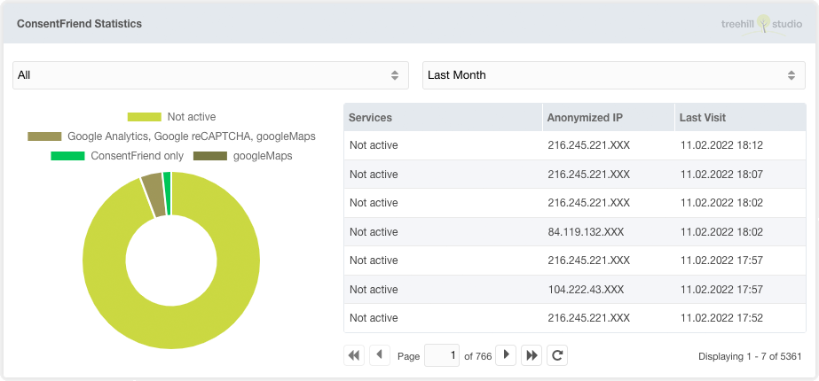

ConsentFriend contains a Dashboard widget since version 1.4.0.

To use this widget you have to enable the `consentfriend.log_usage` system
setting. After enabling this, the frontend usage of ConsentFriend is logged with
an anonymized IP, the browser agent, the access date and the enabled services.
The widget can be placed anywhere on the MODX dashboard.
