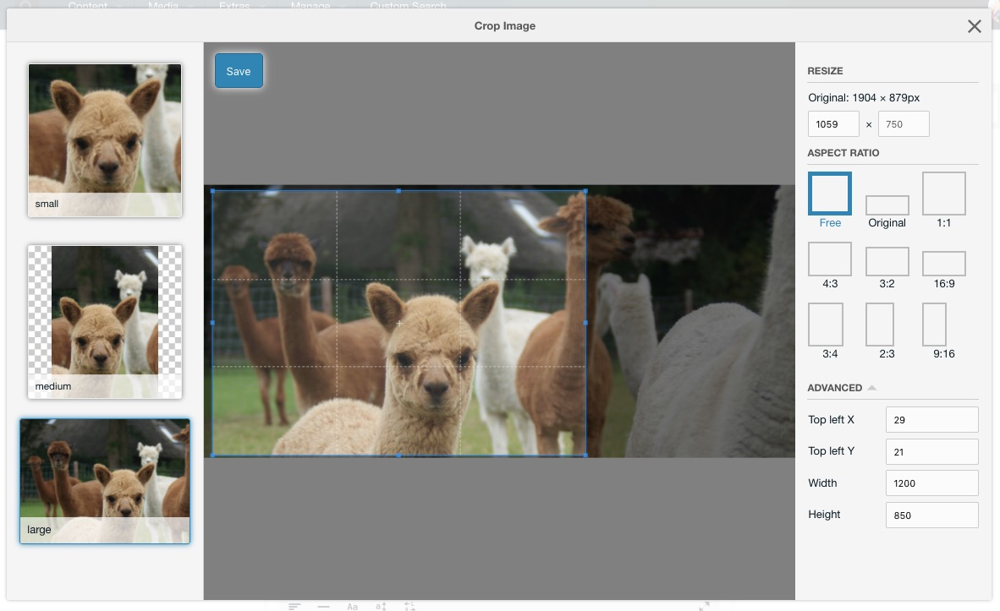
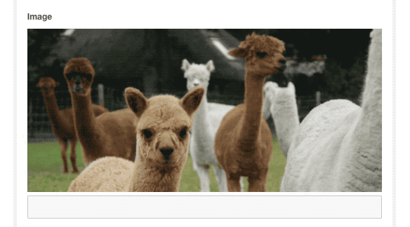

ContentBlocks 1.8 and up come with an image cropper. It's off by default, but can be enabled by adding the crop configuration to an image field. 

The cropper lets the designer or developer define the different crop(s) that should be available, while the end user (editor) can select the part of the image to use for each crop. This can be restricted in size and aspect ratio. Cropped images are generated when saving the crop, so there is no performance penalty to using them in the frontend.

[TOC]

## Setting up Crops

To set up crops, you'll edit an [image](Input_Types/Images) [field](Fields) and enter a specially formatted crop definition into the Crops property. 

The crop definition is a specially crafted string containing one or more crops, separated by the pipe symbol (`|`).

Here's an example of what the setting might contain:

`small:width=200,height=200,aspect=1|medium:width=500,aspect=0.7|large:height=750`

The syntax uses a pipe symbol (`|`) to separate different crops. In the above example, we defined three different crops: small, medium and large.

For each of the crops, the definition starts off with its **name**, followed by a colon (`:`) separating it from the crop **options**. 

The name is displayed to the user when editing an image, and also used for the placeholders with the field template.

When hovering over an inserted image in the canvas, you can also see a preview of each crop. Clicking those will directly edit that specific crop in the cropper.

Options are separated by a comma (`,`) and are specified in the `key=value` format. There are currently four supported options:

- **aspect**: the aspect ratio is the `width` of an image, divided by its `height`. A square image has an aspect ratio of `1`, while a landscape image has an aspect ratio `bigger than 1` and a portrait image has a aspect ratio of `smaller than 1`. To set the aspect ratio, add `aspect=1.3` where 1.3 is the ratio you want to enforce with a **period** as decimal sign. When no aspect ratio is defined, the user has the ability to select any type of rectangle.
- **width**: a width in pixels to limit the selected crop to. This does not restrict the size of the _selected region_, but it will make sure the generated image is at most that wide.
- **height**: a maximum height in pixels. As with the width, this does not restrict the size of the selectable region but only affects how the image is generated.

The end-user does not _see_ these settings directly, however they do see the results. Their crop selection will be restricted to the aspect ratio you define and the image will be generated at the right size determined by the width and height. 

If an aspect ratio is set, or inferred by both the width and height being set, then the Aspect Ratio section will not be shown in the options sidebar.

The resize fields will be disabled if the width or height is set. If the aspect ratio is set along with either the width or the height, then the other one is also disabled as there is no other possibility then the one calculated. 

If only one crop is specified, then the left sidebar to switch between crops will not be shown.

## Updating your Field Template

You'll probably want to display the crops in your front-end once they're generated. This can be done by using some new placeholders that are available in the template for your image field.

The crop placeholders follow the format: `[[+crops.{CROP_NAME}.{CROP_VALUE_KEY}]]` where `{CROP_NAME}` is the name of the crop as it was defined in the `moregallery.crops` system setting (for example _small_, _medium_ or _large_ in the earlier example), and `{CROP_VALUE_KEY}` is one of the below.

- `url`: A fully qualified URL to the cropped image. For example `/assets/crops/small.ao451jds.filename.png`. 
- `targetWidth`: the width of the cropped image in px.
- `targetHeight`: the height of the cropped image in px.
- `width` The width, in pixels, of the selection area on the source image, this is **not the crop width**. For example `200`.
- `height` The height, in pixels, of the selected area on the source image, this is **not the crop height**. For example `300`
- `x`, `y`: The coordinates (in pixels) of the selected (or automatically calculated) crop. `(x, y)` is the coordinate of the top left corner.

So for example if your crop was called small, you could get the url for the cropped image with `[[+crops.small.url]]`, its width with `[[+crops.small.targetWidth]]` and the height with `[[+crops.small.targetHeight]]`.

Using these placeholders, you can add your crops in the way you'd like them to appear in your imageTpl chunk! Perhaps using the picture element or simply to highlight different areas of an image.
