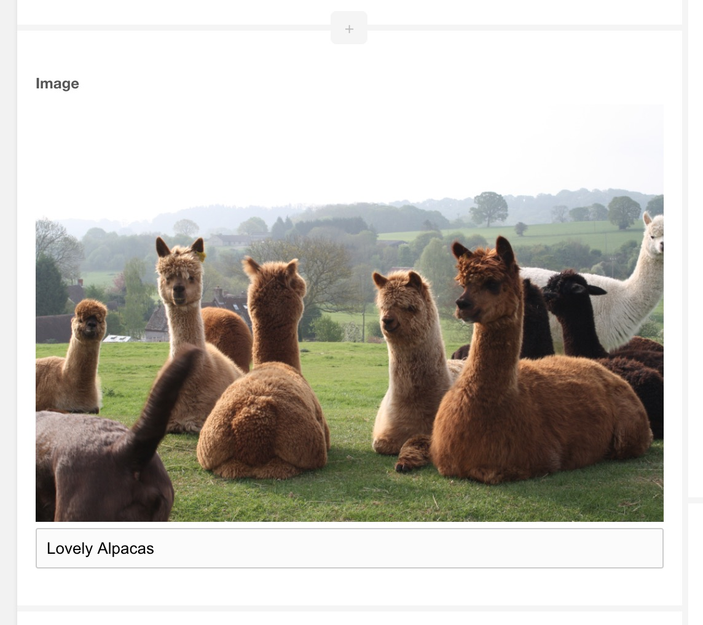

ContentBlocks ships with 2 image input types. 

- Image (`image`), which is just an image.
- Image with Title (`image_with_title`), which is both an image and a title field that is shown when an image is uploaded. 

Both input types work the same aside from the addition of the title field.

[TOC]

## Example

## Use Cases

- Images, obviously!
- Image-based icons in a call to action, especially useful when combined with other fields in a [Repeater](Repeater). 

## Related Settings

See the [System Setting](../System_Settings) documentation for a description of the available settings. 

- `contentblocks.base_url_mode`
- `contentblocks.image.hash_name`
- `contentblocks.image.prefix_time`
- `contentblocks.image.sanitize`
- `contentblocks.image.source`
- `contentblocks.image.upload_path`
- `contentblocks.sanitize_pattern`
- `contentblocks.sanitize_replace`
- `contentblocks.translit`
- `contentblocks.translit_class`
- `contentblocks.translit_class_path`

## Available Properties

When adding or editing a field with the Image or Image with Title input type, these properties are available. 

### Media Source Override

By default image fields will use the media source configured in the `contentblocks.image.source` [System Setting](../System_Settings). By setting the Media Source Override you can choose a media source specific to this field.

### Directory

The directory within the chosen media source where images get uploaded to. If the value is empty, it will fallback to the value of the `contentblocks.image.upload_path` [System Setting](../System_Settings).

Within the directory option (and the setting) it's possible to use the following placeholders. 

- `[[+year]]`: the current year (date format `Y`)
- `[[+month]]`: the current month (date format `m`)
- `[[+day]]`: the current day (date format `d`)
- `[[+user]]`: the ID of the currently logged in user
- `[[+username]]`: the username of the currently logged in user
- `[[++assets_url]]`: the URL to your assets
- `[[++site_url]]`: the full URL for your site
- `[[++base_url]]`: the base url of your site; this is the path following the hostname. 
- `[[+parent_alias]]`: the alias of the parent resource, or empty if the current resource is in the root.
- `[[+ultimate_parent]]`: the ID of the ultimate parent (the resource parent highest up in the tree) for the current resource.
- `[[+ultimate_parent_alias]]`: the alias of the ultimate parent for the current resource.

Resource fields and template variables are also available. For example `[[+pagetitle]]`, `[[+alias]]` or `[[+resource]]` for the resource ID. TV values are available with the `tv` prefix, like `[[+tv.my_awesome_tv]]`. 

### Allowed File Extensions

A comma-separated list of extensions (without dot) that are allowed to be uploaded in this field. Note that the media source also needs to accept the extensions you set here. Leave empty to don't restrict the file extension specifically on the field. 

### Manager Thumbnail Size

Set to a number of pixels to create a thumbnail for the image in the manager. Set to a single number to create a thumbnail in the manager that is square, or in the format `widthxheight` (e.g. `200x150`) to create a thumbnail at that size instead. 

### Use Tiny RTE

Image with Title only. When enabled, a very simple rich text editor will be enabled on the title field. This allows you to add basic bold, italics, underline formatting and links within the title. 